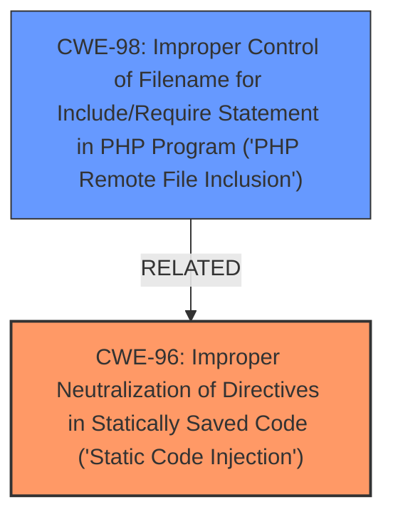

# Raw Analyzer Response for CVE-2024-13264

# Summary
| CWE ID | CWE Name | Confidence | CWE Abstraction Level | CWE Vulnerability Mapping Label | CWE-Vulnerability Mapping Notes |
|---|---|---|---|---|---|
| CWE-96 | Improper Neutralization of Directives in Statically Saved Code ('Static Code Injection') | 0.9 | Base | Primary | Allowed |
| CWE-98 | Improper Control of Filename for Include/Require Statement in PHP Program ('PHP Remote File Inclusion') | 0.7 | Variant | Secondary | Allowed |

## Evidence and Confidence

*   **Confidence Score:** 0.8
*   **Evidence Strength:** MEDIUM

## Relationship Analysis
The primary CWE is CWE-96, which deals with **improper neutralization** in statically saved code. CWE-98, a more specific form of file inclusion vulnerability in PHP, is considered a secondary CWE.

## Vulnerability Chain
The vulnerability chain starts with **improper neutralization of directives** (CWE-96) leading to **PHP Local File Inclusion** (CWE-98). The **improper neutralization** allows an attacker to manipulate the filename used in an include/require statement, leading to the inclusion of unintended files.

## Summary of Analysis
The primary CWE selected is CWE-96 because the vulnerability description highlights **improper neutralization of directives** as the root cause. The description explicitly mentions "Static Code Injection," which aligns well with CWE-96. CWE-98 is included as a secondary CWE because the vulnerability specifically leads to "PHP Local File Inclusion."

The retriever results also support the selection of CWE-96 and CWE-98. CWE-96 has a high similarity score. CWE-98 is the top combined result and is directly related to PHP file inclusion vulnerabilities.

CWE-94 ('Code Injection') was considered, but it's too broad. The description focuses on **improper neutralization**, making CWE-96 a more accurate fit. CWE-22 ('Path Traversal') was also considered, but the vulnerability description emphasizes file inclusion rather than path traversal. CWE-79 ('Cross-site Scripting') is irrelevant because the vulnerability is not related to web page generation or script injection.

The final decision is based on the vulnerability description, which highlights the **improper neutralization** as the root cause and the resulting **PHP Local File Inclusion**.

Relevant CWE Information:

# Enhanced Context (25 CWEs)
The following CWEs were identified as potentially relevant to this vulnerability:

## CWE-96: Improper Neutralization of Directives in Statically Saved Code ('Static Code Injection')
**Abstraction Level**: Base
**Similarity Score**: 0.80
**Source**: dense

**Description**:
The product receives input from an upstream component, but it does not neutralize or incorrectly neutralizes code syntax before inserting the input into an executable resource, such as a library, configuration file, or template.

**Mapping Guidance**:
- Usage: Allowed
- Rationale: This CWE entry is at the Base level of abstraction, which is a preferred level of abstraction for mapping to the root causes of vulnerabilities.

**Explanation**: The vulnerability description explicitly mentions "Static Code Injection," making CWE-96 a strong candidate. The description highlights the **improper neutralization of directives** which is the root cause.

## CWE-98: Improper Control of Filename for Include/Require Statement in PHP Program ('PHP Remote File Inclusion')
**Abstraction Level**: Variant
**Similarity Score**: 2.24
**Source**: graph

**Description**:
The PHP application receives input from an upstream component, but it does not restrict or incorrectly restricts the input before its usage in "require," "include," or similar functions.

**Mapping Guidance**:
- Usage: Allowed
- Rationale: This CWE entry is at the Variant level of abstraction, which is a preferred level of abstraction for mapping to the root causes of vulnerabilities.

**Explanation**: The vulnerability leads to "PHP Local File Inclusion," which aligns with CWE-98. The **improper neutralization** of the filename allows an attacker to include arbitrary files.