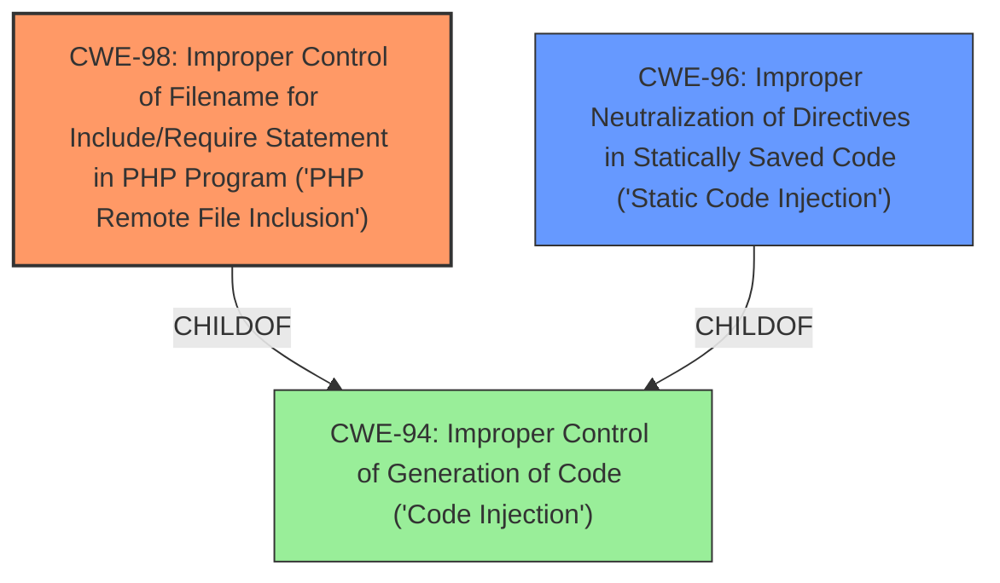

# Analysis Report for CVE-2024-13265

# Vulnerability Analysis Report: CVE-2024-13265

## Description

**Improper Neutralization of Directives in Statically Saved Code** (Static Code Injection) vulnerability in Drupal Opigno Learning path allows PHP Local File Inclusion.This issue affects Opigno Learning path from 0.0.0 before 3.1.2.

## Vulnerability Description Key Phrases

- **Rootcause:** Improper Neutralization of Directives in Statically Saved Code
- **Weakness:** Static Code Injection, Local File Inclusion
- **Product:** Drupal Opigno Learning path
- **Impact:** Local File Inclusion
- **Version:** 0.0.0 to 3.1.1

## Analysis (with Relationship Data)

# Summary
| CWE ID | CWE Name | Confidence | CWE Abstraction Level | CWE Vulnerability Mapping Label | CWE-Vulnerability Mapping Notes |
|---|---|---|---|---|---|
| CWE-98 | Improper Control of Filename for Include/Require Statement in PHP Program ('PHP Remote File Inclusion') | 0.9 | Variant | Primary | Allowed |
| CWE-96 | Improper Neutralization of Directives in Statically Saved Code ('Static Code Injection') | 0.6 | Base | Secondary | Allowed |

## Evidence and Confidence

*   **Confidence Score:** 0.75
*   **Evidence Strength:** MEDIUM

## Relationship Analysis
The primary CWE is CWE-98, which is a variant of CWE-94 (Improper Control of Generation of Code). CWE-96, a potential secondary CWE, is a parent of CWE-95, and a child of CWE-94. These relationships highlight a potential vulnerability chain involving code injection and improper neutralization. The chosen CWEs are at the Base and Variant levels, providing a good balance between specificity and generality.



## Vulnerability Chain
The vulnerability chain starts with **Improper Neutralization of Directives in Statically Saved Code** (CWE-96). This can lead to **Improper Control of Filename for Include/Require Statement in PHP Program** (CWE-98), resulting in PHP Local File Inclusion. The root cause is the lack of proper neutralization, which allows an attacker to control the included file.

## Summary of Analysis
The primary CWE is CWE-98, as it directly relates to the "PHP Local File Inclusion" vulnerability mentioned in the description. The vulnerability description explicitly states "**Improper Neutralization of Directives in Statically Saved Code** (Static Code Injection)" as a vulnerability. CWE-96 is also listed as a potential weakness, which may contribute to the overall vulnerability, but is not the direct cause of the local file inclusion.

The evidence for CWE-98 is that it is the top retriever result and that the vulnerability results in a local file inclusion.

# Enhanced Context (25 CWEs)
The following CWEs were identified as potentially relevant to this vulnerability:

## CWE-96: Improper Neutralization of Directives in Statically Saved Code ('Static Code Injection')
**Abstraction Level**: Base
**Similarity Score**: 0.79
**Source**: dense

**Description**:
The product receives input from an upstream component, but it does not neutralize or incorrectly neutralizes code syntax before inserting the input into an executable resource, such as a library, configuration file, or template.

**Mapping Guidance**:
- Usage: Allowed
- Rationale: This CWE entry is at the Base level of abstraction, which is a preferred level of abstraction for mapping to the root causes of vulnerabilities.

## CWE-98: Improper Control of Filename for Include/Require Statement in PHP Program ('PHP Remote File Inclusion')
**Abstraction Level**: variant
**Similarity Score**: 3.24
**Source**: graph

**Description**:
CWE-98: Improper Control of Filename for Include/Require Statement in PHP Program ('PHP Remote File Inclusion')

**Mapping Guidance**:
- Usage: Allowed
- Rationale: This CWE entry is at the Variant level of abstraction, which is a preferred level of abstraction for mapping to the root causes of vulnerabilities.


## CWE Relationship Analysis

Current CWEs represent these abstraction levels: .


### Vulnerability Chain Analysis

**Chain starting from CWE-96:**
- 96 (Improper Neutralization of Directives in Statically Saved Code ('Static Code Injection')) - ROOT


**Chain starting from CWE-94:**
- 94 (Improper Control of Generation of Code ('Code Injection')) - ROOT


### CWE Relationship Diagram

```mermaid
graph TD
    classDef primary fill:#f96,stroke:#333,stroke-width:2px
    classDef secondary fill:#69f,stroke:#333
    classDef tertiary fill:#9e9,stroke:#333
```


*Report generated on 2025-07-13 04:02:18*
