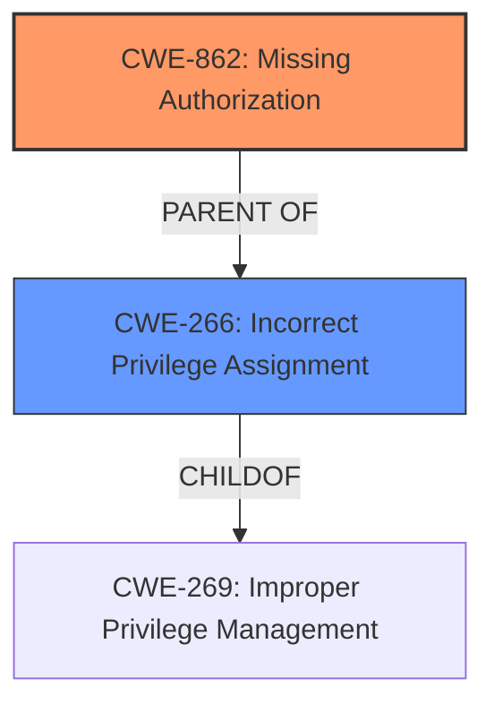

# Enhanced Analysis for CVE-2024-13343

# Summary

| CWE ID  | CWE Name                                          | Confidence | CWE Abstraction Level | CWE Vulnerability Mapping Label | CWE-Vulnerability Mapping Notes |
| ------- | ------------------------------------------------- | ---------- | --------------------- | ----------------------------- | ------------------------------- |
| CWE-862 | Missing Authorization                             | 0.9        | Class                 | Primary                       | Allowed-with-Review             |
| CWE-266 | Incorrect Privilege Assignment                    | 0.7        | Base                  | Secondary                     | Allowed                         |

## Evidence and Confidence

*   **Confidence Score:** 0.8
*   **Evidence Strength:** HIGH

## Relationship Analysis

The primary relationship influencing the selection is the parent-child relationship. CWE-862 (Missing Authorization) is a class-level CWE. The retriever results showed that CWE-862 is the best match. The vulnerability is due to a **missing capability check**. CWE-266 (Incorrect Privilege Assignment) is a base-level CWE and a potential related weakness, where privileges are incorrectly assigned.



## Vulnerability Chain

The vulnerability chain starts with a **missing capability check** (CWE-862), which allows authenticated attackers with low-level access to elevate their privileges. The chain can be represented as follows:

Missing Authorization (CWE-862) -> Privilege Escalation (Impact).

## Summary of Analysis

The initial analysis strongly pointed towards authorization issues. The **missing capability check** is the key indicator. The retriever results suggested CWE-862 (Missing Authorization) as the top candidate. The vulnerability description explicitly states a **missing capability check**, which aligns perfectly with the definition of CWE-862. CWE-266 was also considered as a secondary weakness related to privilege management.

The selected CWEs are at an appropriate level of specificity. CWE-862 captures the root cause, while CWE-266 identifies how privileges are incorrectly assigned. The evidence from the vulnerability description supports these classifications.

Relevant CWE Information:

# Enhanced Context (25 CWEs)
The following CWEs were identified as potentially relevant to this vulnerability:

## CWE-266: Incorrect Privilege Assignment
**Abstraction Level**: Base
**Similarity Score**: 0.79
**Source**: dense

**Description**:
A product incorrectly assigns a privilege to a particular actor, creating an unintended sphere of control for that actor.

**Mapping Guidance**:
- Usage: Allowed
- Rationale: This CWE entry is at the Base level of abstraction, which is a preferred level of abstraction for mapping to the root causes of vulnerabilities.

## CWE-862: Missing Authorization
**Abstraction Level**: Class
**Similarity Score**: 1265.41
**Source**: sparse

**Description**:
The product does not perform an authorization check when an actor attempts to access a resource or perform an action.

**Mapping Guidance**:
- Usage: Allowed-with-Review
- Rationale: This CWE entry is a Class and might have Base-level children that would be more appropriate

# Complete CWE Specifications

CWE-862: Missing Authorization

CWE-266: Incorrect Privilege Assignment


## CWE Relationship Analysis

Current CWEs represent these abstraction levels: .


### Vulnerability Chain Analysis

**Chain starting from CWE-266:**
- 266 (Incorrect Privilege Assignment) - ROOT


**Chain starting from CWE-269:**
- 269 (Improper Privilege Management) - ROOT


### CWE Relationship Diagram

```mermaid
graph TD
    classDef primary fill:#f96,stroke:#333,stroke-width:2px
    classDef secondary fill:#69f,stroke:#333
    classDef tertiary fill:#9e9,stroke:#333
```