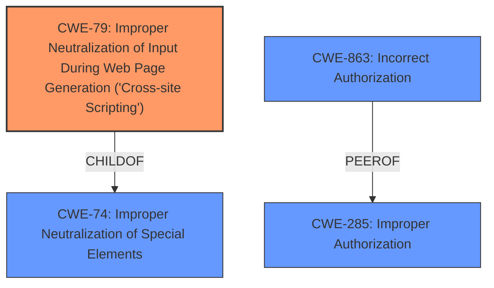

# Analysis Report for CVE-2024-13383

# Vulnerability Analysis Report: CVE-2024-13383

## Description

The HD Quiz WordPress plugin before 2.0.0 **does not sanitise and escape some of its settings**, which could allow high privilege users such as admin to perform Stored Cross-Site Scripting attacks even when the unfiltered_html capability is disallowed (for example in multisite setup).

## Vulnerability Description Key Phrases

- **Rootcause:** does not sanitise and escape some of its settings
- **Weakness:** cross-site scripting
- **Impact:** Stored Cross-Site Scripting attacks
- **Attacker:** high privilege users such as admin
- **Product:** HD Quiz WordPress plugin
- **Version:** before 2.0.0

## Analysis (with Relationship Data)

# Summary
| CWE ID  | CWE Name                                                                                     | Confidence | CWE Abstraction Level | CWE Vulnerability Mapping Label | CWE-Vulnerability Mapping Notes |
| :-------- | :------------------------------------------------------------------------------------------- | :---------- | :---------------------- | :------------------------------ | :------------------------------ |
| CWE-79 | Improper Neutralization of Input During Web Page Generation ('Cross-site Scripting') | 1          | Base                     | Primary CWE                      | Allowed                      |

## Evidence and Confidence

*   **Confidence Score:** 1
*   **Evidence Strength:** HIGH

## Relationship Analysis
The primary CWE is CWE-79, which represents the **improper sanitization and escaping of settings** that leads to Cross-Site Scripting. Many other CWEs were considered based on the retriever results and graph relationships, particularly related to authorization and privilege issues. The high-level class CWEs like CWE-863 (Incorrect Authorization) and CWE-285 (Improper Authorization) were deemed less specific than the base CWE-79, which directly addresses the root cause of **improper neutralization of input**. The parent-child relationships were important to select the most specific CWE.



## Vulnerability Chain
The vulnerability chain starts with the **lack of sanitization and escaping of settings** in the HD Quiz WordPress plugin. This leads to a stored Cross-Site Scripting vulnerability, allowing high-privilege users to inject malicious scripts.
  - **Root Cause:** **Lack of input sanitization and escaping** (CWE-79)
  - **Impact:** Stored Cross-Site Scripting attacks

## Summary of Analysis
The primary assessment is based on the clear evidence provided in the vulnerability description and the CVE Reference Links Content Summary. The description explicitly states that the HD Quiz WordPress plugin **does not sanitise and escape some of its settings**, which directly leads to Cross-Site Scripting. This aligns perfectly with CWE-79 (Improper Neutralization of Input During Web Page Generation). The retriever results also list CWE-79 as a relevant CWE. While other CWEs like authorization-related issues were considered, the root cause remains the **improper neutralization of input**. The selection of CWE-79 is at the optimal level of specificity (Base) as it accurately represents the weakness.

Relevant CWE Information:

*   **CWE-79:** Improper Neutralization of Input During Web Page Generation ('Cross-site Scripting') - The product does not neutralize or incorrectly neutralizes user-controllable input before it is placed in output that is used as a web page that is served to other users. This matches the description of the vulnerability where the plugin settings are not sanitized, leading to XSS.


## CWE Relationship Analysis

Current CWEs represent these abstraction levels: .


### Vulnerability Chain Analysis

**Chain starting from CWE-74:**
- 74 (Improper Neutralization of Special Elements in Output Used by a Downstream Component ('Injection')) - ROOT


**Chain starting from CWE-863:**
- 863 (Incorrect Authorization) - ROOT


### CWE Relationship Diagram

```mermaid
graph TD
    classDef primary fill:#f96,stroke:#333,stroke-width:2px
    classDef secondary fill:#69f,stroke:#333
    classDef tertiary fill:#9e9,stroke:#333
```


*Report generated on 2025-07-13 04:07:54*
