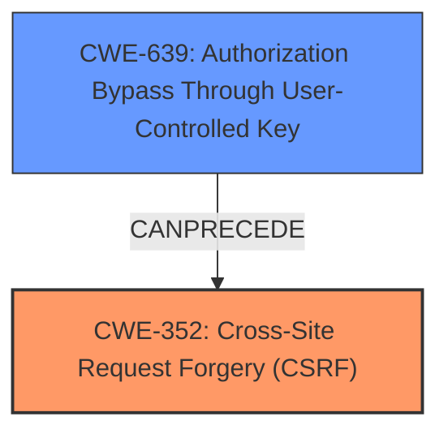

# Raw Analyzer Response for CVE-2024-13452

# Summary
| CWE ID | CWE Name | Confidence | CWE Abstraction Level | CWE Vulnerability Mapping Label | CWE-Vulnerability Mapping Notes |
|---|---|---|---|---|---|
| CWE-352 | Cross-Site Request Forgery (CSRF) | 1.0 | Compound | Allowed | Primary CWE |
| CWE-639 | Authorization Bypass Through User-Controlled Key | 0.6 | Base | Allowed | Secondary Candidate |

## Evidence and Confidence

*   **Confidence Score:** 0.8
*   **Evidence Strength:** HIGH

## Relationship Analysis
The primary CWE is CWE-352, which is a compound weakness describing Cross-Site Request Forgery. The vulnerability description clearly indicates **missing or incorrect nonce validation**, which is a common root cause for CSRF. CWE-639, Authorization Bypass Through User-Controlled Key, is considered as a secondary CWE because the **missing or incorrect nonce validation** allows an attacker to bypass authorization checks.

## Vulnerability Chain
The vulnerability chain starts with the **missing or incorrect nonce validation** (root cause) leading to Cross-Site Request Forgery, which then allows attackers to update settings and inject malicious web scripts.

Missing/Incorrect Nonce Validation -> CSRF -> Update Settings/Inject Malicious Scripts

## Summary of Analysis
The primary assessment is based on the vulnerability description, which states that there's **missing or incorrect nonce validation** leading to a Cross-Site Request Forgery. The evidence is strong as the description explicitly mentions the root cause and the resulting weakness. The graph relationship shows that CWE-639 (Authorization Bypass) can precede CWE-352 (CSRF), fitting the vulnerability's progression.

"This is due to **missing or incorrect nonce validation** on a saveAsCopy function. This makes it possible for unauthenticated attackers to update settings and inject malicious web scripts via a forged request granted they can trick a site administrator into performing an action such as clicking on a link."

CWE-352 is chosen because the core issue is the lack of proper CSRF protection (nonce validation). CWE-639, Authorization Bypass Through User-Controlled Key, is a secondary consideration because the lack of nonce validation effectively allows unauthorized actions by exploiting a forged request. The selected CWEs are at the optimal level of specificity, with CWE-352 being a compound weakness encompassing the overall vulnerability and CWE-639 as a contributing factor.

The retriever results list several other CWEs. CWE-79, Improper Neutralization of Input During Web Page Generation ('Cross-site Scripting'), and CWE-89, Improper Neutralization of Special Elements used in an SQL Command ('SQL Injection'), are not directly applicable as the primary issue isn't related to input sanitization but rather the lack of request forgery protection. CWE-862, Missing Authorization, and CWE-863, Incorrect Authorization, are related to authorization issues, but CWE-639 is more specific in this context, as it involves user-controlled keys and authorization bypass. CWE-472, External Control of Assumed-Immutable Web Parameter, could be loosely related as the nonce is an externally controlled parameter, but the core problem lies in the **missing or incorrect nonce validation** rather than the external control itself.