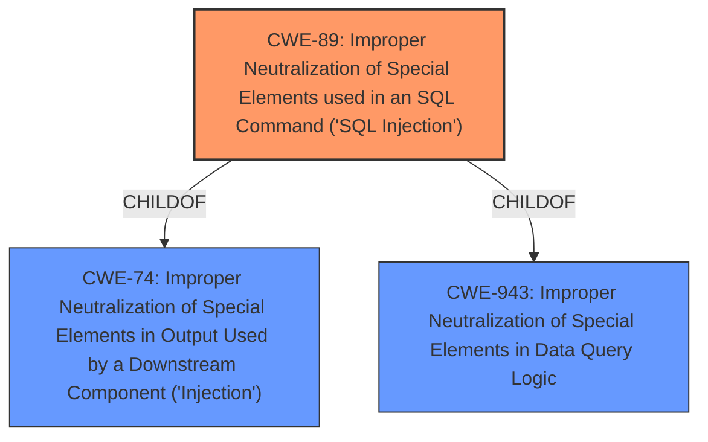

# Raw Analyzer Response for CVE-2024-13477

# Summary
| CWE ID  | CWE Name                                                                                   | Confidence | CWE Abstraction Level | CWE Vulnerability Mapping Label | CWE-Vulnerability Mapping Notes |
| :-------- | :----------------------------------------------------------------------------------------- | :---------- | :----------------------- | :------------------------------ | :------------------------------ |
| CWE-89  | Improper Neutralization of Special Elements used in an SQL Command ('SQL Injection') | 1         | Base                     | Primary                         | Allowed                         |

## Evidence and Confidence

*   **Confidence Score:** 1
*   **Evidence Strength:** HIGH

## Relationship Analysis
The primary CWE is CWE-89, which is a base-level CWE. The analysis considered its parent CWEs (CWE-74, CWE-943) but determined that CWE-89 provides the most accurate and specific representation of the vulnerability because the **improper neutralization** directly leads to **SQL Injection**.

## Vulnerability Chain
The vulnerability chain starts with **insufficient escaping** and **lack of sufficient preparation on the existing SQL query**, leading to **SQL Injection**, which allows attackers to **append SQL queries** and **extract sensitive information from the database**. The root cause is the **improper neutralization**, and the impact is the unauthorized data extraction.

## Summary of Analysis
The analysis is strongly based on the provided evidence, particularly the vulnerability description emphasizing **insufficient escaping** and **lack of sufficient preparation on the existing SQL query**, which directly leads to **SQL Injection**. The vulnerability description clearly states that the plugin is vulnerable to **SQL Injection** due to **insufficient escaping on the user supplied parameter and lack of sufficient preparation on the existing SQL query.** This aligns perfectly with CWE-89, which addresses **improper neutralization** of special elements in SQL commands.

The relationship analysis confirms that CWE-89 is the most specific and appropriate choice, as it directly describes the vulnerability's nature and impact. The retriever results also support this selection, with CWE-89 consistently appearing as a top candidate across different keyphrases.

Relevant CWE Information:

*   **CWE-89: Improper Neutralization of Special Elements used in an SQL Command ('SQL Injection')**
    *   The product constructs all or part of an SQL command using externally-influenced input from an upstream component, but it does not neutralize or incorrectly neutralizes special elements that could modify the intended SQL command when it is sent to a downstream component.

Based on the evidence and relationship analysis, CWE-89 is the optimal choice for this vulnerability.