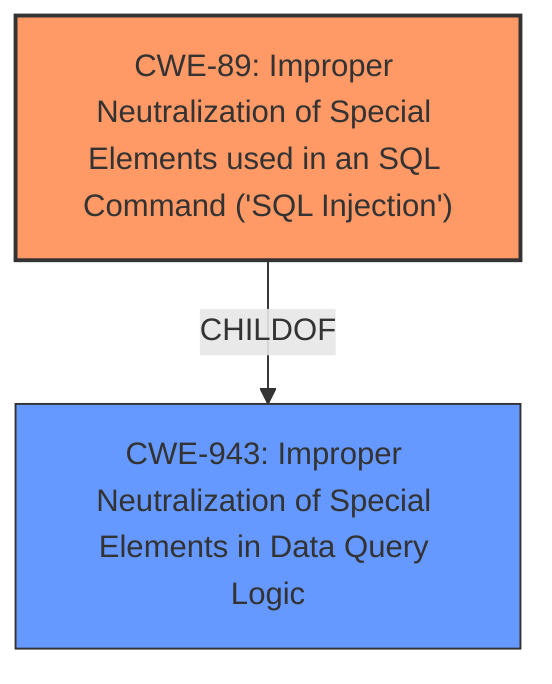

# Raw Analyzer Response for CVE-2024-13480

# Summary
| CWE ID | CWE Name | Confidence | CWE Abstraction Level | CWE Vulnerability Mapping Label | CWE-Vulnerability Mapping Notes |
|---|---|---|---|---|---|
| CWE-89 | Improper Neutralization of Special Elements used in an SQL Command ('SQL Injection') | 1.0 | Base | Primary | Allowed |

## Evidence and Confidence

*   **Confidence Score:** 1.0
*   **Evidence Strength:** HIGH

## Relationship Analysis
The primary identified CWE is CWE-89 which is a Base level CWE. There are parent and child relationships identified, such as CWE-89 being a child of CWE-943 (Improper Neutralization of Special Elements in Data Query Logic), but CWE-89 is the most specific and appropriate choice given the vulnerability description.

## Vulnerability Chain
The vulnerability chain starts with **insufficient escaping on the user supplied parameter and lack of sufficient preparation on the existing SQL query** (root cause) which leads to **SQL injection** (weakness) and finally the ability to extract sensitive information from the database (impact).

## Summary of Analysis
The vulnerability description clearly states that the root cause is **insufficient escaping on the user supplied parameter and lack of sufficient preparation on the existing SQL query**, which directly leads to **SQL Injection**. The description also mentions that this allows unauthenticated attackers to extract sensitive information from the database.

The evidence from the vulnerability description is: "The LTL Freight Quotes For Customers of FedEx Freight plugin for WordPress is vulnerable to SQL Injection via the edit_id and dropship_edit_id parameters in all versions up to, and including, 3.4.1 due to **insufficient escaping on the user supplied parameter and lack of sufficient preparation on the existing SQL query**. This makes it possible for unauthenticated attackers to append additional SQL queries into already existing queries that can be used to extract sensitive information from the database."

CWE-89 (Improper Neutralization of Special Elements used in an SQL Command ('SQL Injection')) is the most appropriate CWE because it directly addresses the root cause and vulnerability described. The relationship analysis supports this decision by showing that while there are parent CWEs, CWE-89 is the most specific.

Other CWEs Considered but Not Used:

*   CWE-116 (Improper Encoding or Escaping of Output): While related to escaping, it is a more general class of weakness. The description specifically mentions SQL injection, making CWE-89 a better fit.
*   CWE-352 (Cross-Site Request Forgery (CSRF)): This is not relevant as the vulnerability is SQL Injection not CSRF.
*   CWE-790 (Improper Filtering of Special Elements): Similar to CWE-116, this is a more general class and less specific than CWE-89.
*   CWE-90 (Improper Neutralization of Special Elements used in an LDAP Query ('LDAP Injection')): This is for LDAP injection, not SQL injection.
*   CWE-943 (Improper Neutralization of Special Elements in Data Query Logic): This is a more general class that contains SQL injection, but CWE-89 is more specific.
*   CWE-502 (Deserialization of Untrusted Data): This is not relevant as the vulnerability is SQL Injection not Deserialization of Untrusted Data.
*   CWE-138 (Improper Neutralization of Special Elements): Too general.
*   CWE-95 (Improper Neutralization of Directives in Dynamically Evaluated Code ('Eval Injection')): This is not relevant as the vulnerability is SQL Injection not Eval Injection.
*   CWE-613 (Insufficient Session Expiration): This is not relevant as the vulnerability is SQL Injection not Session Expiration.