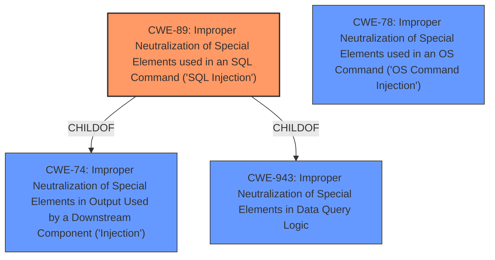

# Analysis for CVE-2024-13533

# Summary
| CWE ID | CWE Name | Confidence | CWE Abstraction Level | CWE Vulnerability Mapping Label | CWE-Vulnerability Mapping Notes |
|---|---|---|---|---|---|
| CWE-89 | Improper Neutralization of Special Elements used in an SQL Command ('SQL Injection') | 1.0 | Base | Allowed | Primary CWE. The vulnerability is due to the lack of proper neutralization of special elements in an SQL command. |

## Evidence and Confidence

*   **Confidence Score:** 1.0
*   **Evidence Strength:** HIGH

## Relationship Analysis
The primary relationship influencing the decision is that CWE-89 is a Base level CWE, which is preferred, and accurately describes the **SQL Injection** vulnerability due to **insufficient escaping** and **lack of preparation** in the SQL query. Other CWEs like CWE-74, CWE-943, and CWE-78 are related through hierarchical or chain relationships, but CWE-89 is the most specific and appropriate.

## Vulnerability Chain
The vulnerability chain starts with **insufficient escaping** on user-supplied parameters and a **lack of sufficient preparation** in the SQL query, leading directly to **SQL Injection** (CWE-89). This allows unauthenticated attackers to inject SQL queries to extract sensitive information.

## Summary of Analysis
The assessment is based on the provided vulnerability description, which clearly indicates an **SQL Injection** vulnerability due to **insufficient escaping** and **lack of sufficient preparation** on the SQL query. The retriever results also strongly suggest CWE-89 as the primary weakness. The relationship analysis confirms that CWE-89 is the most specific and appropriate CWE at the Base level of abstraction.

The vulnerability description states: "The Small Package Quotes USPS Edition plugin for WordPress is vulnerable to SQL Injection via the edit_id parameter in all versions up to, and including, 1.3.5 due to **insufficient escaping on the user supplied parameter and lack of sufficient preparation on the existing SQL query**. This makes it possible for unauthenticated attackers to append additional SQL queries into already existing queries that can be used to extract sensitive information from the database."

CWE-89 is the most specific and appropriate CWE because it directly addresses the root cause described in the vulnerability description: **improper neutralization of special elements used in an SQL command**. This is further supported by the high similarity score in the Retriever Results.

The selected CWEs are at the optimal level of specificity because CWE-89 is a Base level CWE, which is preferred for mapping to the root causes of vulnerabilities.