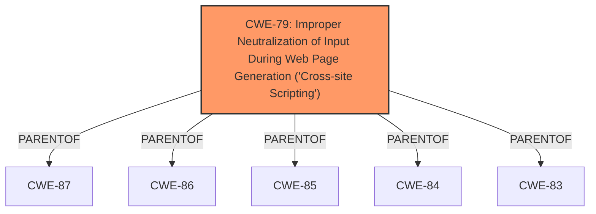

# Raw Analyzer Response for CVE-2024-13574

# Summary
| CWE ID | CWE Name | Confidence | CWE Abstraction Level | CWE Vulnerability Mapping Label | CWE-Vulnerability Mapping Notes |
|---|---|---|---|---|---|
| CWE-79 | Improper Neutralization of Input During Web Page Generation ('Cross-site Scripting') | 1.0 | Base | Primary | Allowed |

## Evidence and Confidence

*   **Confidence Score:** 1.0
*   **Evidence Strength:** HIGH

## Relationship Analysis
The primary relationship that influenced the decision was the parent-child relationship where CWE-79 is a base CWE. This is appropriate because it directly describes the **weakness** of improper neutralization of input leading to cross-site scripting. There were no other relationships that influenced the selection.

## Vulnerability Chain
The vulnerability chain starts with the **lack of sanitization and escaping** of a parameter before outputting it back into the page, which directly leads to Reflected Cross-Site Scripting (XSS).
  - **Root Cause:** **Lack of sanitization and escaping**
  - **Weakness:** Reflected Cross-Site Scripting (XSS)
  - **Impact:** Attack against high privilege users such as administrators.

## Summary of Analysis
The analysis is based on the provided evidence, which clearly states that the plugin does not sanitize and escape a parameter before outputting it back in the page, leading to a Reflected Cross-Site Scripting vulnerability. The CWE-79 is at the optimal level of specificity as a Base CWE, directly addressing the core issue of improper neutralization of input during web page generation.

The "**weakness:** **cross-site scripting**" phrase in the **Vulnerability Description Key Phrases** section strongly supports the selection of CWE-79. Furthermore, the "Root cause of vulnerability: The plugin does not sanitize and escape a parameter before outputting it back in the page" from the **CVE Reference Links Content Summary** section reinforces this classification.

CWE-79 was also the top CWE in the Retriever Results.

Based on these factors, CWE-79 is the most appropriate and specific classification for this vulnerability.