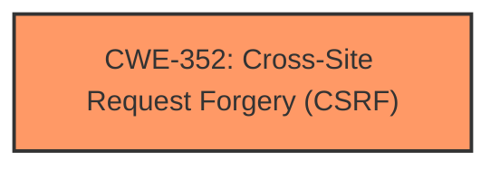

# Analysis Report for CVE-2024-13580

# Vulnerability Analysis Report: CVE-2024-13580

## Description

The XV Random Quotes WordPress plugin through 1.40 **does not have CSRF check** in place when updating its settings, which could allow attackers to make a logged in admin reset them via a CSRF attack

## Vulnerability Description Key Phrases

- **Rootcause:** does not have CSRF check
- **Vector:** CSRF attack
- **Attacker:** attackers
- **Product:** XV Random Quotes WordPress plugin
- **Version:** through 1.40

## Analysis (with Relationship Data)

# Summary
| CWE ID | CWE Name | Confidence | CWE Abstraction Level | CWE Vulnerability Mapping Label | CWE-Vulnerability Mapping Notes |
|---|---|---|---|---|---|
| CWE-352 | Cross-Site Request Forgery (CSRF) | 1.0 | Compound | Allowed | Primary CWE: The plugin **does not have CSRF check** in place when updating its settings, allowing attackers to make a logged-in admin reset them via a CSRF attack. |

## Evidence and Confidence

*   **Confidence Score:** 1.0
*   **Evidence Strength:** HIGH

## Relationship Analysis
The primary identified CWE is CWE-352, Cross-Site Request Forgery (CSRF). This is a compound weakness, meaning it's a combination of multiple weaknesses that occur simultaneously. There are no direct parent-child relationships immediately relevant in this specific case based on the provided information. However, CSRF often involves a missing or improper authentication mechanism and a lack of proper input validation.



## Vulnerability Chain
The vulnerability chain consists of:
1.  **Root Cause:** Missing CSRF check (**CWE-352**).
2.  **Impact:** An attacker can trick a logged-in admin into resetting the settings.

## Summary of Analysis
The analysis is based on the provided vulnerability description and the CVE reference content summary, both of which clearly indicate the **lack of CSRF protection** as the root cause.

The vulnerability description explicitly states that the plugin **does not have CSRF check** in place when updating its settings, making CWE-352 the most appropriate and specific classification.

The retriever results also support this selection, with CWE-352 having the highest similarity score.

```
Vulnerability Description Key Phrases
- rootcause: does not have CSRF check
```
This evidence directly supports the selection of CWE-352.

Other CWEs Considered but Not Used:

*   CWE-425 (Direct Request 'Forced Browsing'): While related to authorization issues, it doesn't specifically address the CSRF vulnerability.
*   CWE-306 (Missing Authentication for Critical Function): While CSRF can be seen as a type of authentication bypass, CWE-352 is more specific to the vulnerability.
*   CWE-79 (Improper Neutralization of Input During Web Page Generation ('Cross-site Scripting')): This is not relevant as it is not about XSS.


## CWE Relationship Analysis

Current CWEs represent these abstraction levels: .


### Vulnerability Chain Analysis

**Chain starting from CWE-352:**
- 352 (Cross-Site Request Forgery (CSRF)) - ROOT


**Chain starting from CWE-306:**
- 306 (Missing Authentication for Critical Function) - ROOT


### CWE Relationship Diagram

```mermaid
graph TD
    classDef primary fill:#f96,stroke:#333,stroke-width:2px
    classDef secondary fill:#69f,stroke:#333
    classDef tertiary fill:#9e9,stroke:#333
```


*Report generated on 2025-07-13 04:21:30*
