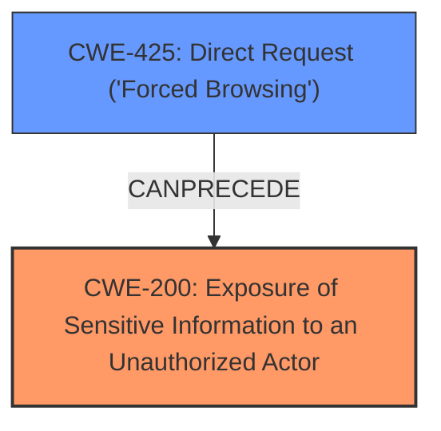

# Analysis Report for CVE-2024-13604

# Vulnerability Analysis Report: CVE-2024-13604

## Description

The KB Support Customer Support Ticket & Helpdesk Plugin, Knowledge Base Plugin plugin for WordPress is vulnerable to **Sensitive Information Exposure** in all versions up to, and including, 1.7.4 via the kbs directory. This makes it possible for unauthenticated attackers to extract sensitive data stored insecurely in the /wp-content/uploads/kbs directory which can contain file attachments included in support tickets. The vulnerability was partially patched in version 1.7.3.2.

## Vulnerability Description Key Phrases

- **Component:** kbs directory
- **Weakness:** Sensitive Information Exposure
- **Product:** KB Support Customer Support Ticket & Helpdesk Plugin, Knowledge Base Plugin
- **Impact:** Information Exposure, extract sensitive data
- **Attacker:** unauthenticated attackers
- **Version:** all versions up to and including 1.7.4

## Analysis (with Relationship Data)

# Summary

| CWE ID | CWE Name | Confidence | CWE Abstraction Level | CWE Vulnerability Mapping Label | CWE-Vulnerability Mapping Notes |
|---|---|---|---|---|---|
| CWE-200 | Exposure of Sensitive Information to an Unauthorized Actor | 0.9 | Class | Allowed-with-Review | The product exposes sensitive information to an actor that is not explicitly authorized to have access to that information. While **Exposure of Sensitive Information** is a high level impact, in this case, it's directly caused by storing the attachments in a publicly accessible directory. |
| CWE-425 | Direct Request ('Forced Browsing') | 0.7 | Base | Allowed | The web application does not adequately enforce appropriate authorization on all restricted URLs, scripts, or files. Since the kbs directory is directly accessible without authentication, this CWE is relevant. |

## Evidence and Confidence

*   **Confidence Score:** 0.8
*   **Evidence Strength:** MEDIUM

## Relationship Analysis
The primary relationship influencing my decision is that CWE-200 [CWE-200: Exposure of Sensitive Information to an Unauthorized Actor] is a high-level class that encompasses many specific types of information exposure. However, in this case, the exposure is directly due to the application failing to restrict access to a directory containing sensitive files. CWE-425 [CWE-425: Direct Request ('Forced Browsing')] is a more specific Base level CWE that describes this **missing authorization** issue. While CWE-200 [CWE-200: Exposure of Sensitive Information to an Unauthorized Actor] describes the impact, CWE-425 [CWE-425: Direct Request ('Forced Browsing')] describes the root cause weakness.



## Vulnerability Chain
The vulnerability chain starts with a **missing authorization** control on the `kbs` directory (CWE-425 [CWE-425: Direct Request ('Forced Browsing')]). Because of this, unauthenticated attackers can directly access sensitive files within that directory, leading to **exposure of sensitive information** (CWE-200 [CWE-200: Exposure of Sensitive Information to an Unauthorized Actor]).

## Summary of Analysis
The analysis is primarily based on the vulnerability description, which highlights the **sensitive information exposure** due to the insecurely stored file attachments in the `/wp-content/uploads/kbs` directory. The key phrase is the **weakness: Sensitive Information Exposure**.

The retriever results suggested several CWEs, including CWE-863 [CWE-863: Incorrect Authorization], CWE-200 [CWE-200: Exposure of Sensitive Information to an Unauthorized Actor], CWE-352 [CWE-352: Cross-Site Request Forgery (CSRF)], CWE-201 [CWE-201: Insertion of Sensitive Information Into Sent Data], CWE-434 [CWE-434: Unrestricted Upload of File with Dangerous Type], CWE-862 [CWE-862: Missing Authorization], and CWE-425 [CWE-425: Direct Request ('Forced Browsing')].

CWE-200 [CWE-200: Exposure of Sensitive Information to an Unauthorized Actor] is a general class of weakness, while CWE-425 [CWE-425: Direct Request ('Forced Browsing')] is a more specific base case describing the root cause, where the web application does not adequately enforce authorization. The `kbs` directory is directly accessible without authentication, allowing sensitive data to be exposed.

CWE-425 [CWE-425: Direct Request ('Forced Browsing')] is the best fit for the root cause of the vulnerability as it clearly states the authorization issue which directly leads to the **sensitive information exposure** i.e. the impact (CWE-200 [CWE-200: Exposure of Sensitive Information to an Unauthorized Actor]).


## CWE Relationship Analysis

Current CWEs represent these abstraction levels: .


### Vulnerability Chain Analysis

**Chain starting from CWE-863:**
- 863 (Incorrect Authorization) - ROOT


**Chain starting from CWE-862:**
- 862 (Missing Authorization) - ROOT


### CWE Relationship Diagram

```mermaid
graph TD
    classDef primary fill:#f96,stroke:#333,stroke-width:2px
    classDef secondary fill:#69f,stroke:#333
    classDef tertiary fill:#9e9,stroke:#333
```


*Report generated on 2025-07-13 04:23:02*
