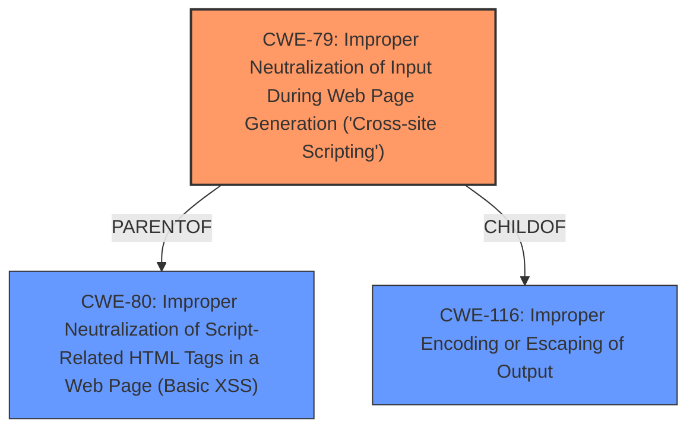

# Analysis Report for CVE-2024-13619

# Vulnerability Analysis Report: CVE-2024-13619

## Description

The LifterLMS WordPress plugin before 8.0.1 does not sanitise and escape a parameter before outputting it back in the page, leading to a Reflected Cross-Site Scripting which could be used against high privilege users such as admin.

## Vulnerability Description Key Phrases

- **Weakness:** cross-site scripting
- **Product:** LifterLMS WordPress plugin
- **Version:** before 8.0.1

## Analysis (with Relationship Data)

# Summary
| CWE ID | CWE Name | Confidence | CWE Abstraction Level | CWE Vulnerability Mapping Label | CWE-Vulnerability Mapping Notes |
|---|---|---|---|---|---|
| CWE-79 | Improper Neutralization of Input During Web Page Generation ('Cross-site Scripting') | 1.0 | Base | Allowed | Primary CWE. The plugin **does not sanitize and escape a parameter before outputting it back in the page**, leading to a Reflected Cross-Site Scripting. |

## Evidence and Confidence

*   **Confidence Score:** 1.0
*   **Evidence Strength:** HIGH

## Relationship Analysis
The primary relationship that influenced the selection of CWE-79 is its direct relevance to the vulnerability description, which explicitly mentions "Reflected Cross-Site Scripting". CWE-79 is a base-level CWE, providing a specific classification for this type of vulnerability. While CWE-116 (Improper Encoding or Escaping of Output) is a related class-level CWE, CWE-79 offers a more precise characterization of the **weakness**.



## Vulnerability Chain
The vulnerability chain consists of:
1.  **Root Cause**: The **lack of sanitization and escaping of user-supplied input** before rendering it in a web page.
2.  **Weakness**: This leads directly to a Reflected Cross-Site Scripting vulnerability (CWE-79).
3.  **Impact**: An attacker can inject arbitrary scripts into the web page, potentially compromising the accounts of high-privilege users.

## Summary of Analysis
The analysis is based on the vulnerability description and the provided CVE reference content. The key factor is that the plugin **does not sanitize and escape a parameter before outputting it back in the page**. This directly matches the description of CWE-79 (Improper Neutralization of Input During Web Page Generation ('Cross-site Scripting')). The retriever results also listed CWE-79 as a strong candidate.

CWE-79 is selected because it accurately describes the root cause and nature of the XSS vulnerability.

Other CWEs Considered:

*   CWE-116 (Improper Encoding or Escaping of Output): While related, it is a more general class-level CWE. Since the specific issue is XSS, CWE-79 is more appropriate.
*   CWE-80 (Improper Neutralization of Script-Related HTML Tags in a Web Page (Basic XSS)): This is a variant of CWE-79 and describes the same **weakness**. However, CWE-79 is more general, so I preferred it since the description doesn't specify that it's only HTML tags.
*   CWE-352 (Cross-Site Request Forgery (CSRF)): This is not applicable as the vulnerability is a Reflected XSS, not a CSRF.
*   CWE-89 (Improper Neutralization of Special Elements used in an SQL Command ('SQL Injection')): This is not applicable as the vulnerability is an XSS, not an SQL Injection.
*   CWE-434 (Unrestricted Upload of File with Dangerous Type): This is not applicable as the vulnerability doesn't involve file uploads.
*   CWE-862 (Missing Authorization): This is not applicable as the vulnerability doesn't involve missing authorization.
*   CWE-472 (External Control of Assumed-Immutable Web Parameter): This is not applicable as the vulnerability is a Reflected XSS, not an external control.
*   CWE-73 (External Control of File Name or Path): This is not applicable as the vulnerability doesn't involve file name or path.


## CWE Relationship Analysis

Current CWEs represent these abstraction levels: .


### Vulnerability Chain Analysis

**Chain starting from CWE-89:**
- 89 (Improper Neutralization of Special Elements used in an SQL Command ('SQL Injection')) - ROOT


**Chain starting from CWE-116:**
- 116 (Improper Encoding or Escaping of Output) - ROOT


### CWE Relationship Diagram

```mermaid
graph TD
    classDef primary fill:#f96,stroke:#333,stroke-width:2px
    classDef secondary fill:#69f,stroke:#333
    classDef tertiary fill:#9e9,stroke:#333
```


*Report generated on 2025-07-13 04:24:54*
