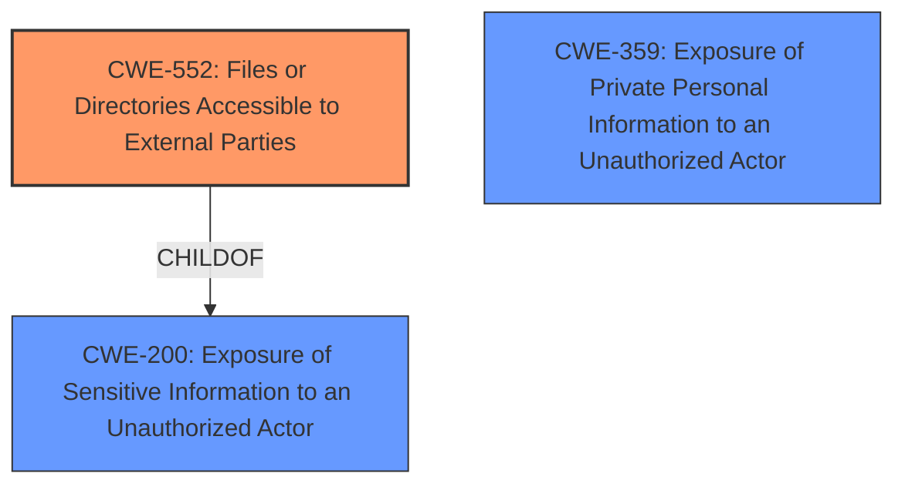

# Analysis for CVE-2024-13623

# Summary
| CWE ID | CWE Name | Confidence | CWE Abstraction Level | CWE Vulnerability Mapping Label | CWE-Vulnerability Mapping Notes |
|---|---|---|---|---|---|
| CWE-552 | Files or Directories Accessible to External Parties | 0.8 | Base | Allowed | Primary CWE |
| CWE-200 | Exposure of Sensitive Information to an Unauthorized Actor | 0.6 | Class | Discouraged | Secondary Candidate |
| CWE-359 | Exposure of Private Personal Information to an Unauthorized Actor | 0.5 | Base | Allowed | Secondary Candidate |

## Evidence and Confidence

*   **Confidence Score:** 0.7
*   **Evidence Strength:** MEDIUM

## Relationship Analysis
The primary relationship that influenced the decision was the hierarchical structure. CWE-552 is a more specific Base-level CWE that falls under the broader Class-level CWE-200. Since the vulnerability involves direct access to files, CWE-552 is more appropriate. CWE-359 is also related to exposure of information, but focuses on personal information.

## Vulnerability Chain
The vulnerability chain is relatively simple:
1.  Insecure Storage of Order Data: Sensitive order information is stored in files within the `/wp-content/uploads` directory.
2.  **Missing Authorization**: There is no access control mechanism in place to restrict access to these files.
3.  **Files or Directories Accessible to External Parties**: As a result, unauthenticated attackers can directly access and download these files.
4.  **Sensitive Information Exposure**: The exposed files contain sensitive order data, leading to information disclosure.

The **primary CWE** is the **CWE-552 Files or Directories Accessible to External Parties** because it directly reflects the **root cause** of the vulnerability, which is the lack of access control allowing unauthorized access to the files.

## Summary of Analysis
The initial analysis focused on identifying the root cause of the vulnerability, which is the insecure storage of sensitive data in publicly accessible files. The key evidence from the vulnerability description includes: "makes it possible for unauthenticated attackers to extract sensitive data stored insecurely in the /wp-content/uploads directory which can contain exported order information."

The retriever results suggested several CWEs, including CWE-200, CWE-359, CWE-425, and CWE-862. While CWE-200 and CWE-359 are related to information exposure, they are less specific than CWE-552, which directly addresses the issue of files being accessible to external parties. CWE-425 and CWE-862 relate to authorization issues but don't fully capture the problem of files being directly exposed.

The final decision to select CWE-552 is based on its direct alignment with the vulnerability description, its base level of abstraction, and its clear representation of the **root cause**. The confidence level is high due to the direct evidence from the vulnerability description. CWE-200 and CWE-359 are considered as secondary candidates because they are related to the impact of the vulnerability, but they do not represent the primary weakness.