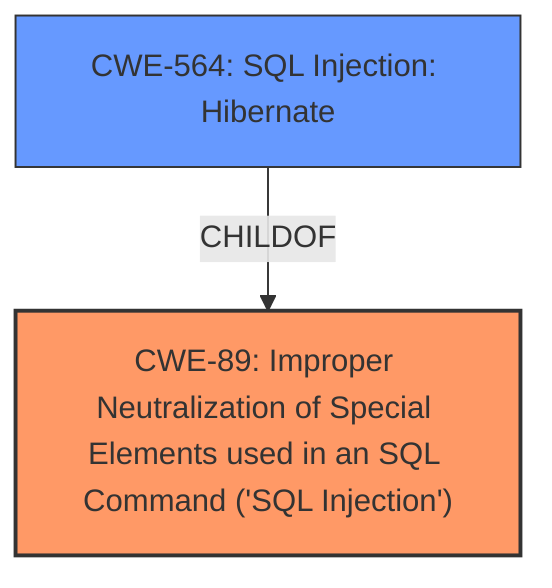

# Enhanced Analysis for CVE-2024-13680

# Summary

| CWE ID  | CWE Name                                                                 | Confidence | CWE Abstraction Level | CWE Vulnerability Mapping Label | CWE-Vulnerability Mapping Notes |
| :-------- | :----------------------------------------------------------------------- | :--------- | :---------------------- | :------------------------------ | :------------------------------ |
| CWE-89    | Improper Neutralization of Special Elements used in an SQL Command ('SQL Injection') | 1.0        | Base                    | Primary CWE                     | Allowed                       |

## Evidence and Confidence

*   **Confidence Score:** 1.0
*   **Evidence Strength:** HIGH

## Relationship Analysis

The primary relationship is that CWE-89 is a base level CWE, which is preferred. There are variant level CWEs that are children of CWE-89, such as CWE-564, but the description does not provide enough detail to determine if Hibernate is being used so CWE-89 is the better choice.



## Vulnerability Chain

The vulnerability chain starts with **insufficient escaping on the user supplied parameter and lack of sufficient preparation on the existing SQL query** (CWE-89), leading to the ability to append additional SQL queries and extract sensitive information.

## Summary of Analysis

The vulnerability description clearly states that the root cause is **insufficient escaping on the user supplied parameter and lack of sufficient preparation on the existing SQL query**, which directly aligns with CWE-89 (Improper Neutralization of Special Elements used in an SQL Command ('SQL Injection')). The description mentions that this allows attackers to append additional SQL queries to extract sensitive information.

The retriever results also strongly suggest CWE-89 as the primary candidate, with a score of 1.0.

The other CWEs considered, such as CWE-116, CWE-352, CWE-90, CWE-863, CWE-790, CWE-862, CWE-502, CWE-564 and CWE-613, are not as directly relevant. CWE-116 is too general, and the others focus on different types of vulnerabilities (CSRF, LDAP Injection, Authorization issues, Deserialization, Session Expiration).

The selection of CWE-89 is at the optimal level of specificity, as it accurately captures the **root cause** of the vulnerability without being overly specific (like CWE-564), which requires more specific evidence about the technology stack.

# Enhanced Context (25 CWEs)
The following CWEs were identified as potentially relevant to this vulnerability:

## CWE-352: Cross-Site Request Forgery (CSRF)
**Abstraction Level**: Compound
**Similarity Score**: 0.71
**Source**: dense
**NOT USED:** This CWE is not relevant since the vulnerability is related to SQL Injection and not related to Cross-Site Request Forgery.

## CWE-472: External Control of Assumed-Immutable Web Parameter
**Abstraction Level**: Base
**Similarity Score**: 0.69
**Source**: dense
**NOT USED:** This CWE is not relevant since the vulnerability is related to SQL Injection and not related to external control of assumed-immutable web parameters.

## CWE-1236: Improper Neutralization of Formula Elements in a CSV File
**Abstraction Level**: Base
**Similarity Score**: 0.68
**Source**: dense
**NOT USED:** This CWE is not relevant since the vulnerability is related to SQL Injection and not related to CSV files.

## CWE-425: Direct Request ('Forced Browsing')
**Abstraction Level**: Base
**Similarity Score**: 0.68
**Source**: dense
**NOT USED:** This CWE is not relevant since the vulnerability is related to SQL Injection and not related to direct request.

## CWE-96: Improper Neutralization of Directives in Statically Saved Code ('Static Code Injection')
**Abstraction Level**: Base
**Similarity Score**: 0.68
**Source**: dense
**NOT USED:** This CWE is not relevant since the vulnerability is related to SQL Injection and not related to static code injection.

## CWE-434: Unrestricted Upload of File with Dangerous Type
**Abstraction Level**: Base
**Similarity Score**: 0.67
**Source**: dense
**NOT USED:** This CWE is not relevant since the vulnerability is related to SQL Injection and not related to unrestricted upload of file with dangerous type.

## CWE-116: Improper Encoding or Escaping of Output
**Abstraction Level**: Class
**Similarity Score**: 0.66
**Source**: dense
**NOT USED:** This is a class level CWE and the description is specific enough that we can choose CWE-89 which is a Base CWE.

## CWE-80: Improper Neutralization of Script-Related HTML Tags in a Web Page (Basic XSS)
**Abstraction Level**: Variant
**Similarity Score**: 0.66
**Source**: dense
**NOT USED:** This CWE is not relevant since the vulnerability is related to SQL Injection and not related to Cross-Site Scripting.

## CWE-89: Improper Neutralization of Special Elements used in an SQL Command ('SQL Injection')
**Abstraction Level**: Base
**Similarity Score**: 0.65
**Source**: dense
**USED:** This is the primary CWE because the vulnerability description states that the **root cause** is **insufficient escaping on the user supplied parameter and lack of sufficient preparation on the existing SQL query**, which aligns directly with CWE-89.

## CWE-639: Authorization Bypass Through User-Controlled Key
**Abstraction Level**: Base
**Similarity Score**: 0.65
**Source**: dense
**NOT USED:** This CWE is not relevant since the vulnerability is related to SQL Injection and not related to authorization bypass.

## CWE-116: Improper Encoding or Escaping of Output
**Abstraction Level**: Class
**Similarity Score**: 671.16
**Source**: sparse
**NOT USED:** This is a class level CWE and the description is specific enough that we can choose CWE-89 which is a Base CWE.

## CWE-89: Improper Neutralization of Special Elements used in an SQL Command ('SQL Injection')
**Abstraction Level**: Base
**Similarity Score**: 648.59
**Source**: sparse
**USED:** This is the primary CWE because the vulnerability description states that the **root cause** is **insufficient escaping on the user supplied parameter and lack of sufficient preparation on the existing SQL query**, which aligns directly with CWE-89.

## CWE-90: Improper Neutralization of Special Elements used in an LDAP Query ('LDAP Injection')
**Abstraction Level**: Base
**Similarity Score**: 602.59
**Source**: sparse
**NOT USED:** This CWE is not relevant since the vulnerability is related to SQL Injection and not related to LDAP Injection.

## CWE-943: Improper Neutralization of Special Elements in Data Query Logic
**Abstraction Level**: Class
**Similarity Score**: 554.86
**Source**: sparse
**NOT USED:** This CWE is not specific enough. CWE-89 is more specific.

## CWE-138: Improper Neutralization of Special Elements
**Abstraction Level**: Class
**Similarity Score**: 542.74
**Source**: sparse
**NOT USED:** This CWE is too generic.

## CWE-613: Insufficient Session Expiration
**Abstraction Level**: base
**Similarity Score**: 4.21
**Source**: graph
**NOT USED:** This CWE is not relevant since the vulnerability is related to SQL Injection and not related to session expiration.

## CWE-471: Modification of Assumed-Immutable Data (MAID)
**Abstraction Level**: base
**Similarity Score**: 2.72
**Source**: graph
**NOT USED:** This CWE is not relevant since the vulnerability is related to SQL Injection and not related to modification of assumed-immutable data.

## CWE-90: Improper Neutralization of Special Elements used in an LDAP Query ('LDAP Injection')
**Abstraction Level**: base
**Similarity Score**: 2.47
**Source**: graph
**NOT USED:** This CWE is not relevant since the vulnerability is related to SQL Injection and not related to LDAP Injection.

## CWE-425: Direct Request ('Forced Browsing')
**Abstraction Level**: Base
**Similarity Score**: 2.33
**Source**: graph
**NOT USED:** This CWE is not relevant since the vulnerability is related to SQL Injection and not related to direct request.

## CWE-94: Improper Control of Generation of Code ('Code Injection')
**Abstraction Level**: base
**Similarity Score**: 2.28
**Source**: graph
**NOT USED:** This CWE is not relevant since the vulnerability is related to SQL Injection and not related to code injection.

## CWE-564: SQL Injection: Hibernate
**Abstraction Level**: variant
**


## CWE Relationship Analysis

Current CWEs represent these abstraction levels: .


### Vulnerability Chain Analysis

**Chain starting from CWE-471:**
- 471 (Modification of Assumed-Immutable Data (MAID)) - ROOT


**Chain starting from CWE-94:**
- 94 (Improper Control of Generation of Code ('Code Injection')) - ROOT


### CWE Relationship Diagram

```mermaid
graph TD
    classDef primary fill:#f96,stroke:#333,stroke-width:2px
    classDef secondary fill:#69f,stroke:#333
    classDef tertiary fill:#9e9,stroke:#333
```