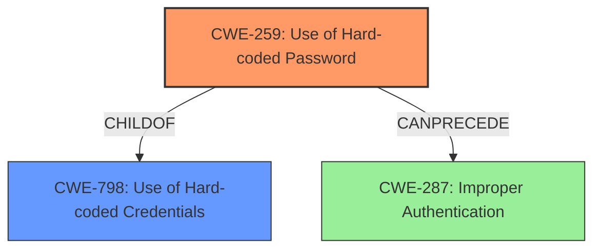

# Analysis Report for CVE-2024-13688

# Vulnerability Analysis Report: CVE-2024-13688

## Description

The Admin and Site Enhancements (ASE) WordPress plugin before 7.6.10 uses a hardcoded password in its Password Protection feature, allowing attacker to bypass the protection offered via a crafted request

## Vulnerability Description Key Phrases

- **Component:** Password Protection feature
- **Rootcause:** hardcoded password, uses a hardcoded password
- **Vector:** crafted request
- **Product:** Admin and Site Enhancements WordPress plugin
- **Impact:** bypass the protection
- **Attacker:** attacker
- **Version:** before 7.6.10

## Analysis (with Relationship Data)

# Summary
| CWE ID | CWE Name | Confidence | CWE Abstraction Level | CWE Vulnerability Mapping Label | CWE-Vulnerability Mapping Notes |
|---|---|---|---|---|---|
| CWE-259 | Use of Hard-coded Password | 1.0 | Variant | Allowed | Primary CWE. The plugin uses a hardcoded password, which is a specific type of hardcoded credential. |
| CWE-798 | Use of Hard-coded Credentials | 0.8 | Base | Allowed | The vulnerability involves the use of hardcoded credentials, but CWE-259 is a more specific variant. |
| CWE-287 | Improper Authentication | 0.7 | Class | Allowed-with-Review | Secondary Candidate. The hardcoded password leads to bypassing authentication. |

## Evidence and Confidence

*   **Confidence Score:** 0.9
*   **Evidence Strength:** HIGH

## Relationship Analysis
The primary weakness is the **use of a hard-coded password (CWE-259)**. This is a specific type of **hard-coded credential (CWE-798)**, making CWE-259 a child of CWE-798. The use of the hard-coded password leads to **improper authentication (CWE-287)**, allowing attackers to bypass protection.



## Vulnerability Chain
The vulnerability chain starts with the **hardcoded password (CWE-259)** which leads to **improper authentication (CWE-287)** and finally results in the **bypass of password protection**.

## Summary of Analysis
The primary root cause of this vulnerability is the **use of a hardcoded password (CWE-259)**. The vulnerability description clearly states the **rootcause: hardcoded password, uses a hardcoded password** and the "CVE Reference Links Content Summary" section also states "The plugin **uses a hardcoded password** in its Password Protection feature."
CWE-259 is a variant of CWE-798 (Use of Hard-coded Credentials), making it more specific and appropriate. The use of this hardcoded password leads directly to an authentication bypass, making CWE-287 (Improper Authentication) a consequence of the primary weakness. The selection of CWE-259 is based on direct evidence and the hierarchical relationship with CWE-798.

Other CWEs Considered:

*   CWE-798: While relevant as a parent, CWE-259 is a more specific variant.
*   CWE-352: Cross-Site Request Forgery (CSRF) - Not applicable, as the vulnerability is not related to CSRF.
*   CWE-425: Direct Request ('Forced Browsing') - Not applicable, as the vulnerability is not about forced browsing.
*   CWE-321: Use of Hard-coded Cryptographic Key - Not applicable, as the vulnerability involves a password, not a cryptographic key.
*   CWE-620: Unverified Password Change - Not applicable, as the vulnerability is not related to password changes.
*   CWE-306: Missing Authentication for Critical Function - While the impact is related to authentication, the root cause is the hardcoded password.
*   CWE-89: Improper Neutralization of Special Elements used in an SQL Command ('SQL Injection') - Not applicable, as the vulnerability is not related to SQL injection.
*   CWE-13: ASP.NET Misconfiguration: Password in Configuration File - Not applicable, as it's specific to ASP.NET and configuration files.
*   CWE-471: Modification of Assumed-Immutable Data (MAID) - Not applicable, as the vulnerability is not about modifying immutable data.


## CWE Relationship Analysis

Current CWEs represent these abstraction levels: .


### Vulnerability Chain Analysis

**Chain starting from CWE-321:**
- 321 (Use of Hard-coded Cryptographic Key) - ROOT


**Chain starting from CWE-89:**
- 89 (Improper Neutralization of Special Elements used in an SQL Command ('SQL Injection')) - ROOT


### CWE Relationship Diagram

```mermaid
graph TD
    classDef primary fill:#f96,stroke:#333,stroke-width:2px
    classDef secondary fill:#69f,stroke:#333
    classDef tertiary fill:#9e9,stroke:#333
```


*Report generated on 2025-07-13 04:28:55*
