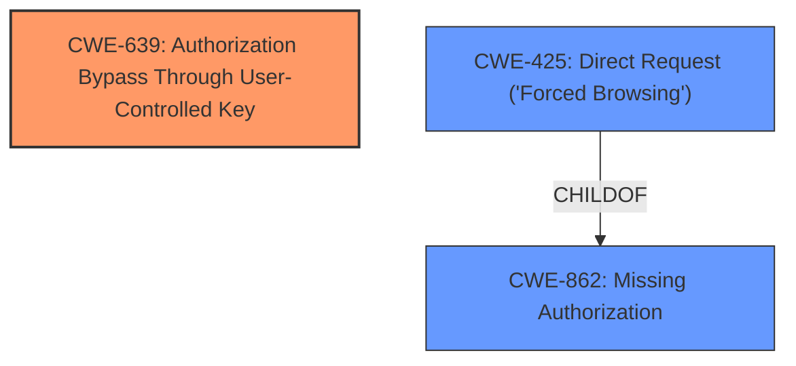

# Analysis Report for CVE-2024-13692

# Vulnerability Analysis Report: CVE-2024-13692

## Description

The Return Refund and Exchange For WooCommerce Return Management System, RMA Exchange, Wallet And Cancel Order Features plugin for WordPress is vulnerable to **Insecure Direct Object Reference** in all versions up to, and including, 4.4.5 via several functions due to **missing validation on a user controlled key**. This makes it possible for unauthenticated attackers to overwrite linked refund image attachments, overwrite refund request message, overwrite order messages, and read order messages of other users.

## Vulnerability Description Key Phrases

- **Component:** ['RMA Exchange', 'Wallet And Cancel Order Features plugin for WordPress']
- **Rootcause:** missing validation on a user controlled key
- **Weakness:** Insecure Direct Object Reference
- **Product:** Return Refund and Exchange For WooCommerce Return Management System
- **Impact:** overwrite linked refund image attachments, overwrite refund request message, overwrite order messages, and read order messages
- **Attacker:** unauthenticated attackers
- **Version:** up to and including 4.4.5

## Analysis (with Relationship Data)

# Summary
| CWE ID | CWE Name | Confidence | CWE Abstraction Level | CWE Vulnerability Mapping Label | CWE-Vulnerability Mapping Notes |
|---|---|---|---|---|---|
| CWE-639 | Authorization Bypass Through User-Controlled Key | 0.9 | Base | Allowed | Primary CWE |
| CWE-862 | Missing Authorization | 0.6 | Class | Allowed-with-Review | Secondary Candidate |
| CWE-425 | Direct Request ('Forced Browsing') | 0.5 | Base | Allowed | Secondary Candidate |

## Evidence and Confidence

*   **Confidence Score:** 0.8
*   **Evidence Strength:** MEDIUM

## Relationship Analysis
The primary CWE is CWE-639, which is a Base level CWE. CWE-862 is a Class level CWE and a parent of CWE-425. CWE-425 is a child of CWE-862, representing a specific type of **missing authorization**. CWE-639 describes a specific type of authorization bypass. Choosing the most specific CWE is best, but the evidence is limited.



## Vulnerability Chain
The vulnerability chain starts with **missing validation on a user controlled key** (CWE-639), which leads to **Insecure Direct Object Reference**. This allows unauthenticated attackers to overwrite linked refund image attachments, overwrite refund request message, overwrite order messages, and read order messages of other users.

## Summary of Analysis
The analysis indicates a vulnerability related to **missing validation on a user controlled key** leading to an **Insecure Direct Object Reference**. This allows unauthorized access and modification of data.

The primary CWE selected is CWE-639 (Authorization Bypass Through User-Controlled Key), which aligns with the **root cause** of the vulnerability, i.e., **missing validation on a user controlled key**. This CWE is a Base level weakness and accurately represents the vulnerability.

CWE-862 (Missing Authorization) and CWE-425 (Direct Request ('Forced Browsing')) were considered as secondary candidates. CWE-862 represents a broader class of authorization issues, while CWE-425 is a more specific instance. However, CWE-639 is more precise in capturing the essence of the vulnerability, which involves manipulating a user-controlled key to bypass authorization.

The decision to select CWE-639 is based on the vulnerability description mentioning **missing validation on a user controlled key**, which directly maps to the concept of authorization bypass through user-controlled keys.

The evidence "This makes it possible for unauthenticated attackers to overwrite linked refund image attachments, overwrite refund request message, overwrite order messages, and read order messages of other users" supports the selection of CWE-639 as it details the impact of the authorization bypass.

The retriever results also list CWE-639 as the top combined result, which further strengthens the confidence in the selection.

Relevant CWE Information:

# Enhanced Context (25 CWEs)
The following CWEs were identified as potentially relevant to this vulnerability:

## CWE-352: Cross-Site Request Forgery (CSRF)
**Abstraction Level**: Compound
**Similarity Score**: 0.74
**Source**: dense

**Description**:
The web application does not, or can not, sufficiently verify whether a well-formed, valid, consistent request was intentionally provided by the user who submitted the request.

**Mapping Guidance**:
- Usage: Allowed
- Rationale: This is a well-known Composite of multiple weaknesses that must all occur simultaneously, although it is attack-oriented in nature.

## CWE-472: External Control of Assumed-Immutable Web Parameter
**Abstraction Level**: Base
**Similarity Score**: 0.73
**Source**: dense

**Description**:
The web application does not sufficiently verify inputs that are assumed to be immutable but are actually externally controllable, such as hidden form fields.

**Mapping Guidance**:
- Usage: Allowed
- Rationale: This CWE entry is at the Base level of abstraction, which is a preferred level of abstraction for mapping to the root causes of vulnerabilities.

## CWE-425: Direct Request ('Forced Browsing')
**Abstraction Level**: Base
**Similarity Score**: 0.73
**Source**: dense

**Description**:
The web application does not adequately enforce appropriate authorization on all restricted URLs, scripts, or files.

**Mapping Guidance**:
- Usage: Allowed
- Rationale: This CWE entry is at the Base level of abstraction, which is a preferred level of abstraction for mapping to the root causes of vulnerabilities.

## CWE-639: Authorization Bypass Through User-Controlled Key
**Abstraction Level**: Base
**Similarity Score**: 0.72
**Source**: dense

**Description**:
The system's authorization functionality does not prevent one user from gaining access to another user's data or record by modifying the key value identifying the data.

**Mapping Guidance**:
- Usage: Allowed
- Rationale: This CWE entry is at the Base level of abstraction, which is a preferred level of abstraction for mapping to the root causes of vulnerabilities.

## CWE-434: Unrestricted Upload of File with Dangerous Type
**Abstraction Level**: Base
**Similarity Score**: 0.70
**Source**: dense

**Description**:
The product allows the upload or transfer of dangerous file types that are automatically processed within its environment.

**Mapping Guidance**:
- Usage: Allowed
- Rationale: This CWE entry is at the Base level of abstraction, which is a preferred level of abstraction for mapping to the root causes of vulnerabilities.

## CWE-502: Deserialization of Untrusted Data
**Abstraction Level**: Base
**Similarity Score**: 0.70
**Source**: dense

**Description**:
The product deserializes untrusted data without sufficiently ensuring that the resulting data will be valid.

**Mapping Guidance**:
- Usage: Allowed
- Rationale: This CWE entry is at the Base level of abstraction, which is a preferred level of abstraction for mapping to the root causes of vulnerabilities.

## CWE-116: Improper Encoding or Escaping of Output
**Abstraction Level**: Class
**Similarity Score**: 0.69
**Source**: dense

**Description**:
The product prepares a structured message for communication with another component, but encoding or escaping of the data is either missing or done incorrectly. As a result, the intended structure of the message is not preserved.

**Mapping Guidance**:
- Usage: Allowed-with-Review
- Rationale: This CWE entry is a Class and might have Base-level children that would be more appropriate

## CWE-359: Exposure of Private Personal Information to an Unauthorized Actor
**Abstraction Level**: Base
**Similarity Score**: 0.69
**Source**: dense

**Description**:
The product does not properly prevent a person's private, personal information from being accessed by actors who either (1) are not explicitly authorized to access the information or (2) do not have the implicit consent of the person about whom the information is collected.

**Mapping Guidance**:
- Usage: Allowed
- Rationale: This CWE entry is at the Base level of abstraction, which is a preferred level of abstraction for mapping to the root causes of vulnerabilities.

## CWE-294: Authentication Bypass by Capture-replay
**Abstraction Level**: Base
**Similarity Score**: 0.68
**Source**: dense

**Description**:
A capture-replay flaw exists when the design of the product makes it possible for a malicious user to sniff network traffic and bypass authentication by replaying it to the server in question to the same effect as the original message (or with minor changes).

**Mapping Guidance**:
- Usage: Allowed
- Rationale: This CWE entry is at the Base level of abstraction, which is a preferred level of abstraction for mapping to the root causes of vulnerabilities.

## CWE-862: Missing Authorization
**Abstraction Level**: Class
**Similarity Score**: 0.68
**Source**: dense

**Description**:
The product does not perform an authorization check when an actor attempts to access a resource or perform an action.

**Mapping Guidance**:
- Usage: Allowed-with-Review
- Rationale: This CWE entry is a Class and might have Base-level children that would be more appropriate

## CWE-639: Authorization Bypass Through User-Controlled Key
**Abstraction Level**: Base
**Similarity Score**: 506.88
**Source**: sparse

**Description**:
The system's authorization functionality does not prevent one user from gaining access to another user's data or record by modifying the key value identifying the data.

**Mapping Guidance**:
- Usage: Allowed
- Rationale: This CWE entry is at the Base level of abstraction, which is


## CWE Relationship Analysis

Current CWEs represent these abstraction levels: .


### Vulnerability Chain Analysis

**Chain starting from CWE-502:**
- 502 (Deserialization of Untrusted Data) - ROOT


**Chain starting from CWE-359:**
- 359 (Exposure of Private Personal Information to an Unauthorized Actor) - ROOT


### CWE Relationship Diagram

```mermaid
graph TD
    classDef primary fill:#f96,stroke:#333,stroke-width:2px
    classDef secondary fill:#69f,stroke:#333
    classDef tertiary fill:#9e9,stroke:#333
```


*Report generated on 2025-07-13 04:29:35*
