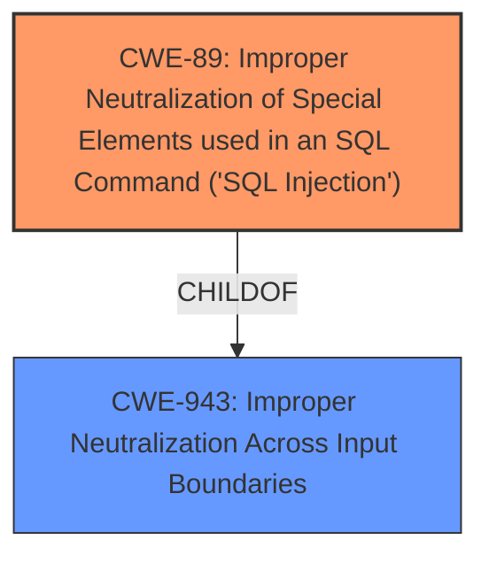

# Enhanced Analysis for CVE-2024-13713

# Summary
| CWE ID | CWE Name | Confidence | CWE Abstraction Level | CWE Vulnerability Mapping Label | CWE-Vulnerability Mapping Notes |
|---|---|---|---|---|---|
| CWE-89 | Improper Neutralization of Special Elements used in an SQL Command ('SQL Injection') | 1.0 | Base | Allowed | Primary CWE. The vulnerability description clearly states that the plugin is vulnerable to **SQL Injection** due to **insufficient escaping** and **lack of sufficient preparation** on the SQL query. |
| CWE-116 | Improper Encoding or Escaping of Output | 0.5 | Class | Allowed-with-Review | Secondary Candidate. While the primary issue is SQL injection, **improper escaping** is mentioned which relates to encoding/escaping of output. This might be a contributing factor, but it is not the primary root cause. |

## Evidence and Confidence

*   **Confidence Score:** 1.0
*   **Evidence Strength:** HIGH

## Relationship Analysis
The primary relationship is that CWE-89 is a type of injection vulnerability.
- Parent-child hierarchical relationships: CWE-89 can be considered a child of CWE-943 (Improper Neutralization Across Input Boundaries).
- Chain relationships: Input is received -> **Improper neutralization** (CWE-89) -> Sensitive data is disclosed or modified.



## Vulnerability Chain
The vulnerability chain starts with the receipt of user input, which is then used in an SQL query without proper neutralization, leading to **SQL Injection**.

Root Cause: **Insufficient escaping** and **lack of sufficient preparation** on the SQL query.
Weakness: **SQL Injection** (CWE-89)
Impact: Extract sensitive information from the database, append additional SQL queries.

## Summary of Analysis
The vulnerability is clearly an instance of **SQL Injection** (CWE-89) due to **insufficient escaping** and **lack of sufficient preparation** on the SQL query. The evidence is strong, and the description aligns well with the definition of CWE-89. The retriever results also strongly suggest CWE-89 as the primary weakness.

The decision is based on the vulnerability description stating "**SQL Injection** due to **insufficient escaping** on the user supplied parameter and **lack of sufficient preparation** on the existing SQL query".

The selected CWE is at the optimal level of specificity (Base) as it directly describes the nature of the vulnerability.

CWE-116 was considered as a secondary weakness because the root cause includes **insufficient escaping** which relates to encoding/escaping of output. However, since the main issue is an **SQL Injection** vulnerability, it is not the primary root cause.


## CWE Relationship Analysis

Current CWEs represent these abstraction levels: .


### Vulnerability Chain Analysis

**Chain starting from CWE-89:**
- 89 (Improper Neutralization of Special Elements used in an SQL Command ('SQL Injection')) - ROOT


**Chain starting from CWE-116:**
- 116 (Improper Encoding or Escaping of Output) - ROOT


### CWE Relationship Diagram

```mermaid
graph TD
    classDef primary fill:#f96,stroke:#333,stroke-width:2px
    classDef secondary fill:#69f,stroke:#333
    classDef tertiary fill:#9e9,stroke:#333
```