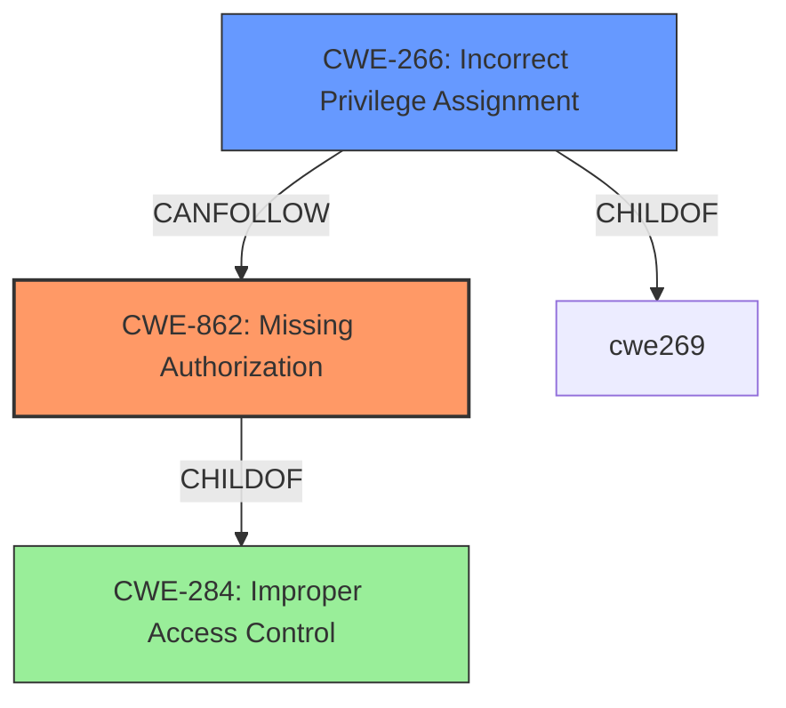

# Analysis for CVE-2024-13835

# Summary

| CWE ID | CWE Name | Confidence | CWE Abstraction Level | CWE Vulnerability Mapping Label | CWE-Vulnerability Mapping Notes |
|---|---|---|---|---|---|
| CWE-862 | Missing Authorization | 0.9 | Class | Allowed-with-Review | Primary CWE. The plugin does not check if the user has the appropriate authorization to modify user meta data in a multisite environment. |
| CWE-266 | Incorrect Privilege Assignment | 0.6 | Base | Allowed | Secondary candidate. The plugin incorrectly allows users with Administrator-level access to gain elevated privileges on subsites. |

## Evidence and Confidence

*   **Confidence Score:** 0.8
*   **Evidence Strength:** HIGH

## Relationship Analysis

The primary CWE is CWE-862, Missing Authorization, because the plugin **does not properly verifying the existence of a multisite installation** prior to allowing user meta to be added/modified. CWE-862 is a class-level CWE. CWE-266, Incorrect Privilege Assignment, is a base-level CWE and a potential consequence of missing authorization, where a user is granted privileges they should not have due to the missing check. Both CWE-862 and CWE-266 are related to access control issues, but CWE-862 directly addresses the **missing** authorization check, making it the primary cause.

## Vulnerability Chain

The vulnerability chain starts with the **missing authorization** check (CWE-862). This leads to the incorrect assignment of privileges (CWE-266), allowing authenticated attackers to gain elevated privileges on subsites.

Missing Authorization (CWE-862) -> Incorrect Privilege Assignment (CWE-266) -> Privilege Escalation (Impact)

## Summary of Analysis

The vulnerability description clearly indicates a **missing authorization** check as the root cause. The plugin **does not properly verify the existence of a multisite installation** before allowing user meta to be modified. This aligns with CWE-862 (Missing Authorization). The consequence of this missing check is that users can gain elevated privileges, which relates to CWE-266 (Incorrect Privilege Assignment).

The retriever results also support this, with CWE-862 being ranked as the top candidate. The guidance on privileges vs. permissions further reinforces this decision, emphasizing that when authorization logic is completely missing, CWE-862 is the most appropriate choice.

The selected CWEs are at an optimal level of specificity. CWE-862 is a class-level CWE, but is appropriate because there is no child-level CWE that fits better. The evidence strongly supports the identification of **missing authorization** as the primary issue, justifying the selection of CWE-862.

Relevant CWE Information:
*   **CWE-862: Missing Authorization** - The product does not perform any authorization check when an actor attempts to access a resource or perform an action.
*   **CWE-266: Incorrect Privilege Assignment** - A product incorrectly assigns a privilege to a particular actor, creating an unintended sphere of control for that actor.

Other CWEs Considered:

*   CWE-863 (Incorrect Authorization), CWE-285 (Improper Authorization): These were considered but deemed less appropriate because the issue is not that the authorization is incorrect, but that it is **missing** entirely.
*   CWE-269 (Improper Privilege Management): Discouraged because it is too high-level.
*   CWE-306 (Missing Authentication for Critical Function): While related, the issue isn't missing authentication, but missing authorization after authentication.