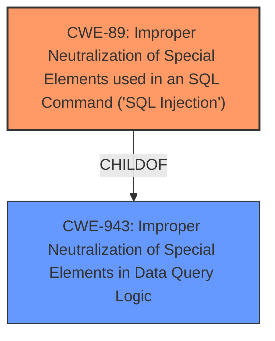

# Enhanced Analysis for CVE-2024-13844

# Summary
| CWE ID | CWE Name | Confidence | CWE Abstraction Level | CWE Vulnerability Mapping Label | CWE-Vulnerability Mapping Notes |
|---|---|---|---|---|---|
| CWE-89 | Improper Neutralization of Special Elements used in an SQL Command ('SQL Injection') | 1.0 | Base | Allowed | Primary CWE. The root cause is **insufficient escaping** of user-supplied parameters and a **lack of sufficient preparation** in the SQL query, directly leading to SQL Injection. |

## Evidence and Confidence

*   **Confidence Score:** 1.0
*   **Evidence Strength:** HIGH

## Relationship Analysis
The primary relationship to consider is that CWE-89 is a Base level CWE, representing a specific type of injection vulnerability. It is a child of CWE-943 (Improper Neutralization of Special Elements in Data Query Logic), which is a Class level CWE. Since the vulnerability description clearly indicates SQL injection due to **insufficient escaping** and **lack of sufficient preparation** within an SQL query, choosing the more specific CWE-89 is appropriate.



## Vulnerability Chain
The vulnerability chain starts with user-supplied input, followed by **insufficient escaping** and **lack of sufficient preparation** in the SQL query, leading to SQL injection. This allows attackers to append additional SQL queries and extract sensitive information.

User Input -> **Insufficient Escaping/Lack of Preparation** -> CWE-89 (SQL Injection) -> Data Extraction

## Summary of Analysis
The analysis is based on the vulnerability description, which highlights **insufficient escaping** on user-supplied parameters and **lack of sufficient preparation** on the existing SQL query as the root cause of the SQL injection vulnerability.

The retriever results strongly support CWE-89 as the primary weakness, with a score of 1.0. The description clearly states that the vulnerability allows authenticated attackers to append additional SQL queries, confirming that this is a case of SQL Injection. Therefore, CWE-89 is the most appropriate choice.

The selected CWE is at the optimal level of specificity because it accurately describes the specific type of injection occurring (SQL Injection) rather than a more general form of injection.

Relevant CWE Information:

# Enhanced Context (25 CWEs)

## CWE-352: Cross-Site Request Forgery (CSRF)
CWE-352 was considered, but it is not relevant because the vulnerability is SQL Injection, not a CSRF issue. CSRF involves tricking a user into performing actions on a web application without their consent, which is different from the described vulnerability.

## CWE-96: Improper Neutralization of Directives in Statically Saved Code ('Static Code Injection')
CWE-96 was considered, but it is not relevant because the injection is happening in an SQL query, not in statically saved code.

## CWE-116: Improper Encoding or Escaping of Output
CWE-116 was considered, but it is a more general case of improper encoding. Since the vulnerability is specifically SQL Injection, CWE-89 is more accurate.

## CWE-472: External Control of Assumed-Immutable Web Parameter
CWE-472 was considered, but it is not directly relevant to the SQL injection vulnerability described.

## CWE-93: Improper Neutralization of CRLF Sequences ('CRLF Injection')
CWE-93 was considered, but it is not relevant because the vulnerability is SQL Injection, not CRLF injection.

## CWE-89: Improper Neutralization of Special Elements used in an SQL Command ('SQL Injection')
CWE-89 is the most appropriate CWE as the **root cause** is **insufficient escaping** of parameters in SQL queries.

## CWE-502: Deserialization of Untrusted Data
CWE-502 was considered, but it is not relevant because the vulnerability is SQL Injection, not related to deserialization of untrusted data.

## CWE-425: Direct Request ('Forced Browsing')
CWE-425 was considered, but it is not relevant because the vulnerability is SQL Injection, not forced browsing.

## CWE-74: Improper Neutralization of Special Elements in Output Used by a Downstream Component ('Injection')
CWE-74 is a high-level CWE, and CWE-89 provides a more specific description of the vulnerability.

## CWE-80: Improper Neutralization of Script-Related HTML Tags in a Web Page (Basic XSS)
CWE-80 was considered, but it is not relevant because the vulnerability is SQL Injection, not XSS.

## CWE-90: Improper Neutralization of Special Elements used in an LDAP Query ('LDAP Injection')
CWE-90 was considered, but it is not relevant because the vulnerability is SQL Injection, not LDAP injection.

## CWE-943: Improper Neutralization of Special Elements in Data Query Logic
CWE-943 is a class-level CWE. Since the vulnerability is specifically SQL Injection, CWE-89 is more accurate.

## CWE-138: Improper Neutralization of Special Elements
CWE-138 is a class-level CWE and too general.

## CWE-613: Insufficient Session Expiration
CWE-613 is not related to SQL Injection vulnerabilities.

## CWE-117: Improper Output Neutralization for Logs
CWE-117 is not related to SQL Injection vulnerabilities.

## CWE-456: Missing Initialization of a Variable
CWE-456 is not related to SQL Injection vulnerabilities.

## CWE-1275: Sensitive Cookie with Improper SameSite Attribute
CWE-1275 is not related to SQL Injection vulnerabilities.

## CWE-144: Improper Neutralization of Line Delimiters
CWE-144 is not related to SQL Injection vulnerabilities.

## CWE-145: Improper Neutralization of Section Delimiters
CWE-145 is not related to SQL Injection vulnerabilities.

## CWE-120: Buffer Copy without Checking Size of Input ('Classic Buffer Overflow')
CWE-120 is not related to SQL Injection vulnerabilities.


## CWE Relationship Analysis

Current CWEs represent these abstraction levels: .


### Vulnerability Chain Analysis

**Chain starting from CWE-93:**
- 93 (Improper Neutralization of CRLF Sequences ('CRLF Injection')) - ROOT


**Chain starting from CWE-80:**
- 80 (Improper Neutralization of Script-Related HTML Tags in a Web Page (Basic XSS)) - ROOT


### CWE Relationship Diagram

```mermaid
graph TD
    classDef primary fill:#f96,stroke:#333,stroke-width:2px
    classDef secondary fill:#69f,stroke:#333
    classDef tertiary fill:#9e9,stroke:#333
```