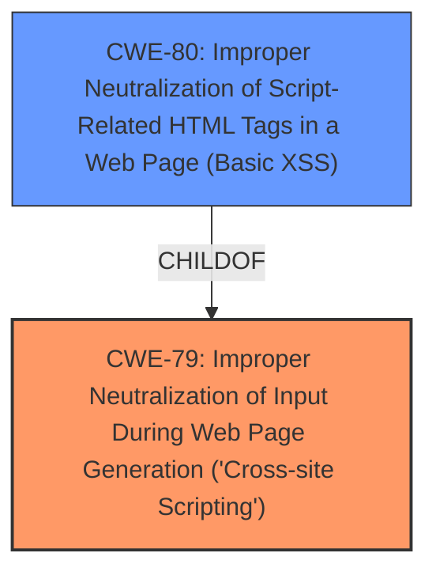

# Analysis for CVE-2024-13865

# Summary

| CWE ID | CWE Name | Confidence | CWE Abstraction Level | CWE Vulnerability Mapping Label | CWE-Vulnerability Mapping Notes |
|---|---|---|---|---|---|
| CWE-79 | Improper Neutralization of Input During Web Page Generation ('Cross-site Scripting') | 1.0 | Base | Allowed | Primary CWE: The plugin fails to properly neutralize user-controlled input before including it in a web page. |

## Evidence and Confidence

*   **Confidence Score:** 1.0
*   **Evidence Strength:** HIGH

## Relationship Analysis

The primary relationship considered was the parent-child relationship between CWE-79 and its variants. CWE-80, a variant of CWE-79, was considered but deemed less suitable as the description explicitly states the **improper sanitization and escaping** occurs before outputting it back in the page, indicating a broader neutralization issue rather than just script-related HTML tags. The base CWE-79 is a better fit than the class and pillar level CWEs.

## Vulnerability Chain

The vulnerability chain is straightforward:

1.  **Root Cause:** **Improper sanitization and escaping** of input.
2.  **Weakness:** Reflected Cross-Site Scripting (XSS).
3.  **Impact:** An attacker can inject malicious scripts into the web page, potentially compromising user accounts or performing unauthorized actions.

## Summary of Analysis

The analysis is based on the provided vulnerability description and the CVE reference content. The key piece of evidence is the statement that the plugin **does not sanitize and escape a parameter before outputting it back in the page**. This directly aligns with the definition of CWE-79, which describes **improper neutralization of user-controllable input before it is placed in output that is used as a web page**.

The graph relationships influenced the decision by highlighting the relationship between CWE-79 and CWE-80. While CWE-80 (Improper Neutralization of Script-Related HTML Tags in a Web Page (Basic XSS)) is related, the more general CWE-79 is more appropriate because the description doesn't limit the **improper sanitization and escaping** to just script-related tags.

The selected CWE is at the optimal level of specificity because it directly reflects the **root cause** of the vulnerability, which is the lack of proper neutralization of input before it is used in a web page.

Relevant CWE Information:

# Enhanced Context (25 CWEs)
The following CWEs were identified as potentially relevant to this vulnerability:

## CWE-352: Cross-Site Request Forgery (CSRF)
**Abstraction Level**: Compound
**Similarity Score**: 0.78
**Source**: dense

**Description**:
The web application does not, or can not, sufficiently verify whether a well-formed, valid, consistent request was intentionally provided by the user who submitted the request.

**Mapping Guidance**:
- Usage: Allowed
- Rationale: This is a well-known Composite of multiple weaknesses that must all occur simultaneously, although it is attack-oriented in nature.

*   Considered but not used: This CWE is not related to the vulnerability description, which focuses on **improper sanitization and escaping** leading to XSS, not CSRF.

## CWE-434: Unrestricted Upload of File with Dangerous Type
**Abstraction Level**: Base
**Similarity Score**: 0.73
**Source**: dense

**Description**:
The product allows the upload or transfer of dangerous file types that are automatically processed within its environment.

**Mapping Guidance**:
- Usage: Allowed
- Rationale: This CWE entry is at the Base level of abstraction, which is a preferred level of abstraction for mapping to the root causes of vulnerabilities.

*   Considered but not used: This CWE is not related to the vulnerability description, which focuses on **improper sanitization and escaping** leading to XSS, not file uploads.

## CWE-116: Improper Encoding or Escaping of Output
**Abstraction Level**: Class
**Similarity Score**: 0.73
**Source**: dense

**Description**:
The product prepares a structured message for communication with another component, but encoding or escaping of the data is either missing or done incorrectly. As a result, the intended structure of the message is not preserved.

**Mapping Guidance**:
- Usage: Allowed-with-Review
- Rationale: This CWE entry is a Class and might have Base-level children that would be more appropriate

*   Considered but not used: While related to the concept of **improper escaping**, this CWE is more general and less specific than CWE-79. CWE-79 directly addresses the context of web page generation and XSS.

## CWE-425: Direct Request ('Forced Browsing')
**Abstraction Level**: Base
**Similarity Score**: 0.73
**Source**: dense

**Description**:
The web application does not adequately enforce appropriate authorization on all restricted URLs, scripts, or files.

**Mapping Guidance**:
- Usage: Allowed
- Rationale: This CWE entry is at the Base level of abstraction, which is a preferred level of abstraction for mapping to the root causes of vulnerabilities.

*   Considered but not used: This CWE is not related to the vulnerability description, which focuses on **improper sanitization and escaping** leading to XSS, not authorization issues.

## CWE-80: Improper Neutralization of Script-Related HTML Tags in a Web Page (Basic XSS)
**Abstraction Level**: Variant
**Similarity Score**: 0.73
**Source**: dense

**Description**:
The product receives input from an upstream component, but it does not neutralize or incorrectly neutralizes special characters such as "<", ">", and "&" that could be interpreted as web-scripting elements when they are sent to a downstream component that processes web pages.

**Mapping Guidance**:
- Usage: Allowed
- Rationale: This CWE entry is at the Variant level of abstraction, which is a preferred level of abstraction for mapping to the root causes of vulnerabilities.

*   Considered but not used: While a more specific form of XSS, the provided information suggests that the lack of **proper sanitization and escaping** is a more general problem than just script-related HTML tags.

## CWE-472: External Control of Assumed-Immutable Web Parameter
**Abstraction Level**: Base
**Similarity Score**: 0.72
**Source**: dense

**Description**:
The web application does not sufficiently verify inputs that are assumed to be immutable but are actually externally controllable, such as hidden form fields.

**Mapping Guidance**:
- Usage: Allowed
- Rationale: This CWE entry is at the Base level of abstraction, which is a preferred level of abstraction for mapping to the root causes of vulnerabilities.

*   Considered but not used: This CWE is not the primary issue, although the vulnerable parameter is externally controlled.

## CWE-862: Missing Authorization
**Abstraction Level**: Class
**Similarity Score**: 0.72
**Source**: dense

**Description**:
The product does not perform an authorization check when an actor attempts to access a resource or perform an action.

**Mapping Guidance**:
- Usage: Allowed-with-Review
- Rationale: This CWE entry is a Class and might have Base-level children that would be more appropriate

*   Considered but not used: This CWE is not related to the vulnerability description, which focuses on **improper sanitization and escaping** leading to XSS, not authorization issues.

## CWE-639: Authorization Bypass Through User-Controlled Key
**Abstraction Level**: Base
**Similarity Score**: 0.70
**Source**: dense

**Description**:
The system's authorization functionality does not prevent one user from gaining access to another user's data or record by modifying the key value identifying the data.

**Mapping Guidance**:
- Usage: Allowed
- Rationale: This CWE entry is at the Base level of abstraction, which is a preferred level of abstraction for mapping to the root causes of vulnerabilities.

*   Considered but not used: This CWE is not related to the vulnerability description, which focuses on **improper sanitization and escaping** leading to XSS, not authorization issues.

## CWE-319: Cleartext Transmission of Sensitive Information
**Abstraction Level**: Base
**Similarity Score**: 0.70
**Source**: dense

**Description**:
The product transmits sensitive or security-critical data in cleartext in a communication channel that can be sniffed by unauthorized actors.

**Mapping Guidance**:
- Usage: Allowed
- Rationale: This CWE entry is at the Base level of abstraction, which is a preferred level of abstraction for mapping to the root causes of vulnerabilities.

*   Considered but not used: This CWE is not related to the vulnerability description, which focuses on **improper sanitization and escaping** leading to XSS, not data transmission issues.

## CWE