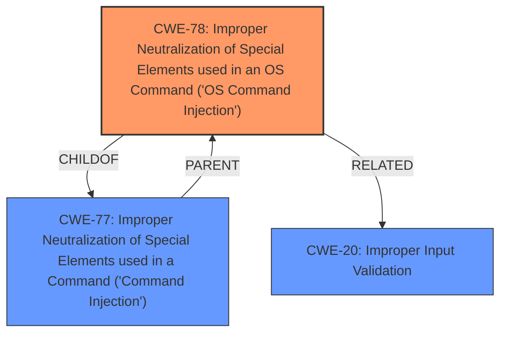

# Raw Analyzer Response for CVE-2024-13892

# Summary
| CWE ID | CWE Name | Confidence | CWE Abstraction Level | CWE Vulnerability Mapping Label | CWE-Vulnerability Mapping Notes |
|---|---|---|---|---|---|
| CWE-78 | Improper Neutralization of Special Elements used in an OS Command ('OS Command Injection') | 1 | Base | Allowed | Primary CWE. The **improper sanitization** leads directly to the **command injection** vulnerability. |
| CWE-20 | Improper Input Validation | 0.7 | Class | Discouraged | Secondary. The **lack of proper sanitization** is a form of input validation, but CWE-78 is more specific. |

## Evidence and Confidence

*   **Confidence Score:** 0.9
*   **Evidence Strength:** HIGH

## Relationship Analysis
The primary relationship that influenced my decision was the parent-child relationship between CWE-77 (Improper Neutralization of Special Elements used in a Command ('Command Injection')) and CWE-78 (Improper Neutralization of Special Elements used in an OS Command ('OS Command Injection')). Since the vulnerability specifically involves OS commands, CWE-78 is a more precise classification than the more general CWE-77. The relationship between CWE-20 (Improper Input Validation) and CWE-78 was also considered; CWE-20 is a broader category, while CWE-78 specifies the type of improper input handling and the command injection context.

## Vulnerability Chain
The vulnerability chain starts with **improper input sanitization**, leading directly to **command injection**. This is a straightforward chain:

1.  **Root Cause:** **Improper input sanitization** (lack of proper input validation).
2.  **Weakness:** Command injection (CWE-78).
3.  **Impact:** Unspecified in this description, but potentially including arbitrary code execution.

## Summary of Analysis
The analysis is based on the provided vulnerability description, which indicates that the **improper sanitization** of Access Point credentials leads to a **command injection** vulnerability in Smartwares cameras. The retriever results and complete CWE specifications were used to identify the most appropriate CWE.

The selection of CWE-78 is justified by the following evidence:

*   The vulnerability description explicitly mentions "command injection".
*   The retriever results list CWE-78 as a highly relevant CWE.
*   The description states that the input is "not properly sanitized", which directly relates to improper neutralization.

The graph relationships influenced the decision by highlighting the specialization of CWE-78 as an OS command injection, compared to the more general command injection (CWE-77). The chosen CWE is at the optimal level of specificity because it directly describes the vulnerability's root cause and the type of injection involved.

Relevant CWE Information:

# Enhanced Context (25 CWEs)
The following CWEs were identified as potentially relevant to this vulnerability:

## CWE-345: Insufficient Verification of Data Authenticity
**Abstraction Level**: Class
**Similarity Score**: 0.77

## CWE-138: Improper Neutralization of Special Elements
**Abstraction Level**: Class
**Similarity Score**: 0.77

## CWE-1391: Use of Weak Credentials
**Abstraction Level**: Class
**Similarity Score**: 0.76

## CWE-134: Use of Externally-Controlled Format String
**Abstraction Level**: Base
**Similarity Score**: 0.76

## CWE-74: Improper Neutralization of Special Elements in Output Used by a Downstream Component ('Injection')
**Abstraction Level**: Class
**Similarity Score**: 0.75

## CWE-807: Reliance on Untrusted Inputs in a Security Decision
**Abstraction Level**: Base
**Similarity Score**: 0.75

## CWE-303: Incorrect Implementation of Authentication Algorithm
**Abstraction Level**: Base
**Similarity Score**: 0.75

## CWE-798: Use of Hard-coded Credentials
**Abstraction Level**: Base
**Similarity Score**: 0.75

## CWE-116: Improper Encoding or Escaping of Output
**Abstraction Level**: Class
**Similarity Score**: 0.75

## CWE-20: Improper Input Validation
**Abstraction Level**: Class
**Similarity Score**: 0.75

## CWE-138: Improper Neutralization of Special Elements
**Abstraction Level**: Class
**Similarity Score**: 981.73

## CWE-116: Improper Encoding or Escaping of Output
**Abstraction Level**: Class
**Similarity Score**: 945.54

## CWE-89: Improper Neutralization of Special Elements used in an SQL Command ('SQL Injection')
**Abstraction Level**: Base
**Similarity Score**: 918.93

## CWE-78: Improper Neutralization of Special Elements used in an OS Command ('OS Command Injection')
**Abstraction Level**: Base
**Similarity Score**: 892.65

## CWE-1336: Improper Neutralization of Special Elements Used in a Template Engine
**Abstraction Level**: Base
**Similarity Score**: 885.33

## CWE-79: Improper Neutralization of Input During Web Page Generation ('Cross-site Scripting')
**Abstraction Level**: base
**Similarity Score**: 3.89

## CWE-73: External Control of File Name or Path
**Abstraction Level**: base
**Similarity Score**: 3.80

## CWE-88: Improper Neutralization of Argument Delimiters in a Command ('Argument Injection')
**Abstraction Level**: base
**Similarity Score**: 3.64

## CWE-89: Improper Neutralization of Special Elements used in an SQL Command ('SQL Injection')
**Abstraction Level**: base
**Similarity Score**: 3.49

## CWE-78: Improper Neutralization of Special Elements used in an OS Command ('OS Command Injection')
**Abstraction Level**: Base
**Similarity Score**: 2.98

## CWE-494: Download of Code Without Integrity Check
**Abstraction Level**: base
**Similarity Score**: 2.87

## CWE-1336: Improper Neutralization of Special Elements Used in a Template Engine
**Abstraction Level**: base
**Similarity Score**: 2.77

## CWE-113: Improper Neutralization of CRLF Sequences in HTTP Headers ('HTTP Request/Response Splitting')
**Abstraction Level**: variant
**Similarity Score**: 2.68

## CWE-94: Improper Control of Generation of Code ('Code Injection')
**Abstraction Level**: base
**Similarity Score**: 2.42

## CWE-120: Buffer Copy without Checking Size of Input ('Classic Buffer Overflow')
**Abstraction Level**: base
**Similarity Score**: 2.42

CWE-77 (Improper Neutralization of Special Elements used in a Command ('Command Injection')) was considered but not selected because CWE-78 is more specific to the OS command context. CWE-20 (Improper Input Validation) was considered as a general weakness, but CWE-78 provides more specific information about the vulnerability. All other CWEs were not selected due to their lower relevance to the specific vulnerability described.