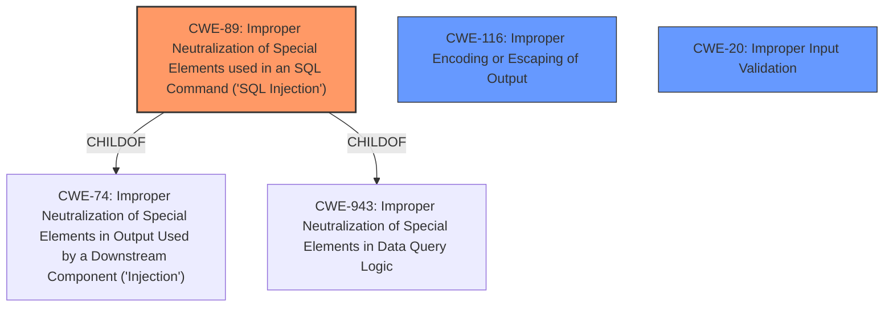

# Analysis Report for CVE-2024-13909

# Vulnerability Analysis Report: CVE-2024-13909

## Description

The Accredible Certificates & Open Badges plugin for WordPress is vulnerable to time-based SQL Injection via the orderby parameter in all versions up to, and including, 1.4.9 due to **insufficient escaping on the user supplied parameter and lack of sufficient preparation on the existing SQL query**. This makes it possible for authenticated attackers, with Administrator-level access and above, to append additional SQL queries into already existing queries that can be used to extract sensitive information from the database.

## Vulnerability Description Key Phrases

- **Rootcause:** ['insufficient escaping on the user supplied parameter and lack of sufficient preparation on the existing SQL query', 'insufficient escaping on user supplied parameter']
- **Weakness:** time-based SQL injection
- **Impact:** extract sensitive information from the database
- **Vector:** orderby parameter
- **Attacker:** authenticated attackers with Administrator-level access
- **Product:** Accredible Certificates & Open Badges plugin for WordPress
- **Version:** all versions up to and including 1.4.9

## Analysis (with Relationship Data)

# Summary
| CWE ID | CWE Name | Confidence | CWE Abstraction Level | CWE Vulnerability Mapping Label | CWE-Vulnerability Mapping Notes |
|---|---|---|---|---|---|
| CWE-89 | Improper Neutralization of Special Elements used in an SQL Command ('SQL Injection') | 1.0 | Base | Primary | Allowed |
| CWE-116 | Improper Encoding or Escaping of Output | 0.7 | Class | Secondary | Allowed-with-Review |
| CWE-20 | Improper Input Validation | 0.6 | Class | Secondary | Discouraged |

## Evidence and Confidence

*   **Confidence Score:** 0.9
*   **Evidence Strength:** HIGH

## Relationship Analysis
The primary weakness is CWE-89, which stems from the **insufficient escaping** and **lack of sufficient preparation** in the SQL query. CWE-89 is a base-level CWE, which is preferred. CWE-89 has hierarchical relationships as a ChildOf CWE-74 and CWE-943. CWE-116 is considered as a secondary CWE because it represents the **improper encoding or escaping of output**, which is a contributing factor to the SQL injection. CWE-20 is a high-level class that represents **improper input validation**, which is also a contributing factor.



## Vulnerability Chain
The vulnerability chain starts with **insufficient escaping on the user supplied parameter and lack of sufficient preparation on the existing SQL query**, leading to time-based SQL injection, which results in the ability to extract sensitive information from the database.

Root Cause:
1.  **Insufficient Escaping and Lack of Preparation**

Weakness:
2.  Time-based SQL Injection (CWE-89)

Impact:
3.  Extract Sensitive Information from Database

## Summary of Analysis
The analysis focuses on the root cause, which is the **insufficient escaping on the user supplied parameter and lack of sufficient preparation on the existing SQL query**. This leads to time-based SQL injection (CWE-89), which can then be exploited to extract sensitive information from the database. The primary CWE is CWE-89 because it directly addresses the SQL injection vulnerability resulting from the **improper neutralization of special elements used in an SQL command**. The secondary CWEs, CWE-116 and CWE-20, are contributing factors. CWE-116 highlights the improper encoding or escaping of output, while CWE-20 points to the lack of proper input validation.

The relationship graph highlights how CWE-89 is related to other CWEs. The choice of CWE-89 as the primary weakness is based on the evidence that the vulnerability is a time-based SQL injection caused by **insufficient escaping** and **lack of sufficient preparation** of the SQL query.

Relevant CWE Information:

*   **CWE-89: Improper Neutralization of Special Elements used in an SQL Command ('SQL Injection')**

    *   The product constructs all or part of an SQL command using externally-influenced input from an upstream component, but it does not neutralize or incorrectly neutralizes special elements that could modify the intended SQL command when it is sent to a downstream component. Without sufficient removal or quoting of SQL syntax in user-controllable inputs, the generated SQL query can cause those inputs to be interpreted as SQL instead of ordinary user data.
*   **CWE-116: Improper Encoding or Escaping of Output**

    *   The product prepares a structured message for communication with another component, but encoding or escaping of the data is either missing or done incorrectly. As a result, the intended structure of the message is not preserved.
*   **CWE-20: Improper Input Validation**

    *   The product receives input or data, but it does not validate or incorrectly validates that the input has the properties that are required to process the data safely and correctly.


## CWE Relationship Analysis

Current CWEs represent these abstraction levels: .


### Vulnerability Chain Analysis

**Chain starting from CWE-89:**
- 89 (Improper Neutralization of Special Elements used in an SQL Command ('SQL Injection')) - ROOT


**Chain starting from CWE-116:**
- 116 (Improper Encoding or Escaping of Output) - ROOT


### CWE Relationship Diagram

```mermaid
graph TD
    classDef primary fill:#f96,stroke:#333,stroke-width:2px
    classDef secondary fill:#69f,stroke:#333
    classDef tertiary fill:#9e9,stroke:#333
```


*Report generated on 2025-07-13 04:41:20*
