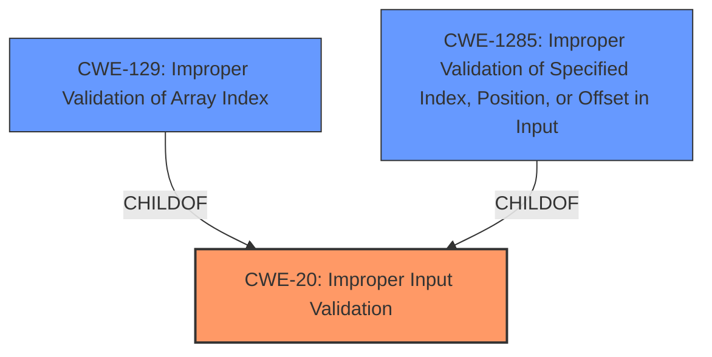

# Analysis for CVE-2024-13943

# Summary
| CWE ID | CWE Name | Confidence | CWE Abstraction Level | CWE Vulnerability Mapping Label | CWE-Vulnerability Mapping Notes |
|---|---|---|---|---|---|
| CWE-20 | Improper Input Validation | 0.9 | Class | Primary | Allowed, but discouraged. However, in this case, it is the most accurate high-level classification given the available information. |

## Evidence and Confidence

*   **Confidence Score:** 0.9
*   **Evidence Strength:** HIGH

## Relationship Analysis
The primary relationship that impacted my decision was the parent-child relationship between CWE-20 and its potential children. While a more specific child CWE would be ideal, the provided information does not allow for a determination beyond **improper input validation**.

## Vulnerability Chain
The vulnerability chain is:
1.  **Root Cause:** CWE-20 Improper Input Validation in the QCMAP\_ConnectionManager component.
2.  Impact: Sandbox escape leading to access to internal LAN network services.

## Summary of Analysis
The initial analysis identified **improper input validation** as the root cause, which is supported by both the vulnerability description and the CVE reference links content summary. The retriever results also list CWE-20 as the top candidate. Although CWE-20 is a Class-level CWE and is generally discouraged when more specific CWEs are available, the provided information does not allow for a more precise classification. The evidence clearly points to a validation issue as the root cause.

The analysis is based heavily on the provided evidence, particularly the "Vulnerability Description Key Phrases" and "CVE Reference Links Content Summary". The key phrases explicitly state "**rootcause:** **improper input validation**" and the summary confirms "Root cause of vulnerability: Improper input validation in the QCMAP\_ConnectionManager component."

The selected CWE is at a higher level of abstraction due to the limitations of the information provided. While more specific CWEs related to input validation might be applicable, there isn't enough detail to confidently select them.

Relevant CWE Information:

# Enhanced Context (25 CWEs)
The following CWEs were identified as potentially relevant to this vulnerability:

## CWE-20: Improper Input Validation
**Abstraction Level**: Class
**Similarity Score**: 0.72
**Source**: dense

**Description**:
The product receives input or data, but it does
        not validate or incorrectly validates that the input has the
        properties that are required to process the data safely and
        correctly.

**Mapping Guidance**:
- Usage: Discouraged
- Rationale: CWE-20 is commonly misused in low-information vulnerability reports when lower-level CWEs could be used instead, or when more details about the vulnerability are available [REF-1287]. It is not useful for trend analysis. It is also a level-1 Class (i.e., a child of a Pillar).

**Justification for inclusion:** The vulnerability description explicitly states that the root cause is **improper input validation**. Despite the discouraged usage, this CWE aligns directly with the identified root cause and is the most appropriate high-level classification.

## CWE-1285: Improper Validation of Specified Index, Position, or Offset in Input
**Abstraction Level**: Base
**Similarity Score**: 0.70
**Source**: dense

**Description**:
The product receives input that is expected to specify an index, position, or offset into an indexable resource such as a buffer or file, but it does not validate or incorrectly validates that the specified index/position/offset has the required properties.

**Mapping Guidance**:
- Usage: Allowed
- Rationale: This CWE entry is at the Base level of abstraction, which is a preferred level of abstraction for mapping to the root causes of vulnerabilities.

**Justification for exclusion:** While this CWE is related to input validation, there is no indication in the vulnerability description that the **improper validation** involves an index, position, or offset. Therefore, it is not specific enough.

## CWE-129: Improper Validation of Array Index
**Abstraction Level**: Variant
**Similarity Score**: 2.27
**Source**: graph

**Description**:
CWE-129: Improper Validation of Array Index

**Mapping Guidance**:
- Usage: Allowed
- Rationale: This CWE entry is at the Variant level of abstraction, which is a preferred level of abstraction for mapping to the root causes of vulnerabilities.

**Relationships**:
- CANPRECEDE -> CWE-789
- CANPRECEDE -> CWE-823
- CANPRECEDE -> CWE-119
- CHILDOF -> CWE-20
- CHILDOF -> CWE-1285

**Justification for exclusion:** Similar to CWE-1285, this CWE is too specific. There is no evidence to suggest the **improper validation** relates to an array index.

## CWE-787: Out-of-bounds Write
**Abstraction Level**: base
**Similarity Score**: 2.40
**Source**: graph

**Description**:
CWE-787: Out-of-bounds Write

**Mapping Guidance**:
- Usage: Allowed
- Rationale: This CWE entry is at the Base level of abstraction, which is a preferred level of abstraction for mapping to the root causes of vulnerabilities.

**Relationships**:
- CANFOLLOW -> CWE-825
- CANFOLLOW -> CWE-824
- CANFOLLOW -> CWE-823
- CANFOLLOW -> CWE-822
- PARENTOF -> CWE-124

**Justification for exclusion:** This CWE relates to writing outside the bounds of a buffer, which is not directly indicated in the description. The root cause is **improper input validation**, which can potentially lead to an out-of-bounds write, but the description doesn't explicitly state this.

## CWE-285: Improper Authorization
**Abstraction Level**: Class
**Similarity Score**: 575.59
**Source**: sparse

**Description**:
The product does not perform or incorrectly performs an authorization check when an actor attempts to access a resource or perform an action.

**Mapping Guidance**:
- Usage: Discouraged
- Rationale: CWE-285 is high-level and lower-level CWEs can frequently be used instead. It is a level-1 Class (i.e., a child of a Pillar).

**Justification for exclusion:** The description mentions abusing the service to assign LAN addresses, which *could* relate to authorization, but the primary issue is the **improper validation** of the input that allows this abuse in the first place. Therefore, CWE-20 is a more direct representation of the root cause.