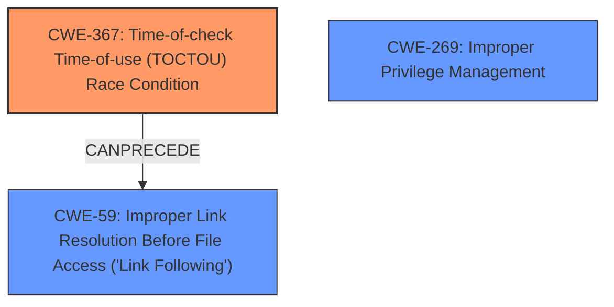

# Analysis Report for CVE-2024-13944

# Vulnerability Analysis Report: CVE-2024-13944

## Description

Link Following **Local Privilege Escalation Vulnerability** in NortonUtilitiesSvc in Norton Utilities Ultimate Version 24.2.16862.6344 on Windows 10 Pro x64 allows local attackers to escalate privileges and execute arbitrary code in the context of SYSTEM via the creation of a symbolic link and leveraging a TOCTTOU (time-of-check to time-of-use) attack.

## Vulnerability Description Key Phrases

- **Rootcause:** ['Time-of-check to time-of-use', 'privilege escalation']
- **Weakness:** Local Privilege Escalation Vulnerability
- **Impact:** ['escalate privileges and execute arbitrary code', 'privilege escalation']
- **Vector:** creation of a symbolic link
- **Attacker:** local attackers
- **Product:** Norton Utilities Ultimate
- **Version:** 24.2.16862.6344
- **Component:** NortonUtilitiesSvc

## Analysis (with Relationship Data)

# Summary
| CWE ID  | CWE Name                                                                                                                                    | Confidence | CWE Abstraction Level | CWE Vulnerability Mapping Label | CWE-Vulnerability Mapping Notes |
| :-------- | :------------------------------------------------------------------------------------------------------------------------------------------ | :--------- | :---------------------- | :------------------------------ | :------------------------------ |
| CWE-367   | Time-of-check Time-of-use (TOCTOU) Race Condition                                                                                            | 0.9        | Base                    | Primary                         | Allowed                         |
| CWE-59    | Improper Link Resolution Before File Access ('Link Following')                                                                              | 0.9        | Base                    | Secondary                       | Allowed                         |
| CWE-269   | Improper Privilege Management                                                                                                               | 0.7        | Class                   | Secondary                       | Allowed                         |

## Evidence and Confidence

*   **Confidence Score:** 0.9
*   **Evidence Strength:** HIGH

## Relationship Analysis
The primary weakness is CWE-367, which describes a **time-of-check time-of-use (TOCTOU) race condition**. The vulnerability description explicitly mentions a TOCTTOU attack as a key component. CWE-59 (Improper Link Resolution Before File Access) is also present because the attack involves creating a symbolic link. CWE-367 can precede CWE-59, as the race condition might allow the link to be followed improperly. Finally, **privilege escalation** means that CWE-269 (Improper Privilege Management) is present.



## Vulnerability Chain
The vulnerability chain starts with a **TOCTOU race condition (CWE-367)**, which allows an attacker to create a symbolic link pointing to a location they shouldn't have access to **(CWE-59)**, ultimately leading to **privilege escalation (CWE-269)** and arbitrary code execution in the context of SYSTEM.

## Summary of Analysis
The analysis is strongly based on the provided evidence, specifically the phrases "**Local Privilege Escalation Vulnerability**", "**symbolic link**" and "**time-of-check to time-of-use (TOCTTOU) attack**". The presence of these elements strongly suggests CWE-367 as the primary cause, with CWE-59 and CWE-269 contributing to the exploit's mechanism and impact. The selected CWEs are at the appropriate level of specificity, with CWE-367 being a Base CWE and CWE-59 being a Base CWE. CWE-269 is a Class CWE that describes **Improper Privilege Management**.


## CWE Relationship Analysis

Current CWEs represent these abstraction levels: .


### Vulnerability Chain Analysis

**Chain starting from CWE-269:**
- 269 (Improper Privilege Management) - ROOT


**Chain starting from CWE-59:**
- 59 (Improper Link Resolution Before File Access ('Link Following')) - ROOT


### CWE Relationship Diagram

```mermaid
graph TD
    classDef primary fill:#f96,stroke:#333,stroke-width:2px
    classDef secondary fill:#69f,stroke:#333
    classDef tertiary fill:#9e9,stroke:#333
```


*Report generated on 2025-07-13 04:44:41*
