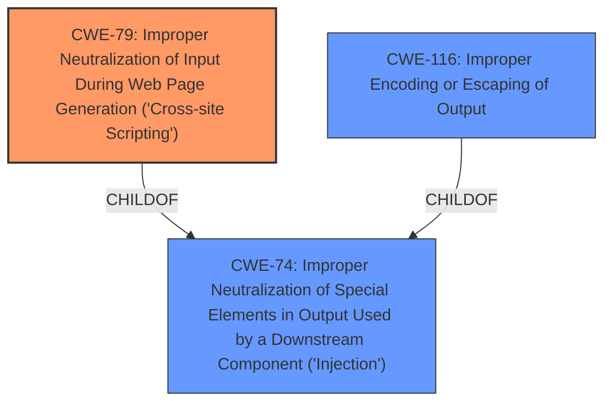

# Raw Analyzer Response for CVE-2024-1399

# Summary
| CWE ID    | CWE Name                                                                    | Confidence | CWE Abstraction Level | CWE Vulnerability Mapping Label | CWE-Vulnerability Mapping Notes |
| --------- | --------------------------------------------------------------------------- | ---------- | --------------------- | ------------------------------- | ----------------------------- |
| CWE-79    | Improper Neutralization of Input During Web Page Generation ('Cross-site Scripting') | 1          | Base                  | Primary CWE                     | Allowed                       |

## Evidence and Confidence

*   **Confidence Score:** 1
*   **Evidence Strength:** HIGH

## Relationship Analysis
The primary relationship impacting the decision is the parent-child relationship between CWE-79 and its parent classes. While several other CWEs were considered, CWE-79 directly addresses the **insufficient input sanitization and output escaping** leading to stored XSS. The base level of abstraction is appropriate as it provides a specific description of the vulnerability's root cause.

## Vulnerability Chain
The vulnerability chain starts with the **insufficient input sanitization and output escaping** of user-supplied attributes. This leads directly to the ability to inject arbitrary web scripts, resulting in a Stored Cross-Site Scripting (XSS) vulnerability. The chain is:

1.  **Root Cause:** **Insufficient input sanitization and output escaping**
2.  **Weakness:** CWE-79 Improper Neutralization of Input During Web Page Generation ('Cross-site Scripting')
3.  **Impact:** Arbitrary web script execution

## Summary of Analysis
The analysis is based on clear evidence within the vulnerability description and CVE reference. The root cause is explicitly stated as **insufficient input sanitization and output escaping**, which aligns perfectly with CWE-79. The attacker's ability to inject arbitrary web scripts confirms the XSS vulnerability.

The selection of CWE-79 is at the optimal level of specificity because it precisely describes the **improper neutralization of input during web page generation**, which is the core issue. Higher-level CWEs like CWE-74, while related, are less specific and do not capture the web-specific nature of the vulnerability.

The evidence supporting this decision includes:

*   "**insufficient input sanitization and output escaping on user supplied attributes**"
*   "authenticated attackers with contributor-level and above permissions to inject arbitrary web scripts"
*   "Stored Cross-Site Scripting"
*   "Root cause of vulnerability: Insufficient input sanitization and output escaping on user-supplied attributes within the plugin's shortcodes."
*   "Weaknesses/vulnerabilities present: Stored Cross-Site Scripting (XSS) vulnerability."
*   "Impact of exploitation: An attacker can inject arbitrary web scripts into pages."

**Other CWEs Considered:**

*   **CWE-116: Improper Encoding or Escaping of Output:** This CWE was considered because the description mentions output escaping. However, CWE-79 is a more specific match as it directly addresses XSS, which is the vulnerability in question.
*   **CWE-863: Incorrect Authorization:** This CWE was considered because the attacker needs to be an authenticated user. However, the core issue is not with authorization, but with the **improper handling of user input**, making CWE-79 a more appropriate choice.
*   **CWE-96: Improper Neutralization of Directives in Statically Saved Code ('Static Code Injection'):** This was considered because the vulnerability involves stored XSS. However, CWE-79 more accurately describes the root cause, which is the **lack of proper input sanitization** leading to the XSS vulnerability.