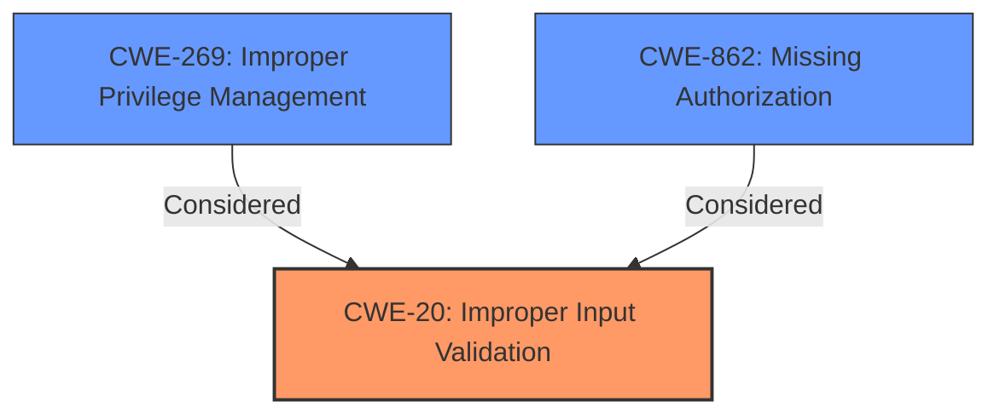

# Analysis for CVE-2024-1609

# Summary
| CWE ID | CWE Name | Confidence | CWE Abstraction Level | CWE Vulnerability Mapping Label | CWE-Vulnerability Mapping Notes |
|---|---|---|---|---|---|
| CWE-20 | Improper Input Validation | 0.9 | Class | Primary CWE | Discouraged: High-level, but best fit based on available information. |
| CWE-269 | Improper Privilege Management | 0.5 | Class | Secondary Candidate | Discouraged: Considered, but lack of specifics makes CWE-20 more appropriate |
| CWE-862 | Missing Authorization | 0.3 | Class | Secondary Candidate | Allowed-with-Review: Considered but there is no evidence authorization is missing |

## Evidence and Confidence

*   **Confidence Score:** 0.9
*   **Evidence Strength:** MEDIUM

## Relationship Analysis
The primary relationship considered was the parent-child relationship between CWE-20 (Improper Input Validation) and its potential children. However, the description lacks the specificity to pinpoint a more precise variant. CWE-269 and CWE-862 were considered due to the "privilege escalation" impact, but the root cause points directly to input validation.

## Vulnerability Chain
The vulnerability chain starts with **improper input validation** (CWE-20), which leads to a possible escalation of privilege. The description does not provide further details about how the **improper input validation** is exploited to achieve privilege escalation.

## Summary of Analysis
The primary CWE assigned is CWE-20 (Improper Input Validation) because the vulnerability description explicitly states that the root cause is **improper input validation**. The evidence from the Vulnerability Description Key Phrases supports this: "**rootcause:** **improper input validation**".

CWE-269 (Improper Privilege Management) was considered because the impact is "escalation of privilege". However, the CWE guidance explicitly states that CWE-269 is discouraged when a more specific root cause is known.

CWE-862 (Missing Authorization) was considered but rejected because the description doesn't mention missing authorization.

The selected CWE (CWE-20) is at the Class level. While more specific Base or Variant level CWEs are generally preferred, the lack of detail in the vulnerability description makes it difficult to pinpoint the exact nature of the input validation issue. Therefore, the Class level is the most appropriate level of specificity based on the available evidence.

Relevant CWE Information:

# Enhanced Context (25 CWEs)
The following CWEs were identified as potentially relevant to this vulnerability:

## CWE-20: Improper Input Validation
**Abstraction Level**: Class
**Similarity Score**: 0.121
**Source**: sparse

**Description**:
The product does not validate or incorrectly validates input that it receives. If the input is not validated, an attacker can supply crafted input that causes the system to perform an unintended operation.

**Mapping Guidance**:
- Usage: Discouraged
- Rationale: This CWE entry is very high level and should only be used if a more specific input validation issue cannot be identified.

## CWE-1284: Improper Validation of Specified Quantity in Input
**Abstraction Level**: Base
**Similarity Score**: 0.102
**Source**: sparse

**Description**:
The product receives an input value that specifies a quantity, but it does not validate or incorrectly validates that the quantity is within the expected bounds.

**Mapping Guidance**:
- Usage: Allowed
- Rationale: This CWE entry is at the Base level of abstraction, which is a preferred level of abstraction for mapping to the root causes of vulnerabilities.

## CWE-295: Improper Certificate Validation
**Abstraction Level**: Base
**Similarity Score**: 0.100
**Source**: sparse

**Description**:
The product does not validate, or improperly validates, the certificate presented to it by the remote end. This can occur in various ways, such as not checking the revocation status, not verifying the hostname, or using an expired certificate.

**Mapping Guidance**:
- Usage: Allowed
- Rationale: This CWE entry is at the Base level of abstraction, which is a preferred level of abstraction for mapping to the root causes of vulnerabilities.

## CWE-1285: Improper Validation of Specified Index, Position, or Offset in Input
**Abstraction Level**: Base
**Similarity Score**: 0.100
**Source**: sparse

**Description**:
The product receives an input value that is used as an index, position, or offset, but it does not validate or incorrectly validates that the input is within the expected bounds.

**Mapping Guidance**:
- Usage: Allowed
- Rationale: This CWE entry is at the Base level of abstraction, which is a preferred level of abstraction for mapping to the root causes of vulnerabilities.

## CWE-787: Out-of-bounds Write
**Abstraction Level**: base
**Similarity Score**: 0.099
**Source**: sparse

**Description**:
CWE-787: Out-of-bounds Write

**Mapping Guidance**:
- Usage: Allowed
- Rationale: This CWE entry is at the Base level of abstraction, which is a preferred level of abstraction for mapping to the root causes of vulnerabilities.

**Relationships**:
- CANFOLLOW -> CWE-825
- CANFOLLOW -> CWE-824
- CANFOLLOW -> CWE-823
- CANFOLLOW -> CWE-822
- PARENTOF -> CWE-124

## CWE-367: Time-of-check Time-of-use (TOCTOU) Race Condition
**Abstraction Level**: Base
**Similarity Score**: 0.099
**Source**: sparse

**Description**:
The product checks the state of a resource before using that resource, but the resource's state can change between the check and the use in a way that invalidates the results of the check. This can cause the product to perform invalid actions when the resource is in an unexpected state.

**Mapping Guidance**:
- Usage: Allowed
- Rationale: This CWE entry is at the Base level of abstraction, which is a preferred level of abstraction for mapping to the root causes of vulnerabilities.

## CWE-665: Improper Initialization
**Abstraction Level**: Class
**Similarity Score**: 0.095
**Source**: sparse

**Description**:
The product does not properly initialize a resource.

**Mapping Guidance**:
- Usage: Discouraged
- Rationale: This CWE entry is very high level and should only be used if a more specific initialization issue cannot be identified.

## CWE-862: Missing Authorization
**Abstraction Level**: Class
**Similarity Score**: 0.093
**Source**: sparse

**Description**:
The product does not perform any authorization checks when an actor attempts to access a resource or perform an action.

**Mapping Guidance**:
- Usage: Allowed-with-Review
- Rationale: This CWE entry is a Class and might have Base-level children that would be more appropriate

## CWE-939: Improper Authorization in Handler for Custom URL Scheme
**Abstraction Level**: base
**Similarity Score**: 0.531
**Source**: dense

**Description**:
CWE-939: Improper Authorization in Handler for Custom URL Scheme

**Mapping Guidance**:
- Usage: Allowed
- Rationale: This CWE entry is at the Base level of abstraction, which is a preferred level of abstraction for mapping to the root causes of vulnerabilities.

**Relationships**:
- CHILDOF -> CWE-862
- PARENTOF -> CWE-939

## CWE-781: Improper Address Validation in IOCTL with METHOD_NEITHER I/O Control Code
**Abstraction Level**: variant
**Similarity Score**: 0.002
**Source**: graph

**Description**:
CWE-781: Improper Address Validation in IOCTL with METHOD_NEITHER I/O Control Code

**Mapping Guidance**:
- Usage: Allowed
- Rationale: This CWE entry is at the Variant level of abstraction, which is a preferred level of abstraction for mapping to the root causes of vulnerabilities.

**Relationships**:
- CANFOLLOW -> CWE-782
- CANPRECEDE -> CWE-822
- CHILDOF -> CWE-1285
- CANFOLLOW -> CWE-781
- CANPRECEDE -> CWE-781