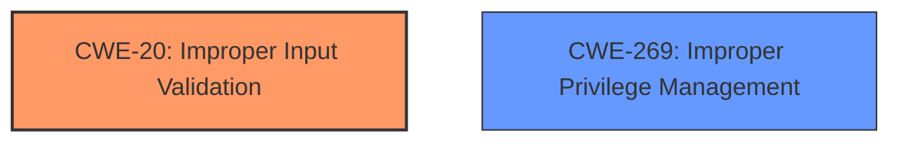

# Analysis for CVE-2024-1610

# Summary
| CWE ID    | CWE Name                                                        | Confidence | CWE Abstraction Level | CWE Vulnerability Mapping Label | CWE-Vulnerability Mapping Notes |
| :-------- | :-------------------------------------------------------------- | :--------- | :-------------------- | :------------------------------ | :------------------------------ |
| CWE-20    | Improper Input Validation                                       | 0.7        | Class                 | Primary                         | Discouraged                   |
| CWE-269   | Improper Privilege Management                                   | 0.5        | Class                 | Secondary                       | Discouraged                   |

## Evidence and Confidence

*   **Confidence Score:** 0.7
*   **Evidence Strength:** LOW

## Relationship Analysis
The primary relationship that influenced the decision was the ChildOf relationship, specifically how CWE-20 is a child of higher-level categories. Also, the guidance indicates that CWE-20 is discouraged and we should prefer more specific Base level CWEs. But, the evidence is lacking to pick a more specific CWE.

## Vulnerability Chain
The vulnerability chain starts with **improper input validation** (CWE-20), which leads to an escalation of privilege. The relationship data doesn't provide direct connections between CWE-20 and privilege escalation, reflecting the need for more specific CWEs to fully capture the chain.

## Summary of Analysis
The initial assessment pointed towards CWE-20 (Improper Input Validation) as the primary weakness, based on the vulnerability description's explicit mention of "**improper input validation**". However, the guidance discourages the use of CWE-20 when more specific CWEs are available. The description also mentions an "escalation of privilege". Since the provided information is limited and lacks specific technical details, choosing a more specific CWE would be speculative. CWE-269 is a plausible secondary candidate because "**improper input validation**" can lead to "**improper privilege management**". The final decision reflects the limited evidence available, resulting in a lower confidence score. More technical details about the **improper input validation** are needed to map the vulnerability to a more precise CWE.

Relevant CWE Information:

# Enhanced Context (25 CWEs)
The following CWEs were identified as potentially relevant to this vulnerability:

## Vulnerability Description
In OPPO Store APP, theres a possible escalation of privilege due to **improper input validation**.

### Vulnerability Description Key Phrases
- **rootcause:** **improper input validation**
- **impact:** escalation of privilege
- **product:** OPPO Store APP

## CVE Reference Links Content Summary
UNRELATED

## Retriever Results

### Top Combined Results

| Rank | CWE ID | Name | Abstraction | Usage  | Retrievers | Individual Scores |
|------|--------|------|-------------|-------|------------|-------------------|
| 1 | 20 | Improper Input Validation | Class | Discouraged | sparse | 0.114 |
| 2 | 1284 | Improper Validation of Specified Quantity in Input | Base | Allowed | sparse | 0.102 |
| 3 | 1285 | Improper Validation of Specified Index, Position, or Offset in Input | Base | Allowed | sparse | 0.100 |
| 4 | 367 | Time-of-check Time-of-use (TOCTOU) Race Condition | Base | Allowed | sparse | 0.099 |
| 5 | 287 | Improper Authentication | Class | Discouraged | sparse | 0.093 |
| 6 | 345 | Insufficient Verification of Data Authenticity | Class | Discouraged | sparse | 0.093 |
| 7 | 862 | Missing Authorization | Class | Allowed-with-Review | sparse | 0.092 |
| 8 | 1288 | Improper Validation of Consistency within Input | Base | Allowed | sparse | 0.092 |
| 9 | 269 | Improper Privilege Management | Class | Discouraged | dense | 0.517 |
| 10 | 770 | Allocation of Resources Without Limits or Throttling | Base | Allowed | graph | 0.002 |

Based on the above information, provide your analysis.
Consider the following key aspects:

1. **Content Matching**
   - Match the vulnerability description against CWE descriptions
   - Identify technical indicators that align with specific CWE characteristics
   - Pay special attention to CWEs with high relevance scores

2. **Relationship Analysis**
   - Evaluate hierarchical relationships (ChildOf, ParentOf) to find the optimal level of specificity
   - Examine chain relationships (CanPrecede, CanFollow, RequiredBy, Requires) to identify potential vulnerability chains
   - Consider peer relationships (PeerOf, CanAlsoBe) that may offer alternative classifications
   - Assess abstraction levels (Pillar, Class, Base, Variant) to ensure appropriate granularity

3. **Mapping Guidance Analysis**
   - Consider the official MITRE mapping guidance when selecting CWEs
   - Pay attention to Usage recommendations (ALLOWED, DISCOURAGED, PROHIBITED)
   - Review the provided rationale for mapping decisions
   - Consider suggested alternative mappings where appropriate

4. **Mitigation Analysis**
   - Consider how the potential mitigations align with the vulnerability description
   - Use mitigation information to help understand the nature of the weakness
   - Evaluate whether the mitigations would address the specific vulnerability described

5. **Evidence-Based Decision Making**
   - Use specific evidence from the vulnerability description to justify your classification
   - Consider how relationship context enhances your understanding of the vulnerability
   - Evaluate confidence based on both direct evidence and relationship insights
   - Consider the retriever scores as supporting evidence for your decisions