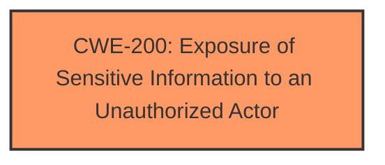

# Raw Analyzer Response for CVE-2024-1662

# Summary
| CWE ID | CWE Name | Confidence | CWE Abstraction Level | CWE Vulnerability Mapping Label | CWE-Vulnerability Mapping Notes |
|---|---|---|---|---|---|
| CWE-200 | Exposure of Sensitive Information to an Unauthorized Actor | 0.75 | Class | Allowed | Primary CWE |

## Evidence and Confidence

*   **Confidence Score:** 0.75
*   **Evidence Strength:** MEDIUM

## Relationship Analysis
The primary relationship considered was the child-parent relationship. While several CWEs were suggested, CWE-200, being a class-level CWE, is less specific than its children, but in this case, the provided information does not clearly indicate which child CWE would be a better fit.

## Vulnerability Chain
The vulnerability chain is relatively simple: The application **exposes sensitive information** due to an unspecified weakness, leading to **unauthorized access**.

## Summary of Analysis
The initial analysis pointed towards CWE-200 as the primary candidate, supported by the vulnerability description highlighting "Exposure of Sensitive Information to an Unauthorized Actor". The sparse retriever results also listed CWE-200.

The vulnerability description states "Exposure of Sensitive Information to an Unauthorized Actor vulnerability in PORTY Smart Tech Technology Joint Stock Company PowerBank Application allows Retrieve Embedded Sensitive Data." The key phrase "Exposure of Sensitive Information to an Unauthorized Actor" directly corresponds to CWE-200.

The confidence level is moderate because while the description clearly indicates exposure of sensitive information, the specific **root cause** or mechanism by which this occurs is not detailed. Without knowing the root cause it is difficult to select a more specific CWE.

Relevant CWE Information:

# Enhanced Context (25 CWEs)
The following CWEs were identified as potentially relevant to this vulnerability:

## CWE-200: Exposure of Sensitive Information to an Unauthorized Actor
**Abstraction Level**: Class
**Similarity Score**: 0.72
**Source**: dense

**Description**:
The product exposes sensitive information to an actor that is not explicitly authorized to have access to that information.

**Mapping Guidance**:
- Usage: Discouraged
- Rationale: CWE-200 is commonly misused to represent the loss of confidentiality in a vulnerability, but confidentiality loss is a technical impact - not a root cause error. As of CWE 4.9, over 400 CWE entries can lead to a loss of confidentiality. Other options are often available. [REF-1287].

### Considered but not used:

*   **CWE-201: Insertion of Sensitive Information Into Sent Data**: While potentially related, the description doesn't explicitly state that the sensitive information is being *inserted* into data being sent, just that it's being exposed. The description mentions "Retrieve Embedded Sensitive Data" which is not necessarily data being sent.

*   **CWE-321: Use of Hard-coded Cryptographic Key**: There's no indication of cryptographic keys being involved.

*   **CWE-598: Use of GET Request Method With Sensitive Query Strings**: The description does not mention HTTP GET requests.

*   **CWE-425: Direct Request ('Forced Browsing')**: This doesn't seem directly relevant as there's no mention of unauthorized access to URLs or files.

*   **CWE-497: Exposure of Sensitive System Information to an Unauthorized Control Sphere**: This is a possible candidate, but CWE-200 is more general and fits the description better without further information.

*   **CWE-306: Missing Authentication for Critical Function**: The description does not mention a missing authentication.

*   **CWE-287: Improper Authentication**: The description does not mention improper authentication.

*   **CWE-213: Exposure of Sensitive Information Due to Incompatible Policies**: The description does not mention incompatible policies.

*   **CWE-471: Modification of Assumed-Immutable Data (MAID)**: The description does not mention modification of immutable data.