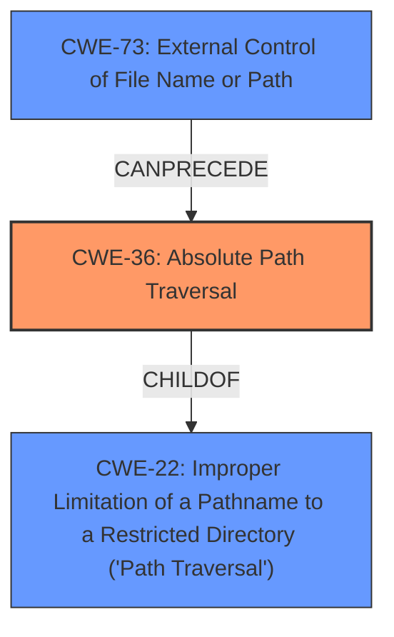

# Analysis for CVE-2024-1873

# Summary
| CWE ID | CWE Name | Confidence | CWE Abstraction Level | CWE Vulnerability Mapping Label | CWE-Vulnerability Mapping Notes |
|---|---|---|---|---|---|
| CWE-36 | Absolute Path Traversal | 1.0 | Base | Allowed | Primary CWE |
| CWE-73 | External Control of File Name or Path | 0.8 | Base | Allowed | Secondary Candidate |
| CWE-434 | Unrestricted Upload of File with Dangerous Type | 0.6 | Base | Allowed | Secondary Candidate |

## Evidence and Confidence

*   **Confidence Score:** 0.9
*   **Evidence Strength:** HIGH

## Relationship Analysis
The primary CWE is CWE-36, Absolute Path Traversal, which is a specific type of path traversal vulnerability. CWE-36 is a child of the broader CWE-22, Improper Limitation of a Pathname to a Restricted Directory ('Path Traversal'). CWE-73, External Control of File Name or Path, is related as it describes the general case where user input influences file paths. The vulnerability description clearly indicates the use of absolute paths, making CWE-36 the most appropriate choice.

## Vulnerability Chain
The vulnerability chain starts with the **improper file handling** of the `/select_database` endpoint, specifically the lack of proper sanitization of file paths. This leads to **path traversal** (CWE-36), allowing attackers to specify absolute paths. The impact of this is data loss and denial of service.

## Summary of Analysis
The initial analysis identified path traversal as a key weakness. After further analysis, the use of absolute paths in the vulnerability description made CWE-36 the best fit. The retriever results and graph relationships support this choice. The evidence from the vulnerability description, specifically the ability to specify absolute paths, strongly supports the selection of CWE-36.

The selection of CWE-36 is at the optimal level of specificity because it directly addresses the absolute path traversal aspect of the vulnerability.

Relevant CWE Information:

# Enhanced Context (25 CWEs)
The following CWEs were identified as potentially relevant to this vulnerability:

## CWE-36: Absolute Path Traversal
**Abstraction Level**: Base
**Similarity Score**: 0.555
**Source**: sparse

**Description**:
The product uses external input to construct an absolute pathname, but it does not properly neutralize special elements within the pathname that can cause the pathname to resolve to a location that is outside of the intended directory.

**Mapping Guidance**:
- Usage: Allowed
- Rationale: This CWE entry is at the Base level of abstraction, which is a preferred level of abstraction for mapping to the root causes of vulnerabilities.

### Justification of each selected CWE
*   **CWE-36: Absolute Path Traversal**
    *   **Technical Explanation:** The vulnerability description explicitly states that the `/select_database` endpoint improperly handles file paths, allowing attackers to specify absolute paths. This matches the definition of CWE-36, where external input is used to construct an absolute pathname without proper neutralization of special elements.
    *   **Security Implications:** This allows attackers to create directories anywhere on the system where the application has permissions, potentially leading to denial of service or data loss.
    *   **Relationship Analysis:** CWE-36 is a child of CWE-22, Improper Limitation of a Pathname to a Restricted Directory ('Path Traversal'). This hierarchical relationship indicates that CWE-36 is a more specific type of path traversal vulnerability.
    *   **Mapping Guidance:** The MITRE mapping guidance allows for the use of CWE-36, as it is at the Base level of abstraction.
    *   **Evidence:** "allowing attackers to specify absolute paths when interacting with the `DiscussionsDB` instance."
    *   **Confidence:** 1.0

*   **CWE-73: External Control of File Name or Path**
    *   **Technical Explanation:** The product allows user input to control or influence paths or file names that are used in filesystem operations. The `/select_database` endpoint allows user-controlled input to specify the database path.
    *   **Security Implications:** Attackers can manipulate the database path, resulting in the loss of client data by constantly changing the file location to an attacker-controlled location, scattering the data across the filesystem and making recovery difficult.
    *   **Relationship Analysis:** CWE-73 can precede CWE-36, as the external control of the file name or path is a prerequisite for absolute path traversal.
    *   **Mapping Guidance:** The MITRE mapping guidance allows for the use of CWE-73, as it is at the Base level of abstraction.
    *   **Evidence:** "The endpoint improperly handles file paths, allowing attackers to specify absolute paths".
    *   **Confidence:** 0.8

*   **CWE-434: Unrestricted Upload of File with Dangerous Type**
    *   **Technical Explanation:** Although not explicitly stated, the ability to control the database path could potentially lead to the upload or creation of files with dangerous types in arbitrary locations, contributing to the denial of service.
    *   **Security Implications:** Creating directories with names of critical files, such as HTTPS certificate files, causing server startup failures.
    *   **Relationship Analysis:** CWE-434 is related to CWE-73, as the external control of file names or paths can lead to the unrestricted upload of files with dangerous types.
    *   **Mapping Guidance:** The MITRE mapping guidance allows for the use of CWE-434, as it is at the Base level of abstraction.
    *   **Evidence:** "potentially leading to denial of service by creating directories with names of critical files, such as HTTPS certificate files, causing server startup failures"
    *   **Confidence:** 0.6

### CWEs Considered But Not Used:

*   **CWE-22: Improper Limitation of a Pathname to a Restricted Directory ('Path Traversal')**: While this is a parent of CWE-36, the specific use of absolute paths makes CWE-36 a more precise match.
*   **CWE-59: Improper Link Resolution Before File Access ('Link Following')**: This CWE is not applicable because the vulnerability does not involve the use of links or shortcuts.
*   **CWE-732: Incorrect Permission Assignment for Critical Resource**: This CWE is not directly applicable as the vulnerability stems from **improper file handling** rather than incorrect permission assignments.
*   **CWE-306: Missing Authentication for Critical Function**: While authentication might be a mitigating factor, the primary vulnerability is the **improper file handling**.