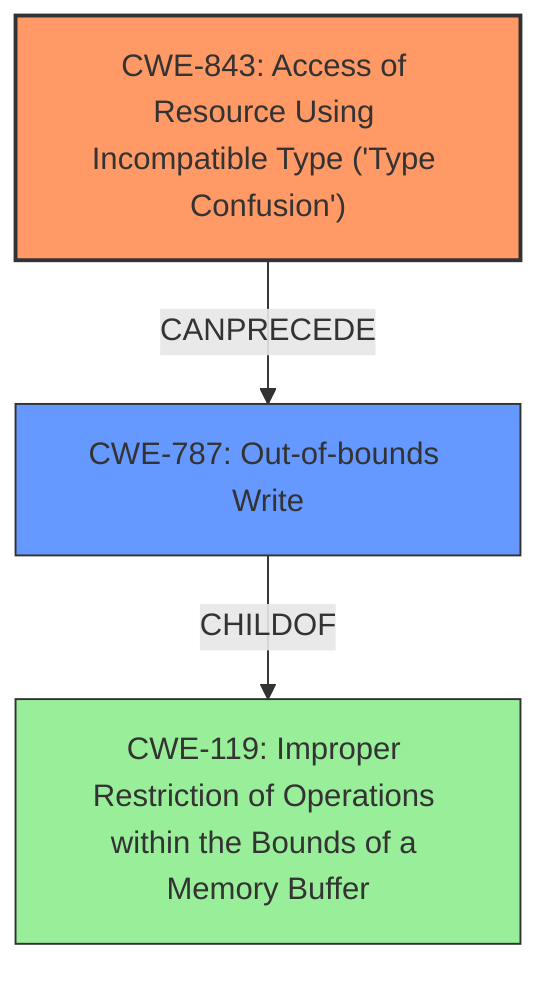

# Analysis Report for CVE-2024-20078

# Vulnerability Analysis Report: CVE-2024-20078

## Description

In venc, there is a possible **out of bounds write** due to **type confusion**. This could lead to local escalation of privilege with System execution privileges needed. User interaction is not needed for exploitation. Patch ID ALPS08737250 Issue ID MSV-1452.

## Vulnerability Description Key Phrases

- **Rootcause:** type confusion
- **Weakness:** out of bounds write
- **Impact:** local escalation of privilege
- **Component:** venc

## Analysis (with Relationship Data)

# Summary
| CWE ID | CWE Name | Confidence | CWE Abstraction Level | CWE Vulnerability Mapping Label | CWE-Vulnerability Mapping Notes |
|---|---|---|---|---|---|
| CWE-843 | Access of Resource Using Incompatible Type ('Type Confusion') | 0.9 | Base | Primary | Allowed |
| CWE-787 | Out-of-bounds Write | 0.8 | Base | Secondary | Allowed |

## Evidence and Confidence

*   **Confidence Score:** 0.9
*   **Evidence Strength:** HIGH

## Relationship Analysis
The primary weakness is **type confusion** (CWE-843), which leads to an **out-of-bounds write** (CWE-787). CWE-787 is a child of CWE-119 (Improper Restriction of Operations within the Bounds of a Memory Buffer), indicating a more general class of buffer-related errors. The relationship CANPRECEDE from CWE-120 (Buffer Copy without Checking Size of Input) to CWE-787 highlights a common path where insufficient size checking leads to out-of-bounds writes. Choosing CWE-843 as primary and CWE-787 as secondary captures both the root cause and the direct consequence.



## Vulnerability Chain
The vulnerability chain starts with **type confusion** (CWE-843) in the `venc` component. This **type confusion** leads to an **out-of-bounds write** (CWE-787). The impact of the **out-of-bounds write** is local escalation of privilege.

## Summary of Analysis
The primary root cause of the vulnerability is **type confusion**, which results in an **out-of-bounds write**. The vulnerability description clearly states "**out of bounds write** due to **type confusion**." The evidence is strong, with supporting information in the "Vulnerability Description Key Phrases" and "CVE Reference Links Content Summary." The retriever results also list CWE-843 and CWE-787 as highly relevant. The selection of CWE-843 as the primary cause and CWE-787 as a secondary weakness reflects the direct sequence of events. The abstraction levels are appropriate, with both CWEs at the Base level.

CWEs considered but not used:

*   CWE-266, CWE-274, CWE-280, CWE-267, CWE-269, CWE-285, CWE-863: These CWEs relate to incorrect privilege management or authorization, but the vulnerability description does not indicate any privilege or permission issues other than the final impact (escalation of privilege). The root cause is **type confusion** and the resulting **out-of-bounds write**, not a direct privilege management flaw.
*   CWE-667: Improper Locking: The vulnerability description does not suggest any issues with concurrent execution or locking.
*   CWE-404: Improper Resource Shutdown or Release: The vulnerability description does not suggest any issues with resource management.
*   CWE-754, CWE-703: Improper Check for Unusual or Exceptional Conditions: While an **out-of-bounds write** could be considered an exceptional condition, these CWEs are too high-level and do not capture the specific nature of the vulnerability.
*   CWE-131: Incorrect Calculation of Buffer Size: While it could lead to an out-of-bounds write, it isn't the root cause as it is **type confusion**.
*   CWE-362: Concurrent Execution using Shared Resource with Improper Synchronization ('Race Condition'): There is no evidence of concurrency issues.
*   CWE-1260, CWE-1257: Improper Handling of Overlap Between Protected Memory Ranges: There is no evidence of memory region overlap.
*   CWE-250: Execution with Unnecessary Privileges: The issue is not about the program running with elevated privileges.
*   CWE-123: Write-what-where Condition: While technically an out-of-bounds write allows writing to an arbitrary location, CWE-787 is a more direct and appropriate classification.
*   CWE-306: Missing Authentication for Critical Function: No authentication issues are mentioned.
*   CWE-191: Integer Underflow (Wrap or Wraparound): The vulnerability description does not indicate integer underflow issues.
*   CWE-908: Use of Uninitialized Resource: The description doesn't mention this condition.
*   CWE-223: Omission of Security-relevant Information: The description doesn't mention this condition.
*   CWE-1021: Improper Restriction of Rendered UI Layers or Frames: The description doesn't mention this condition.


## CWE Relationship Analysis

Current CWEs represent these abstraction levels: .


### Vulnerability Chain Analysis

**Chain starting from CWE-274:**
- 274 (Improper Handling of Insufficient Privileges) - ROOT


**Chain starting from CWE-131:**
- 131 (Incorrect Calculation of Buffer Size) - ROOT


### CWE Relationship Diagram

```mermaid
graph TD
    classDef primary fill:#f96,stroke:#333,stroke-width:2px
    classDef secondary fill:#69f,stroke:#333
    classDef tertiary fill:#9e9,stroke:#333
```


*Report generated on 2025-07-13 04:51:59*
