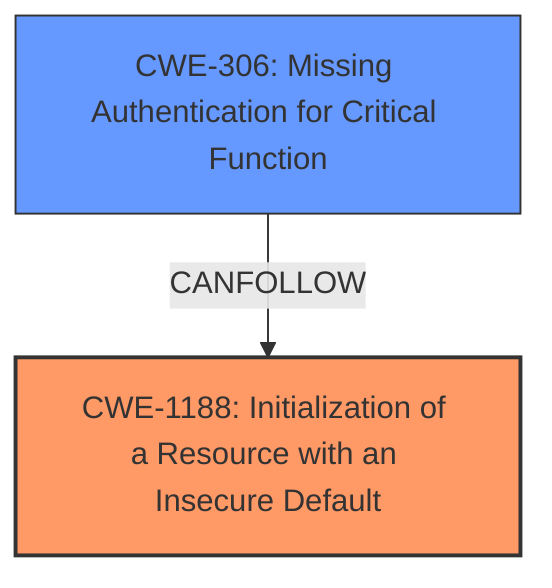

# Analysis Report for CVE-2024-20371

# Vulnerability Analysis Report: CVE-2024-20371

## Description

A vulnerability in the access control list (ACL) programming of Cisco Nexus 3550-F Switches could allow an unauthenticated, remote attacker to send traffic that should be blocked to the management interface of an affected device.&nbsp This vulnerability exists because **ACL deny rules are not properly enforced at the time of device reboot**. An attacker could exploit this vulnerability by attempting to send traffic to the management interface of an affected device. A successful exploit could allow the attacker to send traffic to the management interface of the affected device.

## Vulnerability Description Key Phrases

- **Rootcause:** ACL deny rules are not properly enforced at the time of device reboot
- **Impact:** ['device reboot', 'send traffic to management interface']
- **Attacker:** unauthenticated remote attacker
- **Product:** Cisco Nexus 3550-F Switches

## Analysis (with Relationship Data)

# Summary
| CWE ID | CWE Name | Confidence | CWE Abstraction Level | CWE Vulnerability Mapping Label | CWE-Vulnerability Mapping Notes |
|---|---|---|---|---|---|
| CWE-1188 | Initialization of a Resource with an Insecure Default | 0.8 | Base | Allowed | Primary CWE |
| CWE-306 | Missing Authentication for Critical Function | 0.6 | Base | Allowed | Secondary Candidate |

## Evidence and Confidence

*   **Confidence Score:** 0.7
*   **Evidence Strength:** HIGH

## Relationship Analysis
The primary relationship influencing the selection was the root cause and impact. The **ACL deny rules are not properly enforced at the time of device reboot**, which is a type of **Initialization of a Resource with an Insecure Default**. This can lead to other weaknesses such as **Missing Authentication for Critical Function**, but the root cause is the insecure initialization.



## Vulnerability Chain
The chain of events is:
1.  **Root Cause:** CWE-1188 **ACL deny rules are not properly enforced at the time of device reboot**
2.  **Weakness:** Missing Authentication for Critical Function (CWE-306) because the device fails to block traffic as intended.
3.  **Impact:** An unauthenticated, remote attacker could send traffic to the management interface of an affected device.

## Summary of Analysis
The initial assessment focused on identifying the root cause of the vulnerability. The key phrase, **ACL deny rules are not properly enforced at the time of device reboot** pointed towards a problem with how the device initializes its resources. After considering various CWEs, CWE-1188 emerged as the most fitting primary CWE, as it specifically addresses the issue of initializing a resource (in this case, ACL rules) with an insecure default.

The vulnerability description clearly states that "ACL deny rules are not properly enforced at the time of device reboot." This indicates that the ACL rules are not being initialized correctly or are being initialized in a way that does not provide the intended security.

The graph relationships and retriever results were helpful in narrowing down the potential CWEs. While CWE-306 was also considered, it was deemed a secondary weakness that arises as a result of the insecure initialization.

The selected CWEs are at the optimal level of specificity because they directly address the root cause and a consequence of the vulnerability, providing a clear understanding of the underlying issue.

Relevant CWE Information:

*   **CWE-1188: Initialization of a Resource with an Insecure Default**

    *   **Technical Explanation:** The vulnerability arises because the ACL deny rules are not properly enforced after a device reboot. This means that the ACLs, which are a security resource, are being initialized with an insecure or incomplete configuration. This insecure initialization leads to a state where traffic that should be blocked is not, effectively bypassing the intended security controls.
    *   **Security Implications and Potential Impact:** The immediate security implication is that an attacker can send unauthorized traffic to the management interface of the device. This could lead to further exploitation, such as gaining unauthorized access, disrupting services, or exfiltrating sensitive information.
    *   **Parent-Child Relationships:** CWE-1188 is a Base-level CWE.
    *   **Primary/Secondary:** This is the primary CWE because it represents the root cause of the vulnerability.
    *   **MITRE Mapping Guidance:** The usage is ALLOWED, which is in line with MITRE's recommendations for Base-level CWEs.
*   **CWE-306: Missing Authentication for Critical Function**

    *   **Technical Explanation:** The vulnerability can lead to a state where traffic that should be blocked isn't, meaning that authentication is effectively bypassed for critical functions related to managing the device.
    *   **Security Implications and Potential Impact:** The lack of proper ACL enforcement effectively creates a scenario where critical functions are exposed without proper authentication. An attacker could potentially exploit this to perform unauthorized actions on the device.
    *   **Parent-Child Relationships:** CWE-306 is a Base-level CWE and a child of CWE-287: Improper Authentication
    *   **Primary/Secondary:** This is a secondary CWE because it is a consequence of the primary weakness, which is the insecure initialization of ACL rules (CWE-1188).
    *   **MITRE Mapping Guidance:** The usage is ALLOWED, which is in line with MITRE's recommendations for Base-level CWEs.


## CWE Relationship Analysis

Current CWEs represent these abstraction levels: .


### Vulnerability Chain Analysis

**Chain starting from CWE-1188:**
- 1188 (Initialization of a Resource with an Insecure Default) - ROOT


**Chain starting from CWE-306:**
- 306 (Missing Authentication for Critical Function) - ROOT


### CWE Relationship Diagram

```mermaid
graph TD
    classDef primary fill:#f96,stroke:#333,stroke-width:2px
    classDef secondary fill:#69f,stroke:#333
    classDef tertiary fill:#9e9,stroke:#333
```


*Report generated on 2025-07-13 04:57:04*
