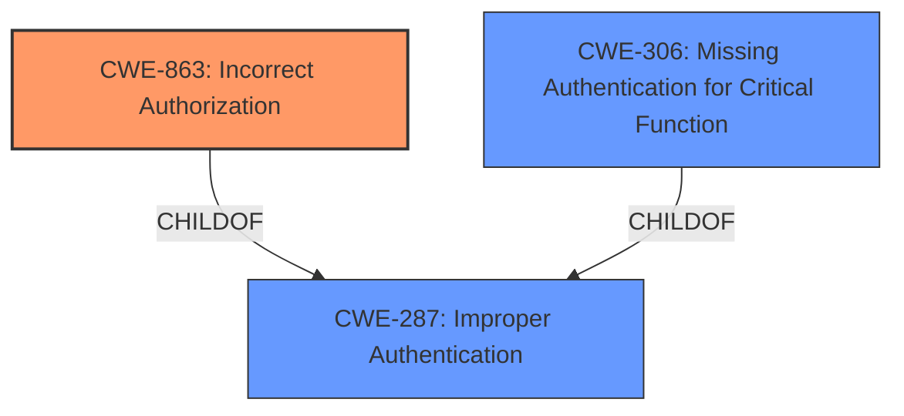

# Enhanced Analysis for CVE-2024-20373

# Summary
| CWE ID   | CWE Name                                                                | Confidence | CWE Abstraction Level | CWE Vulnerability Mapping Label | CWE-Vulnerability Mapping Notes |
| :-------- | :---------------------------------------------------------------------- | :--------- | :-------------------- | :------------------------------ | :------------------------------ |
| CWE-863 | Incorrect Authorization                                                    | 0.95       | Class               | Primary CWE                  | Allowed-with-Review           |
| CWE-306 | Missing Authentication for Critical Function                                | 0.75       | Base                  | Secondary Candidate            | Allowed                       |

## Evidence and Confidence

*   **Confidence Score:** 0.90
*   **Evidence Strength:** HIGH

## Relationship Analysis
The primary relationship influencing the CWE selection is the parent-child relationship between CWE-287 (Improper Authentication), CWE-306 (Missing Authentication for Critical Function), and CWE-863 (Incorrect Authorization). The vulnerability involves the software accepting extended ACLs without properly enforcing them, leading to an **incorrect authorization** scenario rather than a complete lack of authentication.



## Vulnerability Chain
The vulnerability chain begins with the **incorrect implementation of ACL handling** in Cisco IOS and IOS XE Software. This leads to a bypass of intended access restrictions, allowing unauthenticated remote attackers to perform unauthorized SNMP polling. The chain can be summarized as:

1.  **Root Cause:** **Incorrect ACL Handling** (implied by CWE-863)
2.  **Weakness:** **Incorrect Authorization** (CWE-863)
3.  **Impact:** SNMP polling of the device, even if SNMP traffic should be denied.

## Summary of Analysis
The initial analysis focused on the vulnerability description and CVE reference summary, highlighting the root cause as the system's failure to properly enforce extended IPv4 ACLs for SNMP, leading to an access control bypass. The Retriever results and CWE specifications were then reviewed to identify the most appropriate CWE.

The vulnerability description indicates that **Cisco IOS Software and Cisco IOS XE Software do not support extended IPv4 ACLs for SNMP**, but allow administrators to configure them without warning. This results in the configured ACL not being applied to the SNMP listening process, allowing unauthorized SNMP operations if the attacker has the correct community string or SNMPv3 credentials.

The primary CWE selected is **CWE-863 (Incorrect Authorization)** because the software *attempts* to perform access control via ACLs, but the implementation is flawed, resulting in a bypass.

CWE-306 (Missing Authentication for Critical Function) was considered, but the vulnerability is not a complete lack of authentication; it's an **incorrect authorization** because the ACL mechanism is present but not functioning as intended.

The selection of CWE-863 is at the optimal level of specificity because it accurately reflects the core issue: the authorization mechanism is present but flawed. Using a higher-level CWE like CWE-284 (Improper Access Control) would be too generic and would not capture the specific nature of the **incorrect authorization** vulnerability.

Relevant CWE Information:

# Enhanced Context (25 CWEs)
The following CWEs were identified as potentially relevant to this vulnerability:

## CWE-863: Incorrect Authorization
**Abstraction Level**: Class
**Similarity Score**: 2353.74
**Source**: sparse

**Description**:
The product performs an authorization check when an actor attempts to access a resource or perform an action, but it does not correctly perform the check.

**Mapping Guidance**:
- Usage: Allowed-with-Review
- Rationale: This CWE entry is a Class and might have Base-level children that would be more appropriate

## CWE-306: Missing Authentication for Critical Function
**Abstraction Level**: Base
**Similarity Score**: 2196.16
**Source**: sparse

**Description**:
The product does not perform any authentication for functionality that requires a provable user identity or consumes a significant amount of resources.

**Mapping Guidance**:
- Usage: Allowed
- Rationale: This CWE entry is at the Base level of abstraction, which is a preferred level of abstraction for mapping to the root causes of vulnerabilities.


## CWE Relationship Analysis

Current CWEs represent these abstraction levels: .


### Vulnerability Chain Analysis

**Chain starting from CWE-284:**
- 284 (Improper Access Control) - ROOT


**Chain starting from CWE-863:**
- 863 (Incorrect Authorization) - ROOT


### CWE Relationship Diagram

```mermaid
graph TD
    classDef primary fill:#f96,stroke:#333,stroke-width:2px
    classDef secondary fill:#69f,stroke:#333
    classDef tertiary fill:#9e9,stroke:#333
```