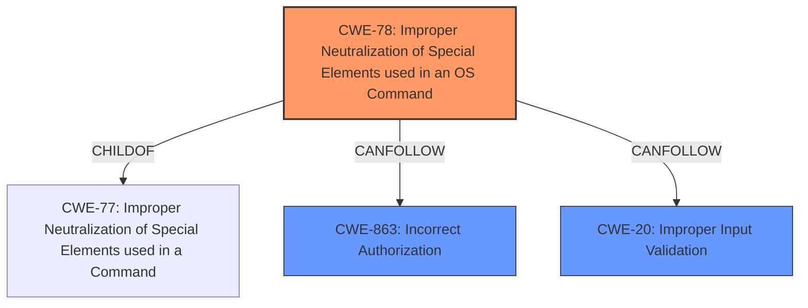

# Raw Analyzer Response for CVE-2024-20432

# Summary
| CWE ID  | CWE Name                                                                                             | Confidence | CWE Abstraction Level | CWE Vulnerability Mapping Label | CWE-Vulnerability Mapping Notes |
| :-------- | :----------------------------------------------------------------------------------------------------- | :--------- | :---------------------- | :------------------------------ | :------------------------------ |
| CWE-78  | Improper Neutralization of Special Elements used in an OS Command ('OS Command Injection') | 1          | Base                    | Primary                         | Allowed                         |
| CWE-863 | Incorrect Authorization                                                                            | 0.9        | Class                   | Secondary                       | Allowed-with-Review             |
| CWE-20  | Improper Input Validation                                                                            | 0.7        | Class                   | Secondary                       | Discouraged                   |

## Evidence and Confidence

*   **Confidence Score:** 0.9
*   **Evidence Strength:** HIGH

## Relationship Analysis
The primary weakness is **CWE-78** (Improper Neutralization of Special Elements used in an OS Command), which is a Base level CWE. It is related to **CWE-77** (Improper Neutralization of Special Elements used in a Command), its Class level parent. The vulnerability also involves **CWE-863** (Incorrect Authorization), which is a Class level CWE indicating an authorization issue. Finally, the vulnerability involves **CWE-20** (Improper Input Validation) because there was insufficient validation of command arguments.

## Vulnerability Chain
1.  **Root Cause:** Improper user authorization (**CWE-863**) and insufficient validation of command arguments (**CWE-20**).
2.  **Weakness:** **CWE-78** (Improper Neutralization of Special Elements used in an OS Command) is the command injection that occurs due to the lack of proper neutralization of special elements.
3.  **Impact:** Execution of arbitrary commands on the CLI of a Cisco NDFC-managed device with network-admin privileges.

The chain starts with authorization and input validation issues leading to command injection, which results in arbitrary command execution.

## Summary of Analysis
The primary CWE is **CWE-78** (Improper Neutralization of Special Elements used in an OS Command) because the core vulnerability is a **command injection** issue. This is supported by the vulnerability description stating "An attacker could exploit this vulnerability by submitting crafted commands to an affected REST API endpoint or through the web UI." The root cause is **improper user authorization** and **insufficient validation of command arguments**, indicating secondary weaknesses such as **CWE-863** (Incorrect Authorization) and **CWE-20** (Improper Input Validation).

**Evidence:**

*   Vulnerability Description Key Phrases:
    *   **rootcause:** **improper user authorization and insufficient validation of command arguments**
    *   **weakness:** **command injection**
*   CVE Reference Links Content Summary:
    *   **Root cause of vulnerability**: Improper user authorization and insufficient validation of command arguments.
    *   **Weaknesses/vulnerabilities present**: Command injection vulnerability in the REST API and web UI of Cisco Nexus Dashboard Fabric Controller (NDFC).

The Retriever Results also support the selection of **CWE-78** as it is listed as a Base level CWE and is related to command injection.

Other CWEs considered:

*   **CWE-77** (Improper Neutralization of Special Elements used in a Command ('Command Injection')): This is a Class-level CWE and a parent of **CWE-78**. While relevant, **CWE-78** is more specific as it explicitly mentions OS commands, making it a better fit.
*   **CWE-284** (Improper Access Control): This is a high-level CWE and is discouraged when more specific CWEs are available. Since the root cause includes both authorization and input validation issues, **CWE-863** and **CWE-20** are more appropriate.
*   **CWE-306** (Missing Authentication for Critical Function): While the description mentions an authenticated attacker, the primary issue is not a complete lack of authentication, but rather **improper authorization**, making **CWE-863** a better fit.

The final selection of **CWE-78**, **CWE-863**, and **CWE-20** provides a comprehensive view of the vulnerability, covering both the specific weakness (command injection) and the underlying root causes (authorization and input validation). These CWEs are at the optimal level of specificity based on the available evidence.