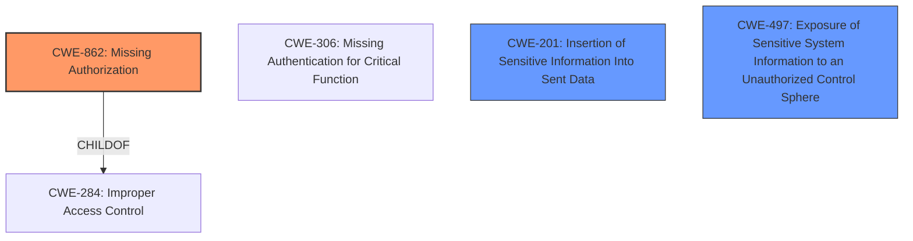

# Analysis for CVE-2024-20441

# Summary
| CWE ID  | CWE Name                                                       | Confidence | CWE Abstraction Level | CWE Vulnerability Mapping Label | CWE-Vulnerability Mapping Notes |
| :------- | :------------------------------------------------------------- | :--------- | :-------------------- | :------------------------------ | :------------------------------ |
| CWE-862 | Missing Authorization                                          | 0.9        | Base                  | Primary CWE                     | Allowed                       |
| CWE-201 | Insertion of Sensitive Information Into Sent Data              | 0.6        | Base                  | Secondary Candidate             | Allowed                       |
| CWE-497 | Exposure of Sensitive System Information to an Unauthorized Control Sphere | 0.6        | Base                  | Secondary Candidate             | Allowed                       |

## Evidence and Confidence

*   **Confidence Score:** 0.8
*   **Evidence Strength:** HIGH

## Relationship Analysis

The primary CWE is CWE-862 **Missing Authorization**, which is a base level CWE. CWE-284 **Improper Access Control** is a parent of CWE-862 and was considered but is too general. CWE-306 **Missing Authentication for Critical Function** was also considered, but the vulnerability description mentions an authenticated attacker, making it clear that authorization is the issue, not authentication. CWE-201 **Insertion of Sensitive Information Into Sent Data** and CWE-497 **Exposure of Sensitive System Information to an Unauthorized Control Sphere** were considered as potential secondary CWEs because the impact is that sensitive information is exposed.

## Vulnerability Chain

The vulnerability chain starts with **insufficient authorization** (**CWE-862**). An authenticated attacker can then send crafted API requests to download config or full backup files, ultimately leading to the exposure of sensitive configuration information (**CWE-201** and **CWE-497**). The **primary CWE** is CWE-862.

## Summary of Analysis

The initial analysis focused on identifying the root cause of the vulnerability. The vulnerability description clearly states that the vulnerability is due to **insufficient authorization** controls on a specific REST API endpoint. The CVE Reference Links Content Summary also confirms this, stating "**Root cause of vulnerability**: Insufficient authorization controls on a specific REST API endpoint in Cisco NDFC."

The Retriever Results listed several candidate CWEs, including CWE-284 **Improper Access Control**, CWE-285 **Improper Authorization**, and CWE-306 **Missing Authentication for Critical Function**. However, the vulnerability description specifies that the attacker is authenticated, eliminating CWE-306. While CWE-284 and CWE-285 are related to authorization, CWE-862 **Missing Authorization** is more specific because there is no authorization check, which aligns with the **insufficient authorization** root cause.

The guidance provided in the Authentication vs Authorization vs Access Control section further supports this decision. It specifically states that CWE-862 is appropriate when the application doesn't check whether the user is authorized at all.

CWE-201 **Insertion of Sensitive Information Into Sent Data** and CWE-497 **Exposure of Sensitive System Information to an Unauthorized Control Sphere** are potentially relevant because the impact of the vulnerability is the exposure of sensitive configuration information. These are being added as secondary candidates.

The selected CWEs are at the optimal level of specificity because they directly address the root cause (**insufficient authorization**) and the impact (exposure of sensitive information).