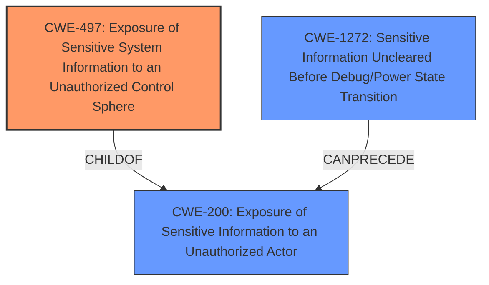

# Analysis Report for CVE-2024-20445

# Vulnerability Analysis Report: CVE-2024-20445

## Description

A vulnerability in the web UI of Cisco Desk Phone 9800 Series, Cisco IP Phone 7800 and 8800 Series, and Cisco Video Phone 8875 could allow an unauthenticated, remote attacker to access sensitive information on an affected device. This vulnerability is due to **improper storage of sensitive information** within the web UI of Session Initiation Protocol (SIP)-based phone loads. An attacker could exploit this vulnerability by browsing to the IP address of a device that has Web Access enabled. A successful exploit could allow the attacker to access sensitive information, including incoming and outgoing call records. Note Web Access is disabled by default.

## Vulnerability Description Key Phrases

- **Rootcause:** improper storage of sensitive information
- **Impact:** access sensitive information
- **Vector:** browsing to IP address with Web Access enabled
- **Attacker:** unauthenticated remote attacker
- **Product:** ['Cisco Desk Phone 9800 Series', 'Cisco IP Phone 7800 and 8800 Series', 'Cisco Video Phone 8875']
- **Component:** web UI

## Analysis (with Relationship Data)

# Summary
| CWE ID | CWE Name | Confidence | CWE Abstraction Level | CWE Vulnerability Mapping Label | CWE-Vulnerability Mapping Notes |
|---|---|---|---|---|---|
| CWE-497 | Exposure of Sensitive System Information to an Unauthorized Control Sphere | 0.8 | Base | Primary CWE | Allowed |

## Evidence and Confidence

*   **Confidence Score:** 0.8
*   **Evidence Strength:** HIGH

## Relationship Analysis
The primary CWE selected is CWE-497, which is a Base level CWE. There are other related CWEs, such as CWE-200 (Exposure of Sensitive Information to an Unauthorized Actor), but CWE-497 is more specific to system information. CWE-1272 (Sensitive Information Uncleared Before Debug/Power State Transition) was also considered, but it is less relevant as it focuses on debug or power state transitions.



## Vulnerability Chain
The vulnerability chain starts with the **improper storage of sensitive information** (CWE-497), which then leads to exposure of sensitive information, such as call records. The attacker can access this information by browsing to the IP address of the affected device, which has the web access enabled.

## Summary of Analysis
The initial assessment identified the **improper storage of sensitive information** as the root cause. The final decision to map this to CWE-497 is based on the vulnerability description and the CVE reference, which points out that the **improper storage** leads to information disclosure. The evidence is clear, and the selected CWE is at the appropriate level of specificity.

Relevant CWE Information:

# Enhanced Context (25 CWEs)
The following CWEs were identified as potentially relevant to this vulnerability:

## CWE-497: Exposure of Sensitive System Information to an Unauthorized Control Sphere
**Abstraction Level**: Base
**Similarity Score**: 0.78
**Source**: dense

**Description**:
The product does not properly prevent sensitive system-level information from being accessed by unauthorized actors who do not have the same level of access to the underlying system as the product does.

**Mapping Guidance**:
- Usage: Allowed
- Rationale: This CWE entry is at the Base level of abstraction, which is a preferred level of abstraction for mapping to the root causes of vulnerabilities.

## CWE-200: Exposure of Sensitive Information to an Unauthorized Actor
**Abstraction Level**: Class
**Similarity Score**: 0.75
**Source**: dense

**Description**:
The product exposes sensitive information to an actor that is not explicitly authorized to have access to that information.

**Mapping Guidance**:
- Usage: Discouraged
- Rationale: CWE-200 is commonly misused to represent the loss of confidentiality in a vulnerability, but confidentiality loss is a technical impact - not a root cause error. As of CWE 4.9, over 400 CWE entries can lead to a loss of confidentiality. Other options are often available. [REF-1287].

## CWE-1272: Sensitive Information Uncleared Before Debug/Power State Transition
**Abstraction Level**: base
**Similarity Score**: 4.33
**Source**: graph

**Description**:
CWE-1272: Sensitive Information Uncleared Before Debug/Power State Transition

**Mapping Guidance**:
- Usage: Allowed
- Rationale: This CWE entry is at the Base level of abstraction, which is a preferred level of abstraction for mapping to the root causes of vulnerabilities.

**Relationships**:
- CANPRECEDE -> CWE-200
- CHILDOF -> CWE-226
- PARENTOF -> CWE-1272
- CANFOLLOW -> CWE-1272

The vulnerability in Cisco Desk Phone 9800 Series, Cisco IP Phone 7800 and 8800 Series, and Cisco Video Phone 8875 allows an unauthenticated, remote attacker to access sensitive information on an affected device. This is due to **improper storage of sensitive information** within the web UI of Session Initiation Protocol (SIP)-based phone loads.

I am selecting CWE-497 (Exposure of Sensitive System Information to an Unauthorized Control Sphere) as the primary CWE. This is because the root cause is **improper storage of sensitive information**, which directly leads to the exposure of sensitive system-level information. The vulnerability description states that sensitive information, including incoming and outgoing call records, is accessible through the web UI. This aligns with the description of CWE-497, which states that the product does not properly prevent sensitive system-level information from being accessed by unauthorized actors. The "Mapping Guidance" for CWE-497 indicates "Usage: Allowed" and "Rationale: This CWE entry is at the Base level of abstraction, which is a preferred level of abstraction for mapping to the root causes of vulnerabilities." This further supports the selection of CWE-497 as the primary CWE.

CWE-200 (Exposure of Sensitive Information to an Unauthorized Actor) was also considered, but it is a more general case of information exposure. The specific vulnerability is related to system information, making CWE-497 a better fit. The "Mapping Guidance" for CWE-200 indicates "Usage: Discouraged" and "Rationale: CWE-200 is commonly misused to represent the loss of confidentiality in a vulnerability, but confidentiality loss is a technical impact - not a root cause error."

CWE-1272 (Sensitive Information Uncleared Before Debug/Power State Transition) was also considered, but it focuses on debug/power state transitions, which is not the case here. The issue is related to **improper storage**, not clearing information during transitions.


## CWE Relationship Analysis

Current CWEs represent these abstraction levels: .


### Vulnerability Chain Analysis

**Chain starting from CWE-1272:**
- 1272 (Sensitive Information Uncleared Before Debug/Power State Transition) - ROOT


**Chain starting from CWE-200:**
- 200 (Exposure of Sensitive Information to an Unauthorized Actor) - ROOT


### CWE Relationship Diagram

```mermaid
graph TD
    classDef primary fill:#f96,stroke:#333,stroke-width:2px
    classDef secondary fill:#69f,stroke:#333
    classDef tertiary fill:#9e9,stroke:#333
```


*Report generated on 2025-07-13 05:02:57*
