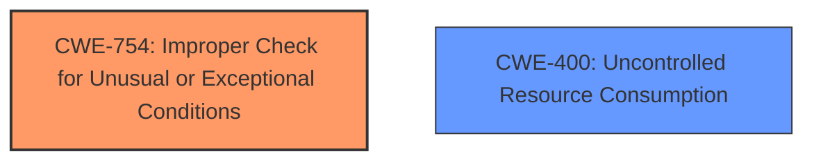

# Analysis Report for CVE-2024-20455

# Vulnerability Analysis Report: CVE-2024-20455

## Description

A vulnerability in the process that classifies traffic that is going to the Unified Threat Defense (UTD) component of Cisco IOS XE Software in controller mode could allow an unauthenticated, remote attacker to cause a denial of service (DoS) condition on an affected device. This vulnerability exists because UTD **improperly handles certain packets** as those packets egress an SD-WAN IPsec tunnel. An attacker could exploit this vulnerability by sending crafted traffic through an SD-WAN IPsec tunnel that is configured on an affected device. A successful exploit could allow the attacker to cause the device to reload, resulting in a DoS condition. Note SD-WAN tunnels that are configured with Generic Routing Encapsulation (GRE) are not affected by this vulnerability.

## Vulnerability Description Key Phrases

- **Rootcause:** improperly handles certain packets
- **Impact:** denial of service (DoS)
- **Vector:** crafted traffic through an SD-WAN IPsec tunnel
- **Attacker:** unauthenticated remote attacker
- **Product:** Cisco IOS XE Software
- **Component:** Unified Threat Defense (UTD) component

## Analysis (with Relationship Data)

# Summary
| CWE ID | CWE Name | Confidence | CWE Abstraction Level | CWE Vulnerability Mapping Label | CWE-Vulnerability Mapping Notes |
|---|---|---|---|---|---|
| CWE-754 | Improper Check for Unusual or Exceptional Conditions | 0.75 | Class | Allowed-with-Review | Primary CWE |
| CWE-400 | Uncontrolled Resource Consumption | 0.60 | Class | Discouraged | Secondary Candidate |

## Evidence and Confidence

*   **Confidence Score:** 0.70
*   **Evidence Strength:** MEDIUM

## Relationship Analysis
The primary relationship that impacted the decision was the parent-child relationship. CWE-754 is a Class-level CWE, and while it might be possible to find a more specific Base-level CWE, the information provided is not granular enough to make that determination confidently. CWE-400 was considered because the denial of service (DoS) impact often results from uncontrolled resource consumption.



## Vulnerability Chain
The vulnerability chain starts with the **improper handling of certain packets** (CWE-754). This leads to a condition where the device reloads, resulting in a denial-of-service (DoS) (CWE-400). The chain is:

1.  **Improper Handling of Packets** (CWE-754)
2.  **Device Reload**
3.  **Denial of Service (DoS)** (CWE-400)

## Summary of Analysis
The analysis is based on the provided evidence, primarily the vulnerability description and CVE reference links. The key phrase "**improperly handles certain packets**" strongly suggests a problem in how the UTD component processes specific network traffic.

The initial assessment considered CWE-20 (Improper Input Validation) because packet handling is related to input processing. However, the description highlights a more specific issue: the UTD component's inability to deal with "certain packets" specifically within an SD-WAN IPsec tunnel. This leans towards a condition check or specific exceptional case.

CWE-754 (Improper Check for Unusual or Exceptional Conditions) aligns better because it addresses the **improper handling** of situations that are not expected during normal operation. The "certain packets" that cause the issue can be considered unusual conditions within the context of SD-WAN IPsec tunnels. While the information is not highly detailed, there is enough to suggest a condition check problem.

CWE-400 (Uncontrolled Resource Consumption) is also considered because the ultimate impact is a denial of service (DoS). A DoS often involves resource exhaustion, making CWE-400 a relevant, but secondary, consideration since it describes impact.

The selection of CWE-754 is at the optimal level of specificity, given the available information. While a more specific Base CWE might exist, the current description does not offer sufficient details to pinpoint it accurately.

Relevant CWE Information:

# Enhanced Context (25 CWEs)
The following CWEs were identified as potentially relevant to this vulnerability:

## CWE-755: Improper Handling of Exceptional Conditions
**Abstraction Level**: Class
**Similarity Score**: 0.76
**Source**: dense

**Description**:
The product does not handle or incorrectly handles an exceptional condition.

**Mapping Guidance**:
- Usage: Discouraged
- Rationale: This CWE entry is a level-1 Class (i.e., a child of a Pillar). It might have lower-level children that would be more appropriate

## CWE-497: Exposure of Sensitive System Information to an Unauthorized Control Sphere
**Abstraction Level**: Base
**Similarity Score**: 0.74
**Source**: dense

**Description**:
The product does not properly prevent sensitive system-level information from being accessed by unauthorized actors who do not have the same level of access to the underlying system as the product does.

**Mapping Guidance**:
- Usage: Allowed
- Rationale: This CWE entry is at the Base level of abstraction, which is a preferred level of abstraction for mapping to the root causes of vulnerabilities.

## CWE-696: Incorrect Behavior Order
**Abstraction Level**: Class
**Similarity Score**: 0.73
**Source**: dense

**Description**:
The product performs multiple related behaviors, but the behaviors are performed in the wrong order in ways which may produce resultant weaknesses.

**Mapping Guidance**:
- Usage: Allowed-with-Review
- Rationale: This CWE entry is a Class and might have Base-level children that would be more appropriate

## CWE-617: Reachable Assertion
**Abstraction Level**: Base
**Similarity Score**: 0.73
**Source**: dense

**Description**:
The product contains an assert() or similar statement that can be triggered by an attacker, which leads to an application exit or other behavior that is more severe than necessary.

**Mapping Guidance**:
- Usage: Allowed
- Rationale: This CWE entry is at the Base level of abstraction, which is a preferred level of abstraction for mapping to the root causes of vulnerabilities.

## CWE-824: Access of Uninitialized Pointer
**Abstraction Level**: Base
**Similarity Score**: 0.73
**Source**: dense

**Description**:
The product accesses or uses a pointer that has not been initialized.

**Mapping Guidance**:
- Usage: Allowed
- Rationale: This CWE entry is at the Base level of abstraction, which is a preferred level of abstraction for mapping to the root causes of vulnerabilities.

## CWE-754: Improper Check for Unusual or Exceptional Conditions
**Abstraction Level**: Class
**Similarity Score**: 0.73
**Source**: dense

**Description**:
The product does not check or incorrectly checks for unusual or exceptional conditions that are not expected to occur frequently during day to day operation of the product.

**Mapping Guidance**:
- Usage: Allowed-with-Review
- Rationale: This CWE entry is a Class and might have Base-level children that would be more appropriate

## CWE-703: Improper Check or Handling of Exceptional Conditions
**Abstraction Level**: Pillar
**Similarity Score**: 0.72
**Source**: dense

**Description**:
The product does not properly anticipate or handle exceptional conditions that rarely occur during normal operation of the product.

**Mapping Guidance**:
- Usage: Discouraged
- Rationale: This CWE entry is extremely high-level, a Pillar.

## CWE-119: Improper Restriction of Operations within the Bounds of a Memory Buffer
**Abstraction Level**: Class
**Similarity Score**: 0.72
**Source**: dense

**Description**:
The product performs operations on a memory buffer, but it reads from or writes to a memory location outside the buffer's intended boundary. This may result in read or write operations on unexpected memory locations that could be linked to other variables, data structures, or internal program data.

**Mapping Guidance**:
- Usage: Discouraged
- Rationale: CWE-119 is commonly misused in low-information vulnerability reports when lower-level CWEs could be used instead, or when more details about the vulnerability are available.

## CWE-1285: Improper Validation of Specified Index, Position, or Offset in Input
**Abstraction Level**: Base
**Similarity Score**: 0.72
**Source**: dense

**Description**:
The product receives input that is expected to specify an index, position, or offset into an indexable resource such as a buffer or file, but it does not validate or incorrectly validates that the specified index/position/offset has the required properties.

**Mapping Guidance**:
- Usage: Allowed
- Rationale: This CWE entry is at the Base level of abstraction, which is a preferred level of abstraction for mapping to the root causes of vulnerabilities.

## CWE-799: Improper Control of Interaction Frequency
**Abstraction Level**: Class
**Similarity Score**: 0.72
**Source**: dense

**Description**:
The product does not properly limit the number or frequency of interactions that it has with an actor, such as the number of incoming requests.

**Mapping Guidance**:
- Usage: Allowed-with-Review
- Rationale: This CWE entry is a Class and might have Base-level children that would be more appropriate

## CWE-119: Improper Restriction of Operations within the Bounds of a Memory Buffer
**Abstraction Level**: Class
**Similarity Score**: 866.86
**Source**: sparse

**Description**:
The product performs operations on a memory buffer, but it reads from or writes to a memory location outside the buffer's intended boundary. This may result in read or write operations on unexpected memory locations that could be linked to other variables, data structures, or internal program data.

**Mapping Guidance**:
- Usage: Discouraged
- Rationale: CWE-119 is commonly misused in low-information vulnerability reports when lower-level CWEs could be used instead, or when more details about the vulnerability are available.

## CWE-20: Improper Input Validation
**Abstraction Level**: Class
**Similarity Score**: 82


## CWE Relationship Analysis

Current CWEs represent these abstraction levels: .


### Vulnerability Chain Analysis

**Chain starting from CWE-400:**
- 400 (Uncontrolled Resource Consumption) - ROOT


**Chain starting from CWE-703:**
- 703 (Improper Check or Handling of Exceptional Conditions) - ROOT


### CWE Relationship Diagram

```mermaid
graph TD
    classDef primary fill:#f96,stroke:#333,stroke-width:2px
    classDef secondary fill:#69f,stroke:#333
    classDef tertiary fill:#9e9,stroke:#333
```


*Report generated on 2025-07-13 05:03:17*
