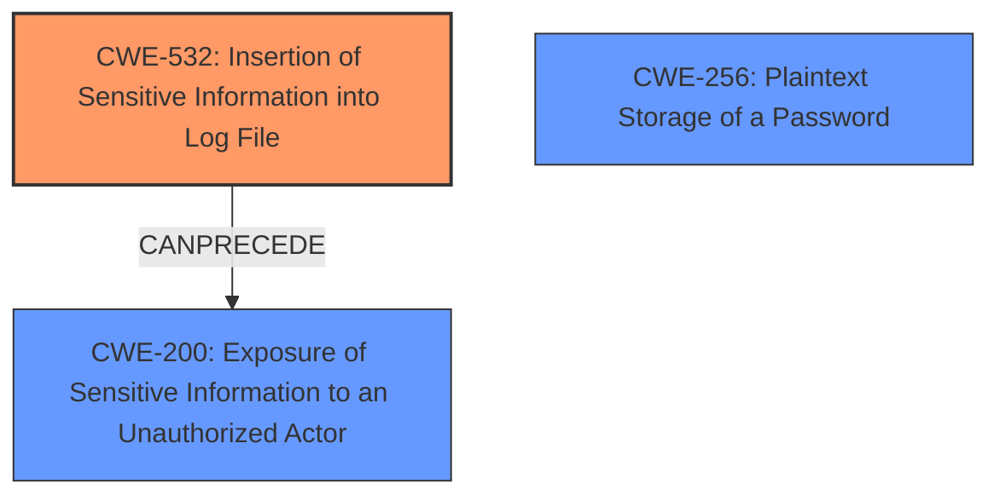

# Analysis Report for CVE-2024-20490

# Vulnerability Analysis Report: CVE-2024-20490

## Description

A vulnerability in a logging function of Cisco Nexus Dashboard Fabric Controller (NDFC) and Cisco Nexus Dashboard Orchestrator (NDO) could allow an attacker with access to a tech support file to view sensitive information. This vulnerability exists because HTTP proxy credentials could be recorded in an internal log that is stored in the tech support file. An attacker could exploit this vulnerability by accessing a tech support file that is generated from an affected system. A successful exploit could allow the attacker to view HTTP proxy server admin credentials in clear text that are configured on Nexus Dashboard to reach an external network. Note Best practice is to store debug logs and tech support files safely and to share them only with trusted parties because they may contain sensitive information.

## Vulnerability Description Key Phrases

- **Impact:** view sensitive information
- **Vector:** access tech support file
- **Attacker:** attacker
- **Product:** ['Cisco Nexus Dashboard Fabric Controller', 'Cisco Nexus Dashboard Orchestrator']
- **Component:** logging function

## Analysis (with Relationship Data)

# Summary
| CWE ID | CWE Name | Confidence | CWE Abstraction Level | CWE Vulnerability Mapping Label | CWE-Vulnerability Mapping Notes |
|---|---|---|---|---|---|
| CWE-532 | Insertion of Sensitive Information into Log File | 1.0 | Base | Allowed | Primary CWE. The root cause is logging sensitive information. |
| CWE-256 | Plaintext Storage of a Password | 0.7 | Base | Allowed | Secondary candidate. Proxy credentials stored in cleartext. |
| CWE-200 | Exposure of Sensitive Information to an Unauthorized Actor | 0.6 | Class | Discouraged | Secondary candidate. The result of logging sensitive information is exposure. |

## Evidence and Confidence

*   **Confidence Score:** 0.9
*   **Evidence Strength:** HIGH

## Relationship Analysis
The primary relationship is that CWE-532, **Insertion of Sensitive Information into Log File**, leads directly to CWE-200, **Exposure of Sensitive Information to an Unauthorized Actor**. The **plaintext storage** aspect of the credentials can be represented by CWE-256. CWE-532 is at the Base level, which is appropriate for a root cause. CWE-200 is a Class and discouraged, but can represent the impact.



## Vulnerability Chain
The vulnerability chain starts with **CWE-532 (Insertion of Sensitive Information into Log File)**, where the HTTP proxy credentials are **recorded in an internal log** within the tech support file. This leads to **CWE-256 (Plaintext Storage of a Password)** because the credentials are stored in clear text. Finally, accessing the tech support file leads to **CWE-200 (Exposure of Sensitive Information to an Unauthorized Actor)**, enabling an attacker to view the credentials.

## Summary of Analysis
The primary weakness is the **insertion of sensitive information into a log file (CWE-532)**. The vulnerability description clearly states that "HTTP proxy credentials could be recorded in an internal log that is stored in the tech support file." This aligns directly with the description of CWE-532.

The fact that the credentials are in clear text suggests **CWE-256 (Plaintext Storage of a Password)**, as the attacker could "view HTTP proxy server admin credentials in clear text".

The ultimate impact is **CWE-200 (Exposure of Sensitive Information to an Unauthorized Actor)**, as the attacker can view the credentials, although this is a less preferred mapping since its the impact.

The graph relationships confirm the sequence, with the logging of sensitive information leading to exposure. CWE-532 is at the Base level, providing the right level of specificity for the root cause.

Relevant CWE Information:
# Enhanced Context (25 CWEs)
The following CWEs were identified as potentially relevant to this vulnerability:

## CWE-497: Exposure of Sensitive System Information to an Unauthorized Control Sphere
**Abstraction Level**: Base
**Similarity Score**: 0.77
**Source**: dense

**Description**:
The product does not properly prevent sensitive system-level information from being accessed by unauthorized actors who do not have the same level of access to the underlying system as the product does.

**Mapping Guidance**:
- Usage: Allowed
- Rationale: This CWE entry is at the Base level of abstraction, which is a preferred level of abstraction for mapping to the root causes of vulnerabilities.

*Reason for not using*: While related, it's less specific than CWE-532 which highlights the logging aspect.

## CWE-532: Insertion of Sensitive Information into Log File
**Abstraction Level**: Base
**Similarity Score**: 0.75
**Source**: dense

**Description**:
The product writes sensitive information to a log file.

**Mapping Guidance**:
- Usage: Allowed
- Rationale: This CWE entry is at the Base level of abstraction, which is a preferred level of abstraction for mapping to the root causes of vulnerabilities.

*Reason for using*: Directly related to the vulnerability description.

## CWE-538: Insertion of Sensitive Information into Externally-Accessible File or Directory
**Abstraction Level**: Base
**Similarity Score**: 0.74
**Source**: dense

**Description**:
The product places sensitive information into files or directories that are accessible to actors who are allowed to have access to the files, but not to the sensitive information.

**Mapping Guidance**:
- Usage: Allowed
- Rationale: This CWE entry is at the Base level of abstraction, which is a preferred level of abstraction for mapping to the root causes of vulnerabilities.

*Reason for not using*: Not externally accessible, but rather the file needs to be acquired somehow.

## CWE-522: Insufficiently Protected Credentials
**Abstraction Level**: Class
**Similarity Score**: 0.74
**Source**: dense

**Description**:
The product transmits or stores authentication credentials, but it uses an insecure method that is susceptible to unauthorized interception and/or retrieval.

**Mapping Guidance**:
- Usage: Allowed-with-Review
- Rationale: This CWE entry is a Class and might have Base-level children that would be more appropriate

*Reason for using*: Potentially relevant as credentials are not protected.

## CWE-288: Authentication Bypass Using an Alternate Path or Channel
**Abstraction Level**: Base
**Similarity Score**: 0.74
**Source**: dense

**Description**:
The product requires authentication, but the product has an alternate path or channel that does not require authentication.

**Mapping Guidance**:
- Usage: Allowed
- Rationale: This CWE entry is at the Base level of abstraction, which is a preferred level of abstraction for mapping to the root causes of vulnerabilities.

*Reason for not using*: Not relevant, as there is no authentication bypass.

## CWE-303: Incorrect Implementation of Authentication Algorithm
**Abstraction Level**: Base
**Similarity Score**: 0.73
**Source**: dense

**Description**:
The requirements for the product dictate the use of an established authentication algorithm, but the implementation of the algorithm is incorrect.

**Mapping Guidance**:
- Usage: Allowed
- Rationale: This CWE entry is at the Base level of abstraction, which is a preferred level of abstraction for mapping to the root causes of vulnerabilities.

*Reason for not using*: Not relevant, as there is no authentication algorithm implemented incorrectly.

## CWE-798: Use of Hard-coded Credentials
**Abstraction Level**: Base
**Similarity Score**: 0.73
**Source**: dense

**Description**:
The product contains hard-coded credentials, such as a password or cryptographic key.

**Mapping Guidance**:
- Usage: Allowed
- Rationale: This CWE entry is at the Base level of abstraction, which is a preferred level of abstraction for mapping to the root causes of vulnerabilities.

*Reason for not using*: Not relevant, as the credentials are not hardcoded.

## CWE-212: Improper Removal of Sensitive Information Before Storage or Transfer
**Abstraction Level**: Base
**Similarity Score**: 0.73
**Source**: dense

**Description**:
The product stores, transfers, or shares a resource that contains sensitive information, but it does not properly remove that information before the product makes the resource available to unauthorized actors.

**Mapping Guidance**:
- Usage: Allowed
- Rationale: This CWE entry is at the Base level of abstraction, which is a preferred level of abstraction for mapping to the root causes of vulnerabilities.

*Reason for not using*: While the tech support file is stored, it's more about the logging of the information.

## CWE-200: Exposure of Sensitive Information to an Unauthorized Actor
**Abstraction Level**: Class
**Similarity Score**: 0.73
**Source**: dense

**Description**:
The product exposes sensitive information to an actor that is not explicitly authorized to have access to that information.

**Mapping Guidance**:
- Usage: Discouraged
- Rationale: CWE-200 is commonly misused to represent the loss of confidentiality in a vulnerability, but confidentiality loss is a technical impact - not a root cause error. As of CWE 4.9, over 400 CWE entries can lead to a loss of confidentiality. Other options are often available. [REF-1287].

*Reason for using*: Directly related to the vulnerability description.

## CWE-668: Exposure of Resource to Wrong Sphere
**Abstraction Level**: Class
**Similarity Score**: 0.73
**Source**: dense

**Description**:
The product exposes a resource to the wrong control sphere, providing unintended actors with inappropriate access to the resource.

**Mapping Guidance**:
- Usage: Discouraged
- Rationale: CWE-668 is high-level and is


## CWE Relationship Analysis

Current CWEs represent these abstraction levels: .


### Vulnerability Chain Analysis

**Chain starting from CWE-288:**
- 288 (Authentication Bypass Using an Alternate Path or Channel) - ROOT


**Chain starting from CWE-212:**
- 212 (Improper Removal of Sensitive Information Before Storage or Transfer) - ROOT


### CWE Relationship Diagram

```mermaid
graph TD
    classDef primary fill:#f96,stroke:#333,stroke-width:2px
    classDef secondary fill:#69f,stroke:#333
    classDef tertiary fill:#9e9,stroke:#333
```


*Report generated on 2025-07-13 05:05:53*
