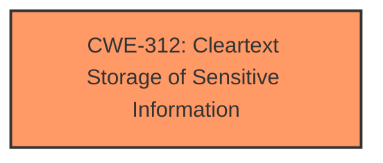

# Analysis Report for CVE-2024-20503

# Vulnerability Analysis Report: CVE-2024-20503

## Description

A vulnerability in Cisco Duo Epic for Hyperdrive could allow an authenticated, local attacker to view sensitive information in cleartext on an affected system. This vulnerability is due to **improper storage of an unencrypted registry key**. A low-privileged attacker could exploit this vulnerability by viewing or querying the registry key on the affected system. A successful exploit could allow the attacker to view sensitive information in cleartext.

## Vulnerability Description Key Phrases

- **Rootcause:** improper storage of an unencrypted registry key
- **Impact:** view sensitive information in cleartext
- **Attacker:** low-privileged attacker
- **Product:** Cisco Duo Epic for Hyperdrive

## Analysis (with Relationship Data)

# Summary
| CWE ID | CWE Name | Confidence | CWE Abstraction Level | CWE Vulnerability Mapping Label | CWE-Vulnerability Mapping Notes |
|---|---|---|---|---|---|
| CWE-312 | Cleartext Storage of Sensitive Information | 1.0 | Base | Allowed | Primary CWE. The root cause is the storage of sensitive information in an unencrypted registry key. |

## Evidence and Confidence

*   **Confidence Score:** 1.0
*   **Evidence Strength:** HIGH

## Relationship Analysis
The primary CWE is CWE-312 **Cleartext Storage of Sensitive Information**, which is a base-level CWE. This is appropriate because the vulnerability involves storing sensitive information in cleartext in a registry key. No parent-child or chain relationships influenced this decision, as the evidence clearly points to this specific weakness.



## Vulnerability Chain
The vulnerability chain is straightforward:

1.  **Root Cause:** CWE-312 **Cleartext Storage of Sensitive Information** due to **improper storage of an unencrypted registry key**.
2.  **Impact:** View sensitive information in cleartext.

## Summary of Analysis
The analysis is based on the provided evidence, which clearly indicates that the root cause of the vulnerability is the **improper storage of an unencrypted registry key**, leading to the ability to view sensitive information in cleartext.

The vulnerability description explicitly states: "This vulnerability is due to **improper storage of an unencrypted registry key**." The "CVE Reference Links Content Summary" also supports this, stating: "Root cause of vulnerability: Improper storage of an unencrypted registry key."

CWE-312 **Cleartext Storage of Sensitive Information** is the optimal level of specificity, as it directly addresses the **improper storage of an unencrypted registry key**, which is the root cause of the vulnerability. The retriever results also list CWE-312 with a high similarity score and the usage is ALLOWED.

Other CWEs Considered but Not Used:

*   CWE-532 **Insertion of Sensitive Information into Log File**: While log files can be a storage location, the vulnerability specifically mentions the registry key, not a log file.
*   CWE-311 **Missing Encryption of Sensitive Data**: This is a higher-level class. CWE-312 **Cleartext Storage of Sensitive Information** is more specific.
*   CWE-256 **Plaintext Storage of a Password**: This CWE is specific to passwords, while the vulnerability description refers to sensitive information in general.
*   CWE-522 **Insufficiently Protected Credentials**: This CWE is about credentials, whereas the vulnerability is about sensitive information in general.
*   CWE-319 **Cleartext Transmission of Sensitive Information**: This CWE is about transmission, whereas the vulnerability is about storage.
*   CWE-321 **Use of Hard-coded Cryptographic Key**: This CWE is specific to cryptographic keys, not general sensitive information.


## CWE Relationship Analysis

Current CWEs represent these abstraction levels: .


### Vulnerability Chain Analysis

**Chain starting from CWE-321:**
- 321 (Use of Hard-coded Cryptographic Key) - ROOT


**Chain starting from CWE-319:**
- 319 (Cleartext Transmission of Sensitive Information) - ROOT


### CWE Relationship Diagram

```mermaid
graph TD
    classDef primary fill:#f96,stroke:#333,stroke-width:2px
    classDef secondary fill:#69f,stroke:#333
    classDef tertiary fill:#9e9,stroke:#333
```


*Report generated on 2025-07-13 05:08:29*
