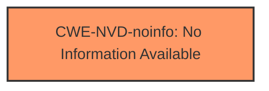

# Analysis for CVE-2024-21140

# Summary
| CWE ID | CWE Name | Confidence | CWE Abstraction Level | CWE Vulnerability Mapping Label | CWE-Vulnerability Mapping Notes |
|---|---|---|---|---|---|
| CWE-NVD-noinfo | No Information Available | 0.8 |  N/A | Primary |  This is the primary CWE due to the lack of detailed information about the vulnerability.|

## Evidence and Confidence

*   **Confidence Score:** 0.8
*   **Evidence Strength:** LOW

## Relationship Analysis
Since the primary CWE is CWE-NVD-noinfo, there are no meaningful relationships to analyze. The vulnerability description and CVE details lack specific information about the root cause. Therefore, any relationship analysis would be speculative and not based on solid evidence.

## Vulnerability Chain
Due to the absence of specific details about the vulnerability, it is impossible to construct a vulnerability chain. The available information only indicates a potential impact (unauthorized data access/modification) but does not describe the underlying weakness that enables the exploit.

## Summary of Analysis
The analysis is severely limited by the lack of detailed information about the vulnerability. The primary CWE, CWE-NVD-noinfo, reflects this lack of specificity. The decision to use this CWE is based on the "CWE for similar CVE Descriptions" which lists CWE-NVD-noinfo as the Primary CWE Match and Top CWEs with a count of 100.

The retriever results suggest several potential CWEs, including CWE-502 (Deserialization of Untrusted Data), CWE-611 (Improper Restriction of XML External Entity Reference), and CWE-306 (Missing Authentication for Critical Function). However, without more specific information about the **root cause**, it is impossible to determine if any of these are applicable. The vulnerability description mentions "Hotspot" component, but this does not provide enough technical detail to map to a specific weakness. The potential impact (unauthorized data access/modification) is a symptom, not a root cause.

The selected CWE is at the appropriate level of specificity, given the available evidence. A more detailed CWE would require more information about the vulnerability. The confidence score reflects the uncertainty due to the limited information.