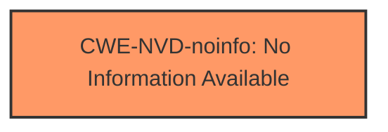

# Analysis Report for CVE-2024-21140

# Vulnerability Analysis Report: CVE-2024-21140

## Description

Vulnerability in the Oracle Java SE, Oracle GraalVM for JDK, Oracle GraalVM Enterprise Edition product of Oracle Java SE (component Hotspot). Supported versions that are affected are Oracle Java SE 8u411, 8u411-perf, 11.0.23, 17.0.11, 21.0.3, 22.0.1 Oracle GraalVM for JDK 17.0.11, 21.0.3, 22.0.1 Oracle GraalVM Enterprise Edition 20.3.14 and 21.3.10. Difficult to exploit vulnerability allows unauthenticated attacker with network access via multiple protocols to compromise Oracle Java SE, Oracle GraalVM for JDK, Oracle GraalVM Enterprise Edition. Successful attacks of this vulnerability can result in unauthorized update, insert or delete access to some of Oracle Java SE, Oracle GraalVM for JDK, Oracle GraalVM Enterprise Edition accessible data as well as unauthorized read access to a subset of Oracle Java SE, Oracle GraalVM for JDK, Oracle GraalVM Enterprise Edition accessible data. Note This vulnerability can be exploited by using APIs in the specified Component, e.g., through a web service which supplies data to the APIs. This vulnerability also applies to Java deployments, typically in clients running sandboxed Java Web Start applications or sandboxed Java applets, that load and run untrusted code (e.g., code that comes from the internet) and rely on the Java sandbox for security. CVSS 3.1 Base Score 4.8 (Confidentiality and Integrity impacts). CVSS Vector (CVSS3.1/AVN/ACH/PRN/UIN/SU/CL/IL/AN).

## Vulnerability Description Key Phrases

- **Impact:** ['Integrity', 'Oracle GraalVM Enterprise Edition accessible data', 'Oracle GraalVM for JDK', 'insert or delete access to Oracle Java SE', 'unauthorized read access to Oracle Java SE', 'unauthorized update']
- **Attacker:** unauthenticated attacker with network access
- **Product:** ["['Oracle Java SE'", "'Oracle GraalVM for JDK'", "'Oracle GraalVM Enterprise Edition']"]
- **Version:** ["['8u411'", "'8u411-perf'", "'11.0.23'", "'17.0.11'", "'21.0.3'", "'22.0.1']"]
- **Component:** Hotspot

## Analysis (with Relationship Data)

# Summary
| CWE ID | CWE Name | Confidence | CWE Abstraction Level | CWE Vulnerability Mapping Label | CWE-Vulnerability Mapping Notes |
|---|---|---|---|---|---|
| CWE-NVD-noinfo | No Information Available | 0.8 |  N/A | Primary |  This is the primary CWE due to the lack of detailed information about the vulnerability.|

## Evidence and Confidence

*   **Confidence Score:** 0.8
*   **Evidence Strength:** LOW

## Relationship Analysis
Since the primary CWE is CWE-NVD-noinfo, there are no meaningful relationships to analyze. The vulnerability description and CVE details lack specific information about the root cause. Therefore, any relationship analysis would be speculative and not based on solid evidence.



## Vulnerability Chain
Due to the absence of specific details about the vulnerability, it is impossible to construct a vulnerability chain. The available information only indicates a potential impact (unauthorized data access/modification) but does not describe the underlying weakness that enables the exploit.

## Summary of Analysis
The analysis is severely limited by the lack of detailed information about the vulnerability. The primary CWE, CWE-NVD-noinfo, reflects this lack of specificity. The decision to use this CWE is based on the "CWE for similar CVE Descriptions" which lists CWE-NVD-noinfo as the Primary CWE Match and Top CWEs with a count of 100.

The retriever results suggest several potential CWEs, including CWE-502 (Deserialization of Untrusted Data), CWE-611 (Improper Restriction of XML External Entity Reference), and CWE-306 (Missing Authentication for Critical Function). However, without more specific information about the **root cause**, it is impossible to determine if any of these are applicable. The vulnerability description mentions "Hotspot" component, but this does not provide enough technical detail to map to a specific weakness. The potential impact (unauthorized data access/modification) is a symptom, not a root cause.

The selected CWE is at the appropriate level of specificity, given the available evidence. A more detailed CWE would require more information about the vulnerability. The confidence score reflects the uncertainty due to the limited information.


## CWE Relationship Analysis

Current CWEs represent these abstraction levels: .


### Vulnerability Chain Analysis

**Chain starting from CWE-502:**
- 502 (Deserialization of Untrusted Data) - ROOT


**Chain starting from CWE-306:**
- 306 (Missing Authentication for Critical Function) - ROOT


### CWE Relationship Diagram

```mermaid
graph TD
    classDef primary fill:#f96,stroke:#333,stroke-width:2px
    classDef secondary fill:#69f,stroke:#333
    classDef tertiary fill:#9e9,stroke:#333
```


*Report generated on 2025-07-13 05:17:39*
