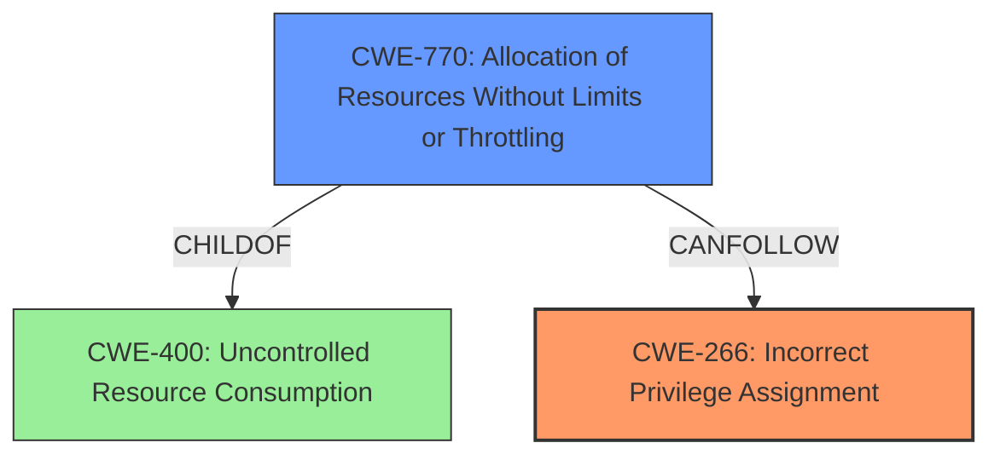

# Analysis Report for CVE-2024-21142

# Vulnerability Analysis Report: CVE-2024-21142

## Description

Vulnerability in the MySQL Server product of Oracle MySQL (component Server Security Privileges). Supported versions that are affected are 8.0.37 and prior and 8.4.0 and prior. Easily exploitable vulnerability allows high privileged attacker with network access via multiple protocols to compromise MySQL Server. Successful attacks of this vulnerability can result in unauthorized ability to cause a hang or frequently repeatable crash (complete DOS) of MySQL Server. CVSS 3.1 Base Score 4.9 (Availability impacts). CVSS Vector (CVSS3.1/AVN/ACL/PRH/UIN/SU/CN/IN/AH).

## Vulnerability Description Key Phrases

- **Impact:** ['cause a hang or frequently repeatable crash', 'hang or frequently repeatable crash (complete DOS) of MySQL Server']
- **Vector:** multiple protocols
- **Attacker:** high privileged attacker with network access
- **Product:** MySQL Server
- **Version:** 8.0.37 and prior and 8.4.0 and prior
- **Component:** Server Security Privileges

## Analysis (with Relationship Data)

# Summary
| CWE ID | CWE Name | Confidence | CWE Abstraction Level | CWE Vulnerability Mapping Label | CWE-Vulnerability Mapping Notes |
|---|---|---|---|---|---|
| CWE-266 | Incorrect Privilege Assignment | 0.8 | Base | Primary | Allowed |
| CWE-770 | Allocation of Resources Without Limits or Throttling | 0.4 | Base | Secondary | Allowed |

## Evidence and Confidence

*   **Confidence Score:** 0.6
*   **Evidence Strength:** MEDIUM

## Relationship Analysis
The primary relationship influencing the decision is that of privilege management. The vulnerability involves a high-privileged attacker, suggesting a problem with how privileges are assigned or managed. CWE-266 is a base-level CWE that deals with incorrect privilege assignment. Several other privilege-related CWEs were considered, but CWE-266 appeared to be the most direct match. CWE-770 was considered as a possible follow-on weakness as a successful attack of this vulnerability can result in unauthorized ability to cause a hang or frequently repeatable crash (complete DOS) of MySQL Server.



## Vulnerability Chain
The vulnerability chain starts with **CWE-266 Incorrect Privilege Assignment**, where a high-privileged attacker can exploit the system. This leads to a denial-of-service condition, which could be related to resource exhaustion **CWE-770: Allocation of Resources Without Limits or Throttling**.

## Summary of Analysis
The initial analysis focused on identifying the root cause of the vulnerability. The description indicates a high-privileged attacker can cause a denial-of-service, suggesting a privilege-related issue.

The evidence supporting **CWE-266 Incorrect Privilege Assignment** is derived from the vulnerability description indicating that a "high privileged attacker with network access" can compromise the MySQL server. The key phrase "Server Security Privileges" also points towards a privilege management issue.

The decision to select **CWE-266** is based on its direct relevance to the vulnerability description and the provided CWE guidance on privileges vs. permissions. The guidance suggests using CWE-266 when there is a misconfigured role or faulty logic during account provisioning, which aligns with the concept of a high-privileged attacker exploiting the system.

CWE-285 Improper Authorization and CWE-863 Incorrect Authorization were considered but not selected because they typically involve flawed permission checking, whereas the description leans more towards an initial incorrect assignment of privileges. CWE-269 Improper Privilege Management was also considered, but the guidance discourages its use as it is often misused and not specific enough.

CWE-770 Allocation of Resources Without Limits or Throttling was also considered as the successful attacks can result in unauthorized ability to cause a hang or frequently repeatable crash (complete DOS) of MySQL Server, which is a result of uncontrolled resource consumption.

Relevant CWE Information:

**CWE-266: Incorrect Privilege Assignment**
A product incorrectly assigns a privilege to a particular actor, creating an unintended sphere of control for that actor.

**CWE-770: Allocation of Resources Without Limits or Throttling**
The product does not properly control the allocation of resources, potentially leading to resource exhaustion or denial-of-service.


## CWE Relationship Analysis

Current CWEs represent these abstraction levels: .


### Vulnerability Chain Analysis

**Chain starting from CWE-863:**
- 863 (Incorrect Authorization) - ROOT


**Chain starting from CWE-400:**
- 400 (Uncontrolled Resource Consumption) - ROOT


### CWE Relationship Diagram

```mermaid
graph TD
    classDef primary fill:#f96,stroke:#333,stroke-width:2px
    classDef secondary fill:#69f,stroke:#333
    classDef tertiary fill:#9e9,stroke:#333
```


*Report generated on 2025-07-13 05:18:15*
