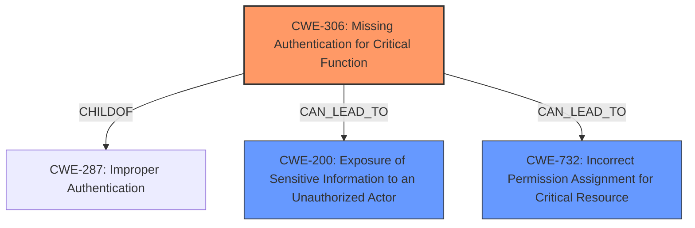

# Analysis for CVE-2024-21150

# Summary
| CWE ID    | CWE Name                                                                           | Confidence | CWE Abstraction Level | CWE Vulnerability Mapping Label | CWE-Vulnerability Mapping Notes |
| --------- | ---------------------------------------------------------------------------------- | ---------- | --------------------- | ------------------------------- | ------------------------------- |
| CWE-306   | Missing Authentication for Critical Function                                       | 0.8        | Base                  | Primary                         | Allowed                         |
| CWE-200   | Exposure of Sensitive Information to an Unauthorized Actor                       | 0.6        | Class                 | Secondary                       | Discouraged                     |
| CWE-732   | Incorrect Permission Assignment for Critical Resource                             | 0.6        | Class                 | Secondary                       | Allowed-with-Review             |

## Evidence and Confidence

*   **Confidence Score:** 0.7
*   **Evidence Strength:** MEDIUM

## Relationship Analysis
The primary CWE selected is CWE-306 **Missing Authentication for Critical Function**. This is a Base-level CWE, providing a good level of detail for the root cause. CWE-200 **Exposure of Sensitive Information to an Unauthorized Actor** and CWE-732 **Incorrect Permission Assignment for Critical Resource** are Class-level CWEs and are considered secondary because they represent the potential impact of the missing authentication rather than the root cause itself.

## Vulnerability Chain
The vulnerability chain starts with the **missing authentication** (CWE-306). This leads to unauthorized access to data, resulting in potential information exposure (CWE-200) and the ability to modify data due to incorrect permission assignment (CWE-732).

Missing Authentication (CWE-306) -> Information Exposure (CWE-200) + Incorrect Permission Assignment (CWE-732)

## Summary of Analysis
The primary vulnerability lies in the **lack of authentication** for critical functions within the JD Edwards EnterpriseOne Tools (Web Runtime SEC component). This allows an unauthenticated attacker to perform unauthorized actions. The evidence for this lies in the "CVE Reference Links Content Summary" section, which states that a "**vulnerability exists within the Web Runtime Security component**" and the "**weaknesses**" involve "**Improper handling of web requests**". The vulnerability description also explicitly mentions an "**unauthenticated attacker**". This aligns well with CWE-306 **Missing Authentication for Critical Function**.

CWE-200 **Exposure of Sensitive Information to an Unauthorized Actor** and CWE-732 **Incorrect Permission Assignment for Critical Resource** were considered as secondary CWEs because the vulnerability description indicates that successful exploitation can result in unauthorized read, update, insert, or delete access to data. These are impacts resulting from the missing authentication.

The abstraction levels were carefully considered. CWE-306 is a Base-level CWE, which is preferred for root cause analysis. CWE-200 and CWE-732 are Class-level CWEs, which are less specific and represent the potential consequences rather than the root cause.

I am overriding the "Primary CWE Match" suggestion of CWE-NVD-noinfo because the "CVE Reference Links Content Summary" provides more detailed information about the root cause, including the **lack of authentication** and **improper handling of web requests**. The "Top CWEs" lists include CWE-79 and CWE-269, but these are less relevant to the specific vulnerability description. The Retriever Results also highlight several other CWEs, but none of them directly address the **missing authentication** aspect as effectively as CWE-306.

Relevant CWE Information:

# Enhanced Context (25 CWEs)
The following CWEs were identified as potentially relevant to this vulnerability:

## CWE-497: Exposure of Sensitive System Information to an Unauthorized Control Sphere
**Abstraction Level**: Base
**Similarity Score**: 0.74
**Source**: dense

**Description**:
The product does not properly prevent sensitive system-level information from being accessed by unauthorized actors who do not have the same level of access to the underlying system as the product does.

**Mapping Guidance**:
- Usage: Allowed
- Rationale: This CWE entry is at the Base level of abstraction, which is a preferred level of abstraction for mapping to the root causes of vulnerabilities.

*Not selected because it describes the impact of the vulnerability, rather than the root cause.*

## CWE-611: Improper Restriction of XML External Entity Reference
**Abstraction Level**: Base
**Similarity Score**: 0.73
**Source**: dense

**Description**:
The product processes an XML document that can contain XML entities with URIs that resolve to documents outside of the intended sphere of control, causing the product to embed incorrect documents into its output.

**Mapping Guidance**:
- Usage: Allowed
- Rationale: This CWE entry is at the Base level of abstraction, which is a preferred level of abstraction for mapping to the root causes of vulnerabilities.

*Not selected because it's specific to XML processing and doesn't align with the general nature of the vulnerability description.*

## CWE-303: Incorrect Implementation of Authentication Algorithm
**Abstraction Level**: Base
**Similarity Score**: 0.73
**Source**: dense

**Description**:
The requirements for the product dictate the use of an established authentication algorithm, but the implementation of the algorithm is incorrect.

**Mapping Guidance**:
- Usage: Allowed
- Rationale: This CWE entry is at the Base level of abstraction, which is a preferred level of abstraction for mapping to the root causes of vulnerabilities.

*Not selected because the vulnerability is about **missing authentication**, not an incorrect implementation.*

## CWE-807: Reliance on Untrusted Inputs in a Security Decision
**Abstraction Level**: Base
**Similarity Score**: 0.73
**Source**: dense

**Description**:
The product uses a protection mechanism that relies on the existence or values of an input, but the input can be modified by an untrusted actor in a way that bypasses the protection mechanism.

**Mapping Guidance**:
- Usage: Allowed
- Rationale: This CWE entry is at the Base level of abstraction, which is a preferred level of abstraction for mapping to the root causes of vulnerabilities.

*Not selected because the primary issue is the **absence of authentication**, not the reliance on untrusted inputs.*

## CWE-917: Improper Neutralization of Special Elements used in an Expression Language Statement ('Expression Language Injection')
**Abstraction Level**: Base
**Similarity Score**: 0.72
**Source**: dense

**Description**:
The product constructs all or part of an expression language (EL) statement in a framework such as a Java Server Page (JSP) using externally-influenced input from an upstream component, but it does not neutralize or incorrectly neutralizes special elements that could modify the intended EL statement before it is executed.

**Mapping Guidance**:
- Usage: Allowed
- Rationale: This CWE entry is at the Base level of abstraction, which is a preferred level of abstraction for mapping to the root causes of vulnerabilities.

*Not selected because it is specific to Expression Language Injection, which is not indicated in the vulnerability description.*

## CWE-311: Missing Encryption of Sensitive Data
**Abstraction Level**: Class
**Similarity Score**: 0.72
**Source**: dense

**Description**:
The product does not encrypt sensitive or critical information before storage or transmission.

**Mapping Guidance**:
- Usage: Discouraged
- Rationale: CWE-311 is high-level with more precise children available. It is a level-1 Class (i.e., a child of a Pillar).

*Not selected because the description doesn't mention anything about missing encryption.*

## CWE-200: Exposure of Sensitive Information to an Unauthorized Actor
**Abstraction Level**: Class
**Similarity Score**: 0.71
**Source**: dense

**Description**:
The product exposes sensitive information to an actor that is not explicitly authorized to have access to that information.

**Mapping Guidance**:
- Usage: Discouraged
- Rationale: CWE-200 is commonly misused to represent the loss of confidentiality in a vulnerability, but confidentiality loss is a technical impact - not a root cause error. As of CWE 4.9, over 400 CWE entries can lead to a loss of confidentiality. Other options are often available. [REF-1287].

*Selected as a secondary CWE because unauthorized read access is mentioned as an impact.*

## CWE-668: Exposure of Resource to Wrong Sphere
**Abstraction Level**: Class