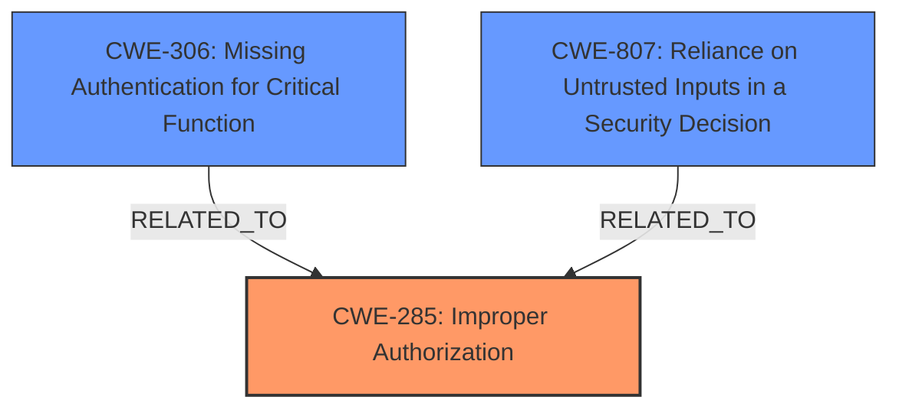

# Raw Analyzer Response for CVE-2024-21153

# Summary
| CWE ID      | CWE Name                                                                  | Confidence | CWE Abstraction Level | CWE Vulnerability Mapping Label | CWE-Vulnerability Mapping Notes |
| ----------- | ------------------------------------------------------------------------- | ---------- | --------------------- | ----------------------------- | ----------------------------- |
| CWE-285     | Improper Authorization                                                    | 0.75       | Class                 | Primary                       | Discouraged                   |
| CWE-306     | Missing Authentication for Critical Function                              | 0.65       | Base                  | Secondary                     | Allowed                       |
| CWE-807     | Reliance on Untrusted Inputs in a Security Decision                      | 0.60       | Base                  | Secondary                     | Allowed                       |

## Evidence and Confidence

*   **Confidence Score:** 0.70
*   **Evidence Strength:** MEDIUM

## Relationship Analysis
The primary CWE is CWE-285, Improper Authorization, which is a Class-level CWE. Although it's discouraged to use Class-level CWEs when more specific ones exist, the information provided doesn't offer sufficient detail to pinpoint the exact authorization flaw. CWE-306 and CWE-807 are added as secondary considerations, offering more specific angles related to missing authentication and reliance on untrusted inputs respectively. These three CWEs do not have a direct hierarchical relationship, but they all relate to control sphere issues (access control, authentication).

## Vulnerability Chain
The vulnerability chain starts with a potential **ROOTCAUSE** of **improper authorization (CWE-285)** within the Quality Management Specs component of Oracle Process Manufacturing Product Development. If authorization is not correctly implemented, a low-privileged attacker can gain unauthorized access, leading to the impact of unauthorized creation, deletion, or modification of critical data. This could also lead to unauthorized access to sensitive information. The chain could be further detailed with more information regarding authentication (**CWE-306**) or how untrusted inputs are used in security decisions (**CWE-807**), but the description lacks specific details about the exact mechanism.

## Summary of Analysis
The initial assessment focused on identifying the **ROOTCAUSE** of the vulnerability based on the provided evidence. The description highlights a scenario where a low-privileged attacker can compromise the system, leading to unauthorized data manipulation and access.

The primary challenge was the lack of specific technical details in the vulnerability description. The description indicates that a low-privileged attacker can "compromise Oracle Process Manufacturing Product Development," leading to unauthorized data access and modification. The key phrase "easily exploitable vulnerability allows low privileged attacker" suggests a flaw in authorization or access control. The **impact** of "unauthorized creation, deletion or modification access to critical data" points towards an authorization issue.

Given the limited information, **CWE-285 (Improper Authorization)** is the most suitable primary CWE. It aligns with the observed behavior of unauthorized actions due to insufficient permission checks. The retriever suggested CWE-306 (Missing Authentication for Critical Function) and CWE-807 (Reliance on Untrusted Inputs in a Security Decision) which can be related to authorization failures.

The selection of CWE-285 is made with the understanding that a more specific CWE might be applicable if more details were available. The decision to include CWE-306 and CWE-807 as secondary candidates reflects the possibility of authentication gaps or vulnerabilities related to untrusted inputs contributing to the overall issue.

Relevant CWE Information:

# Enhanced Context (25 CWEs)
The following CWEs were identified as potentially relevant to this vulnerability:

## CWE-497: Exposure of Sensitive System Information to an Unauthorized Control Sphere
**Abstraction Level**: Base
**Similarity Score**: 0.74
**Source**: dense

**Description**:
The product does not properly prevent sensitive system-level information from being accessed by unauthorized actors who do not have the same level of access to the underlying system as the product does.

**Mapping Guidance**:
- Usage: Allowed
- Rationale: This CWE entry is at the Base level of abstraction, which is a preferred level of abstraction for mapping to the root causes of vulnerabilities.

*Not selected as there is no evidence to suggest that system level information is being exposed.*

## CWE-303: Incorrect Implementation of Authentication Algorithm
**Abstraction Level**: Base
**Similarity Score**: 0.74
**Source**: dense

**Description**:
The requirements for the product dictate the use of an established authentication algorithm, but the implementation of the algorithm is incorrect.

**Mapping Guidance**:
- Usage: Allowed
- Rationale: This CWE entry is at the Base level of abstraction, which is a preferred level of abstraction for mapping to the root causes of vulnerabilities.

*Not selected as there is no evidence that a specific algorithm is implemented incorrectly, only that authorization is not properly implemented.*

## CWE-807: Reliance on Untrusted Inputs in a Security Decision
**Abstraction Level**: Base
**Similarity Score**: 0.73
**Source**: dense

**Description**:
The product uses a protection mechanism that relies on the existence or values of an input, but the input can be modified by an untrusted actor in a way that bypasses the protection mechanism.

**Mapping Guidance**:
- Usage: Allowed
- Rationale: This CWE entry is at the Base level of abstraction, which is a preferred level of abstraction for mapping to the root causes of vulnerabilities.

*Selected as it relates to the attacker being low privileged and having network access via HTTP.*

## CWE-200: Exposure of Sensitive Information to an Unauthorized Actor
**Abstraction Level**: Class
**Similarity Score**: 0.72
**Source**: dense

**Description**:
The product exposes sensitive information to an actor that is not explicitly authorized to have access to that information.

**Mapping Guidance**:
- Usage: Discouraged
- Rationale: CWE-200 is commonly misused to represent the loss of confidentiality in a vulnerability, but confidentiality loss is a technical impact - not a root cause error. As of CWE 4.9, over 400 CWE entries can lead to a loss of confidentiality. Other options are often available. [REF-1287].

*Not selected as it is too high level and the usage is discouraged.*

## CWE-311: Missing Encryption of Sensitive Data
**Abstraction Level**: Class
**Similarity Score**: 0.72
**Source**: dense

**Description**:
The product does not encrypt sensitive or critical information before storage or transmission.

**Mapping Guidance**:
- Usage: Discouraged
- Rationale: CWE-311 is high-level with more precise children available. It is a level-1 Class (i.e., a child of a Pillar).

*Not selected as the vulnerability appears to be related to authorization, not encryption.*

## CWE-472: External Control of Assumed-Immutable Web Parameter
**Abstraction Level**: Base
**Similarity Score**: 0.72
**Source**: dense

**Description**:
The web application does not sufficiently verify inputs that are assumed to be immutable but are actually externally controllable, such as hidden form fields.

**Mapping Guidance**:
- Usage: Allowed
- Rationale: This CWE entry is at the Base level of abstraction, which is a preferred level of abstraction for mapping to the root causes of vulnerabilities.

*Not selected as there is no evidence of external control of assumed immutable web parameters.*

## CWE-668: Exposure of Resource to Wrong Sphere
**Abstraction Level**: Class
**Similarity Score**: 0.72
**Source**: dense

**Description**:
The product exposes a resource to the wrong control sphere, providing unintended actors with inappropriate access to the resource.

**Mapping Guidance**:
- Usage: Discouraged
- Rationale: CWE-668 is high-level and is often misused as a catch-all when lower-level CWE IDs might be applicable. It is sometimes used for low-information vulnerability reports [REF-1287]. It is a level-1 Class (i.e., a child of a Pillar). It is not useful for trend analysis.

*Not selected as it is too high level and the usage is discouraged.*

## CWE-274: Improper Handling of Insufficient Privileges
**Abstraction Level**: Base
**Similarity Score**: 0.72
**Source**: dense

**Description**:
The product does not handle or incorrectly handles when it has insufficient privileges to perform an operation, leading to resultant weaknesses.

**Mapping Guidance**:
- Usage: Discouraged
- Rationale: This CWE entry could be deprecated in a future version of CWE.

*Not selected due to discouragement in mapping guidance.*

## CWE-345: Insufficient Verification of Data Authenticity
**Abstraction Level**: Class
**Similarity Score**: 0.