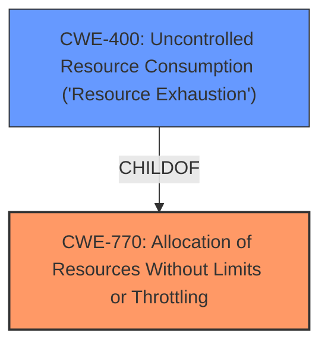

# Analysis for CVE-2024-21159

# Summary
| CWE ID        | CWE Name                                                                 | Confidence | CWE Abstraction Level | CWE Vulnerability Mapping Label | CWE-Vulnerability Mapping Notes |
|---------------|--------------------------------------------------------------------------|------------|-----------------------|---------------------------------|---------------------------------|
| CWE-770       | Allocation of Resources Without Limits or Throttling                     | 0.75       | Base                  | Primary                           | Allowed                         |
| CWE-400       | Uncontrolled Resource Consumption ('Resource Exhaustion')                 | 0.60       | Class                 | Secondary                         | Allowed-with-Review           |

## Evidence and Confidence

*   **Confidence Score:** 0.70
*   **Evidence Strength:** MEDIUM

## Relationship Analysis
The primary CWE is CWE-770 Allocation of Resources Without Limits or Throttling. This is a base level CWE. A related CWE is CWE-400 Uncontrolled Resource Consumption ('Resource Exhaustion'), which is a class level CWE and a child of CWE-770. The relationship suggests that the excessive allocation of resources (CWE-770) directly leads to resource exhaustion (CWE-400), causing a denial-of-service.

## Vulnerability Chain
The vulnerability chain starts with **uncontrolled allocation of resources (CWE-770)**, which leads to **resource exhaustion (CWE-400)**, ultimately resulting in a denial-of-service.

## Summary of Analysis
The analysis indicates that the vulnerability is due to **uncontrolled allocation of resources** in the InnoDB component of MySQL Server, which can lead to resource exhaustion and a denial-of-service. The primary evidence for this conclusion comes from the "Vulnerability Description Key Phrases" that highlight the impact as a "hang or frequently repeatable crash (complete DOS) of MySQL Server" and the "CVE Reference Links Content Summary" which identifies the impact as having a "High" impact on availability".

CWE-770 Allocation of Resources Without Limits or Throttling is chosen as the primary CWE because it directly addresses the **root cause** of the vulnerability. The system allocates resources without proper limits, which allows an attacker to exhaust these resources. CWE-400 Uncontrolled Resource Consumption ('Resource Exhaustion') is a consequence of CWE-770, and is included as a secondary CWE.

The evidence supports the selection of CWE-770 as the primary weakness, with CWE-400 as the result of this weakness.

Other CWEs Considered and Rejected:

*   CWE-NVD-noinfo: This is a placeholder CWE and not informative, so it was rejected.
*   CWE-89 Improper Neutralization of Special Elements used in an SQL Command ('SQL Injection'): While SQL injection is a common vulnerability in database systems, the description doesn't indicate that this vulnerability is due to SQL injection. Therefore, this CWE was not selected.
*   CWE-129 Improper Validation of Array Index: This CWE is not applicable as the vulnerability doesn't involve array index validation issues.
*   CWE-789 Memory Allocation with Excessive Size Value: This is similar to CWE-770, but CWE-770 is a broader category that better fits the description.
*   CWE-20 Improper Input Validation: This is a very broad CWE and doesn't capture the specific nature of the vulnerability, so it was not selected.

# Enhanced Context (25 CWEs)
The following CWEs were identified as potentially relevant to this vulnerability:

## CWE-89: Improper Neutralization of Special Elements used in an SQL Command ('SQL Injection')
**Abstraction Level**: Base
**Similarity Score**: 0.68
**Source**: dense

**Description**:
The product constructs all or part of an SQL command using externally-influenced input from an upstream component, but it does not neutralize or incorrectly neutralizes special elements that could modify the intended SQL command when it is sent to a downstream component. Without sufficient removal or quoting of SQL syntax in user-controllable inputs, the generated SQL query can cause those inputs to be interpreted as SQL instead of ordinary user data.

**Mapping Guidance**:
- Usage: Allowed
- Rationale: This CWE entry is at the Base level of abstraction, which is a preferred level of abstraction for mapping to the root causes of vulnerabilities.

## CWE-129: Improper Validation of Array Index
**Abstraction Level**: Variant
**Similarity Score**: 0.67
**Source**: dense

**Description**:
The product uses untrusted input when calculating or using an array index, but the product does not validate or incorrectly validates the index to ensure the index references a valid position within the array.

**Mapping Guidance**:
- Usage: Allowed
- Rationale: This CWE entry is at the Variant level of abstraction, which is a preferred level of abstraction for mapping to the root causes of vulnerabilities.

## CWE-833: Deadlock
**Abstraction Level**: Base
**Similarity Score**: 0.66
**Source**: dense

**Description**:
The product contains multiple threads or executable segments that are waiting for each other to release a necessary lock, resulting in deadlock.

**Mapping Guidance**:
- Usage: Allowed
- Rationale: This CWE entry is at the Base level of abstraction, which is a preferred level of abstraction for mapping to the root causes of vulnerabilities.

## CWE-209: Generation of Error Message Containing Sensitive Information
**Abstraction Level**: Base
**Similarity Score**: 0.66
**Source**: dense

**Description**:
The product generates an error message that includes sensitive information about its environment, users, or associated data.

**Mapping Guidance**:
- Usage: Allowed
- Rationale: This CWE entry is at the Base level of abstraction, which is a preferred level of abstraction for mapping to the root causes of vulnerabilities.

## CWE-303: Incorrect Implementation of Authentication Algorithm
**Abstraction Level**: Base
**Similarity Score**: 0.66
**Source**: dense

**Description**:
The requirements for the product dictate the use of an established authentication algorithm, but the implementation of the algorithm is incorrect.

**Mapping Guidance**:
- Usage: Allowed
- Rationale: This CWE entry is at the Base level of abstraction, which is a preferred level of abstraction for mapping to the root causes of vulnerabilities.

## CWE-1391: Use of Weak Credentials
**Abstraction Level**: Class
**Similarity Score**: 0.66
**Source**: dense

**Description**:
The product uses weak credentials (such as a default key or hard-coded password) that can be calculated, derived, reused, or guessed by an attacker.

**Mapping Guidance**:
- Usage: Allowed-with-Review
- Rationale: This CWE entry is a Class and might have Base-level children that would be more appropriate

## CWE-755: Improper Handling of Exceptional Conditions
**Abstraction Level**: Class
**Similarity Score**: 0.66
**Source**: dense

**Description**:
The product does not handle or incorrectly handles an exceptional condition.

**Mapping Guidance**:
- Usage: Discouraged
- Rationale: This CWE entry is a level-1 Class (i.e., a child of a Pillar). It might have lower-level children that would be more appropriate

## CWE-330: Use of Insufficiently Random Values
**Abstraction Level**: Class
**Similarity Score**: 0.65
**Source**: dense

**Description**:
The product uses insufficiently random numbers or values in a security context that depends on unpredictable numbers.

**Mapping Guidance**:
- Usage: Discouraged
- Rationale: This CWE entry is a level-1 Class (i.e., a child of a Pillar). It might have lower-level children that would be more appropriate

## CWE-824: Access of Uninitialized Pointer
**Abstraction Level**: Base
**Similarity Score**: 0.65
**Source**: dense

**Description**:
The product accesses or uses a pointer that has not been initialized.

**Mapping Guidance**:
- Usage: Allowed
- Rationale: This CWE entry is at the Base level of abstraction, which is a preferred level of abstraction for mapping to the root causes of vulnerabilities.

## CWE-665: Improper Initialization
**Abstraction Level**: Class
**Similarity Score**: 0.65
**Source**: dense

**Description**:
The product does not initialize or incorrectly initializes a resource, which might leave the resource in an unexpected state when it is accessed or used.

**Mapping Guidance**:
- Usage: Discouraged
- Rationale: This CWE entry is a level-1 Class (i.e., a child of a Pillar). It might have lower-level children that would be more appropriate

## CWE-770: Allocation of Resources Without Limits or Throttling
**Abstraction Level**: Base
**Similarity Score**: 680.03
**Source