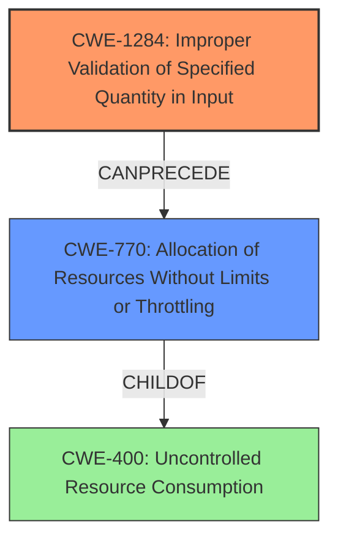

# Analysis for CVE-2024-21163

# Summary
| CWE ID | CWE Name | Confidence | CWE Abstraction Level | CWE Vulnerability Mapping Label | CWE-Vulnerability Mapping Notes |
|---|---|---|---|---|---|
| CWE-1284 | Improper Validation of Specified Quantity in Input | 0.6 | Base | Allowed | Primary CWE |
| CWE-770 | Allocation of Resources Without Limits or Throttling | 0.4 | Base | Allowed | Secondary Candidate |
| CWE-400 | Uncontrolled Resource Consumption | 0.3 | Class | Discouraged | Secondary Candidate |

## Evidence and Confidence

*   **Confidence Score:** 0.6
*   **Evidence Strength:** MEDIUM

## Relationship Analysis
The primary CWE, CWE-1284, is a base-level weakness that focuses on the **improper validation of specified quantity in input**. This can lead to downstream issues such as resource exhaustion. CWE-770 (Allocation of Resources Without Limits or Throttling) is a related base-level CWE that could be a consequence of CWE-1284. CWE-400 (Uncontrolled Resource Consumption) is a class-level CWE which is a parent of CWE-770. The relationship between CWE-770 and CWE-400 is ChildOf, which means CWE-770 is a more specific case of CWE-400.

## Vulnerability Chain
The vulnerability chain starts with **improper validation of specified quantity in input** (CWE-1284). This leads to excessive resource allocation (CWE-770), which ultimately results in a denial-of-service (DoS) condition by exhausting resources (CWE-400). The **root cause** is the **improper validation**, and the impact is DoS.

## Summary of Analysis
The initial assessment focused on the description indicating a DoS vulnerability due to a weakness in the Server Optimizer. The **Vulnerability Description Key Phrases** highlight the impact as "cause a hang or frequently repeatable crash (complete DOS) of MySQL Server". The **CVE Reference Links Content Summary** also indicates the impact as allowing "an attacker to cause a denial of service".

The primary focus was to identify the **root cause** of the vulnerability. While the impact is clearly DoS, the underlying cause is related to how the Server Optimizer handles data. After analyzing the retriever results and the provided information, CWE-1284 (Improper Validation of Specified Quantity in Input) was selected as the primary CWE due to the likelihood that the crafted request contains a malformed value that leads to resource exhaustion.

CWE-770 (Allocation of Resources Without Limits or Throttling) was considered as a secondary weakness, because improper validation of input can lead to allocation of resources without limits.

CWE-400 (Uncontrolled Resource Consumption) was considered but not selected as the primary CWE because it represents the impact (DoS) rather than the **root cause** of the vulnerability.

The relationships between these CWEs influenced the decision, with CWE-1284 as the initial flaw leading to subsequent resource allocation issues (CWE-770) and ultimately DoS (CWE-400).

The selection of CWE-1284 is at the optimal level of specificity because it directly addresses the **improper validation** aspect, which sets off the chain of events leading to the vulnerability. The evidence supports this classification, although more specific details about the exact nature of the **improper validation** would increase the confidence.

Relevant CWE Information:

# Enhanced Context (25 CWEs)
The following CWEs were identified as potentially relevant to this vulnerability:

## CWE-89: Improper Neutralization of Special Elements used in an SQL Command ('SQL Injection')
**Abstraction Level**: Base
**Similarity Score**: 0.70
**Source**: dense

**Description**:
The product constructs all or part of an SQL command using externally-influenced input from an upstream component, but it does not neutralize or incorrectly neutralizes special elements that could modify the intended SQL command when it is sent to a downstream component. Without sufficient removal or quoting of SQL syntax in user-controllable inputs, the generated SQL query can cause those inputs to be interpreted as SQL instead of ordinary user data.

**Mapping Guidance**:
- Usage: Allowed
- Rationale: This CWE entry is at the Base level of abstraction, which is a preferred level of abstraction for mapping to the root causes of vulnerabilities.

**Why Not Chosen:** This CWE is specific to SQL injection vulnerabilities, which is not indicated in the vulnerability description.

## CWE-303: Incorrect Implementation of Authentication Algorithm
**Abstraction Level**: Base
**Similarity Score**: 0.69
**Source**: dense

**Description**:
The requirements for the product dictate the use of an established authentication algorithm, but the implementation of the algorithm is incorrect.

**Mapping Guidance**:
- Usage: Allowed
- Rationale: This CWE entry is at the Base level of abstraction, which is a preferred level of abstraction for mapping to the root causes of vulnerabilities.

**Why Not Chosen:** Authentication issues are not indicated in the vulnerability description.

## CWE-129: Improper Validation of Array Index
**Abstraction Level**: Variant
**Similarity Score**: 0.69
**Source**: dense

**Description**:
The product uses untrusted input when calculating or using an array index, but the product does not validate or incorrectly validates the index to ensure the index references a valid position within the array.

**Mapping Guidance**:
- Usage: Allowed
- Rationale: This CWE entry is at the Variant level of abstraction, which is a preferred level of abstraction for mapping to the root causes of vulnerabilities.

**Why Not Chosen:** While **improper validation** is a general theme, this CWE is specific to array indices, which is not directly mentioned in the vulnerability description.

## CWE-209: Generation of Error Message Containing Sensitive Information
**Abstraction Level**: Base
**Similarity Score**: 0.68
**Source**: dense

**Description**:
The product generates an error message that includes sensitive information about its environment, users, or associated data.

**Mapping Guidance**:
- Usage: Allowed
- Rationale: This CWE entry is at the Base level of abstraction, which is a preferred level of abstraction for mapping to the root causes of vulnerabilities.

**Why Not Chosen:** Exposure of sensitive information via error messages is not indicated in the vulnerability description.

## CWE-472: External Control of Assumed-Immutable Web Parameter
**Abstraction Level**: Base
**Similarity Score**: 0.68
**Source**: dense

**Description**:
The web application does not sufficiently verify inputs that are assumed to be immutable but are actually externally controllable, such as hidden form fields.

**Mapping Guidance**:
- Usage: Allowed
- Rationale: This CWE entry is at the Base level of abstraction, which is a preferred level of abstraction for mapping to the root causes of vulnerabilities.

**Why Not Chosen:** This CWE is specific to web parameters, which is not relevant to the described vulnerability.

## CWE-200: Exposure of Sensitive Information to an Unauthorized Actor
**Abstraction Level**: Class
**Similarity Score**: 0.68
**Source**: dense

**Description**:
The product exposes sensitive information to an actor that is not explicitly authorized to have access to that information.

**Mapping Guidance**:
- Usage: Discouraged
- Rationale: CWE-200 is commonly misused to represent the loss of confidentiality in a vulnerability, but confidentiality loss is a technical impact - not a root cause error. As of CWE 4.9, over 400 CWE entries can lead to a loss of confidentiality. Other options are often available. [REF-1287].

**Why Not Chosen:** This CWE describes information exposure, which is not indicated in the vulnerability description.

## CWE-755: Improper Handling of Exceptional Conditions
**Abstraction Level**: Class
**Similarity Score**: 0.68
**Source**: dense

**Description**:
The product does not handle or incorrectly handles an exceptional condition.

**Mapping Guidance**:
- Usage: Discouraged
- Rationale: This CWE entry is a level-1 Class (i.e., a child of a Pillar). It might have lower-level children that would be more appropriate

**Why Not Chosen:** While DoS might be considered an exceptional condition, this CWE is too generic and doesn't address the **root cause**.

## CWE-943: Improper Neutralization of Special Elements in Data Query Logic
**Abstraction Level**: Class
**Similarity Score**: 0.68
**Source**: dense

**Description**: