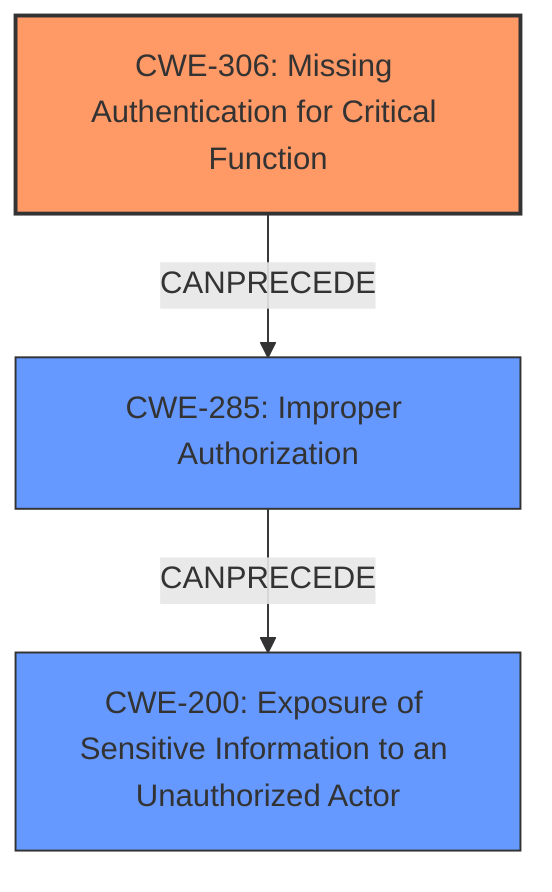

# Analysis Report for CVE-2024-21169

# Vulnerability Analysis Report: CVE-2024-21169

## Description

Vulnerability in the Oracle Marketing product of Oracle E-Business Suite (component Partners). Supported versions that are affected are 12.2.3-12.2.13. Easily exploitable vulnerability allows unauthenticated attacker with network access via HTTP to compromise Oracle Marketing. Successful attacks of this vulnerability can result in unauthorized update, insert or delete access to some of Oracle Marketing accessible data as well as unauthorized read access to a subset of Oracle Marketing accessible data. CVSS 3.1 Base Score 6.5 (Confidentiality and Integrity impacts). CVSS Vector (CVSS3.1/AVN/ACL/PRN/UIN/SU/CL/IL/AN).

## Vulnerability Description Key Phrases

- **Impact:** ['Integrity', 'insert or delete access', 'unauthorized read access', 'unauthorized update']
- **Vector:** HTTP
- **Attacker:** unauthenticated attacker
- **Product:** Oracle E-Business Suite
- **Version:** 12.2.3-12.2.13
- **Component:** Oracle Marketing Partners component

## Analysis (with Relationship Data)

# Summary
| CWE ID | CWE Name | Confidence | CWE Abstraction Level | CWE Vulnerability Mapping Label | CWE-Vulnerability Mapping Notes |
|---|---|---|---|---|---|
| CWE-306 | Missing Authentication for Critical Function | 0.9 | Base | Allowed | Primary CWE: The vulnerability is exploitable by an **unauthenticated attacker**, indicating a **lack of authentication**. |
| CWE-285 | Improper Authorization | 0.7 | Class | Discouraged | Secondary Candidate: The CVE description mentions "unauthorized update, insert or delete access" which may be due to **improper authorization**. |
| CWE-200 | Exposure of Sensitive Information to an Unauthorized Actor | 0.6 | Class | Discouraged | Secondary Candidate: The CVE description mentions "unauthorized read access to a subset of Oracle Marketing accessible data" which constitutes **exposure of sensitive information**. |

## Evidence and Confidence

*   **Confidence Score:** 0.8
*   **Evidence Strength:** MEDIUM

## Relationship Analysis
The primary weakness is **CWE-306 [Missing Authentication for Critical Function]**, as the vulnerability is directly linked to the absence of authentication, allowing unauthenticated attackers to perform actions. This can then lead to **CWE-285 [Improper Authorization]** because even if authentication were present, authorization could be bypassed, leading to unauthorized access. The unauthorized access results in **CWE-200 [Exposure of Sensitive Information to an Unauthorized Actor]**.



## Vulnerability Chain
The vulnerability chain starts with **CWE-306 [Missing Authentication for Critical Function]**, allowing an **unauthenticated attacker** to proceed without proper verification. This **lack of authentication** can lead to **CWE-285 [Improper Authorization]**, where the attacker gains unauthorized access to resources or actions. Finally, the chain leads to **CWE-200 [Exposure of Sensitive Information to an Unauthorized Actor]**, where sensitive data is accessed without authorization. The root cause is the **missing authentication**, leading to a cascade of weaknesses.

## Summary of Analysis
The primary assessment is based on the description of an **unauthenticated attacker** exploiting the vulnerability, directly pointing to **CWE-306 [Missing Authentication for Critical Function]**. The CVE Reference Links Content Summary further supports this by mentioning "No specific authentication is required to exploit the vulnerability." This provides enough evidence to confidently assign CWE-306 as the primary CWE. The secondary CWEs, **CWE-285 [Improper Authorization]** and **CWE-200 [Exposure of Sensitive Information to an Unauthorized Actor]**, are considered based on the potential impact of the vulnerability, such as unauthorized data access and modification. The graph relationships helped clarify the order of events, with authentication being the first step and unauthorized access following. The selected CWEs are at the optimal level of specificity, addressing the root cause and potential consequences of the vulnerability.

Relevant CWE Information:

# Enhanced Context (25 CWEs)
The following CWEs were identified as potentially relevant to this vulnerability:

## CWE-303: Incorrect Implementation of Authentication Algorithm
**Abstraction Level**: Base
**Similarity Score**: 0.70
**Source**: dense

**Description**:
The requirements for the product dictate the use of an established authentication algorithm, but the implementation of the algorithm is incorrect.

**Mapping Guidance**:
- Usage: Allowed
- Rationale: This CWE entry is at the Base level of abstraction, which is a preferred level of abstraction for mapping to the root causes of vulnerabilities.

*Not Selected*: While authentication is mentioned, the vulnerability description and summary point to a missing authentication mechanism rather than an incorrect implementation.

## CWE-497: Exposure of Sensitive System Information to an Unauthorized Control Sphere
**Abstraction Level**: Base
**Similarity Score**: 0.70
**Source**: dense

**Description**:
The product does not properly prevent sensitive system-level information from being accessed by unauthorized actors who do not have the same level of access to the underlying system as the product does.

**Mapping Guidance**:
- Usage: Allowed
- Rationale: This CWE entry is at the Base level of abstraction, which is a preferred level of abstraction for mapping to the root causes of vulnerabilities.

*Not Selected*: The scope is too broad. CWE-200 is better suited for general exposure of sensitive information.

## CWE-807: Reliance on Untrusted Inputs in a Security Decision
**Abstraction Level**: Base
**Similarity Score**: 0.70
**Source**: dense

**Description**:
The product uses a protection mechanism that relies on the existence or values of an input, but the input can be modified by an untrusted actor in a way that bypasses the protection mechanism.

**Mapping Guidance**:
- Usage: Allowed
- Rationale: This CWE entry is at the Base level of abstraction, which is a preferred level of abstraction for mapping to the root causes of vulnerabilities.

*Not Selected*: There's no explicit mention of relying on untrusted inputs for security decisions.

## CWE-472: External Control of Assumed-Immutable Web Parameter
**Abstraction Level**: Base
**Similarity Score**: 0.70
**Source**: dense

**Description**:
The web application does not sufficiently verify inputs that are assumed to be immutable but are actually externally controllable, such as hidden form fields.

**Mapping Guidance**:
- Usage: Allowed
- Rationale: This CWE entry is at the Base level of abstraction, which is a preferred level of abstraction for mapping to the root causes of vulnerabilities.

*Not Selected*: The vulnerability description doesn't mention externally controllable parameters.

## CWE-611: Improper Restriction of XML External Entity Reference
**Abstraction Level**: Base
**Similarity Score**: 0.70
**Source**: dense

**Description**:
The product processes an XML document that can contain XML entities with URIs that resolve to documents outside of the intended sphere of control, causing the product to embed incorrect documents into its output.

**Mapping Guidance**:
- Usage: Allowed
- Rationale: This CWE entry is at the Base level of abstraction, which is a preferred level of abstraction for mapping to the root causes of vulnerabilities.

*Not Selected*: XML External Entity Reference is not mentioned in the vulnerability description.

## CWE-74: Improper Neutralization of Special Elements in Output Used by a Downstream Component ('Injection')
**Abstraction Level**: Class
**Similarity Score**: 0.69
**Source**: dense

**Description**:
The product constructs all or part of a command, data structure, or record using externally-influenced input from an upstream component, but it does not neutralize or incorrectly neutralizes special elements that could modify how it is parsed or interpreted when it is sent to a downstream component.

**Mapping Guidance**:
- Usage: Discouraged
- Rationale: CWE-74 is high-level and often misused when lower-level weaknesses are more appropriate.

*Not Selected*: Injection is not explicitly mentioned in the vulnerability description.

## CWE-668: Exposure of Resource to Wrong Sphere
**Abstraction Level**: Class
**Similarity Score**: 0.69
**Source**: dense

**Description**:
The product exposes a resource to the wrong control sphere, providing unintended actors with inappropriate access to the resource.

**Mapping Guidance**:
- Usage: Discouraged
- Rationale: CWE-668 is high-level and is often misused as a catch-all when lower-level CWE IDs might be applicable. It is sometimes used for low-information vulnerability reports [REF-1287]. It is a level-1 Class (i.e., a child of a Pillar). It is not useful for trend analysis.

*Not Selected*: The description is vague, and CWE-200 is a better fit for the specific impact.

## CWE-941: Incorrectly Specified Destination in a Communication Channel
**Abstraction Level**: Base
**Similarity Score**: 0.69
**Source**: dense

**Description**:
The product creates a communication channel to initiate an outgoing request to an actor, but it does not correctly specify the intended destination for that actor.

**Mapping Guidance**:
- Usage: Allowed
- Rationale: This CWE entry is at the Base level of abstraction, which is a preferred level of abstraction for mapping to the root causes of vulnerabilities.

*Not Selected*: This CWE is not relevant to the provided vulnerability description.

## CWE-200: Exposure of Sensitive Information to an Unauthorized Actor
**Abstraction Level**: Class
**Similarity Score**: 0.69
**Source**: dense

**Description**:
The product exposes sensitive information to an actor that is not explicitly authorized to have access to that information.

**


## CWE Relationship Analysis

Current CWEs represent these abstraction levels: .


### Vulnerability Chain Analysis

**Chain starting from CWE-611:**
- 611 (Improper Restriction of XML External Entity Reference) - ROOT


**Chain starting from CWE-306:**
- 306 (Missing Authentication for Critical Function) - ROOT


### CWE Relationship Diagram

```mermaid
graph TD
    classDef primary fill:#f96,stroke:#333,stroke-width:2px
    classDef secondary fill:#69f,stroke:#333
    classDef tertiary fill:#9e9,stroke:#333
```


*Report generated on 2025-07-13 05:21:29*
