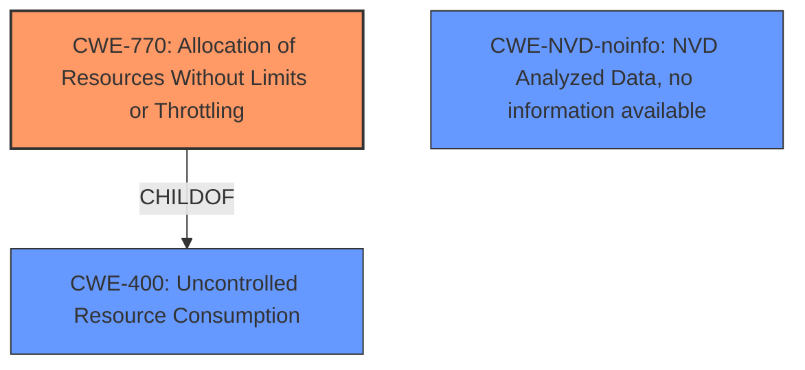

# Analysis for CVE-2024-21173

# Summary
| CWE ID        | CWE Name                                                                                                     | Confidence | CWE Abstraction Level | CWE Vulnerability Mapping Label | CWE-Vulnerability Mapping Notes |
| ------------- | ------------------------------------------------------------------------------------------------------------- | ---------- | ----------------------- | ------------------------------- | ------------------------------- |
| CWE-770       | Allocation of Resources Without Limits or Throttling                                                          | 0.75       | Base                    | Primary CWE                     | Allowed                         |
| CWE-400       | Uncontrolled Resource Consumption                                                                                       | 0.65       | Class                    | Secondary Candidate                    | Allowed-with-Review                         |
| CWE-NVD-noinfo | NVD Analyzed Data, no information available                                                                    | 0.50       | -                      | Secondary Candidate                     | -                             |

## Evidence and Confidence

*   **Confidence Score:** 0.70
*   **Evidence Strength:** MEDIUM

## Relationship Analysis
The primary CWE is CWE-770, which is a base-level CWE and a child of CWE-400.
CWE-400 is a class-level CWE representing uncontrolled resource consumption and related to the DoS vulnerability due to resource allocation issues.
CWE-NVD-noinfo is included as the vulnerability report itself provides minimal information and depends on external sources to be fully understood.



## Vulnerability Chain
The vulnerability chain starts with the **uncontrolled allocation of resources**, leading to excessive resource consumption and ultimately a denial-of-service condition.
CWE-770 (Root Cause) -> Excessive resource allocation -> Resource Exhaustion -> CWE-400 (Impact: Denial of Service)

## Summary of Analysis
The analysis focuses on the root cause and impact of the vulnerability, which is a denial of service due to **uncontrolled resource allocation**.
The primary CWE, CWE-770, accurately represents the root cause, while CWE-400 represents the impact.

The vulnerability description indicates that successful attacks can result in a hang or frequently repeatable crash of the MySQL Server, leading to a complete denial of service. The CVE Reference Links Content Summary states, "Successful exploitation can lead to a denial of service".

CWE-770 (Allocation of Resources Without Limits or Throttling) is selected as the primary CWE because it directly addresses the **uncontrolled allocation of resources**, which is the root cause of the denial-of-service vulnerability. This aligns with the vulnerability description and the provided evidence.

CWE-400 (Uncontrolled Resource Consumption) is included to represent the denial-of-service impact.

CWE-NVD-noinfo is included because the initial description lacks specific technical details.

The retriever results offered several potential CWEs, but most were rejected as less relevant than CWE-770. For example:

*   CWE-129 (Improper Validation of Array Index) was considered, but it does not directly relate to the resource allocation issue described in the vulnerability.
*   CWE-89 (Improper Neutralization of Special Elements used in an SQL Command ('SQL Injection')) was not selected because the vulnerability is not related to SQL injection.
*   CWE-20 (Improper Input Validation) was not selected because it is too general and a more specific CWE (CWE-770) is available.

Relevant CWE Information:
```
CWE-770: Allocation of Resources Without Limits or Throttling
The product allocates a reusable resource or group of resources on behalf of an actor without imposing any restrictions on the size or number of resources that can be allocated, in violation of the intended security policy for that actor.
```