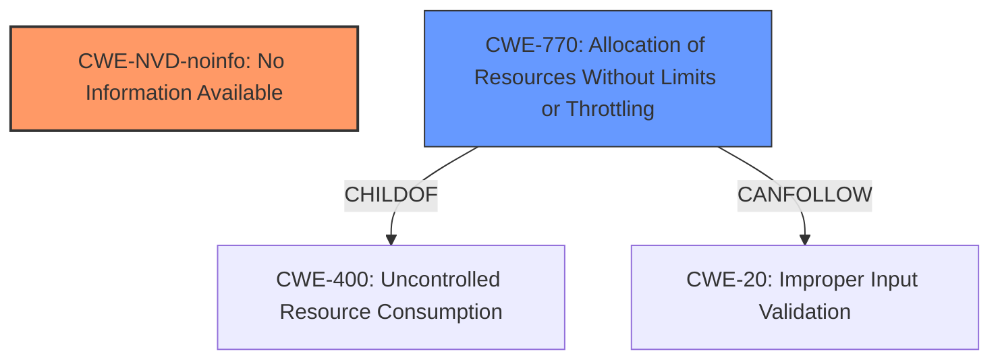

# Analysis Report for CVE-2024-21194

# Vulnerability Analysis Report: CVE-2024-21194

## Description

Vulnerability in the MySQL Server product of Oracle MySQL (component InnoDB). Supported versions that are affected are 8.0.39 and prior, 8.4.2 and prior and 9.0.1 and prior. Easily exploitable vulnerability allows high privileged attacker with network access via multiple protocols to compromise MySQL Server. Successful attacks of this vulnerability can result in unauthorized ability to cause a hang or frequently repeatable crash (complete DOS) of MySQL Server. CVSS 3.1 Base Score 4.9 (Availability impacts). CVSS Vector (CVSS3.1/AVN/ACL/PRH/UIN/SU/CN/IN/AH).

## Vulnerability Description Key Phrases

- **Impact:** cause a hang or frequently repeatable crash (complete DOS) of MySQL Server
- **Vector:** multiple protocols
- **Attacker:** high privileged attacker with network access
- **Product:** MySQL Server
- **Version:** 8.0.39 and prior, 8.4.2 and prior and 9.0.1 and prior
- **Component:** InnoDB

## Analysis (with Relationship Data)

# Summary

| CWE ID        | CWE Name                                                                | Confidence | CWE Abstraction Level | CWE Vulnerability Mapping Label | CWE-Vulnerability Mapping Notes |
|---------------|-------------------------------------------------------------------------|------------|-----------------------|---------------------------------|-----------------------------------|
| CWE-NVD-noinfo | No Information Available                                                                  | 0.7        | N/A                   | Primary                           | N/A                               |
| CWE-770       | CWE-770: Allocation of Resources Without Limits or Throttling | 0.4        | Base                    | Secondary                         | Allowed                           |

## Evidence and Confidence

*   **Confidence Score:** 0.6
*   **Evidence Strength:** LOW

## Relationship Analysis

The primary identified CWE is CWE-NVD-noinfo, which indicates a lack of specific information about the vulnerability. CWE-770 (Allocation of Resources Without Limits or Throttling) is considered as a secondary candidate because the successful attack results in a denial of service (hang or crash). CWE-770 is related to CWE-400 (Uncontrolled Resource Consumption) as its child and CWE-20 (Improper Input Validation) and other CWEs as its parent.



## Vulnerability Chain

The vulnerability chain starts with an unspecified weakness in the InnoDB component. A high-privileged attacker with network access exploits this **unspecified vulnerability**, leading to a hang or crash of the MySQL Server, resulting in a denial-of-service condition.

## Summary of Analysis

The initial assessment strongly relies on the provided evidence, primarily the "CVE Reference Links Content Summary" and "Vulnerability Description Key Phrases". The primary classification is CWE-NVD-noinfo due to the lack of detailed information about the root cause.

The decision to include CWE-770 is based on the impact description, which mentions a denial-of-service condition. However, without knowing the exact mechanism that causes the resource exhaustion, the confidence in this secondary classification remains low.

The selected CWEs represent the optimal level of specificity given the available information. A more detailed analysis would require further investigation into the specific **root cause** of the vulnerability.

Relevant CWE Information:

# Enhanced Context (25 CWEs)

## CWE-89: Improper Neutralization of Special Elements used in an SQL Command ('SQL Injection')

**Abstraction Level**: Base
**Similarity Score**: 0.68
**Source**: dense

**Description**:
The product constructs all or part of an SQL command using externally-influenced input from an upstream component, but it does not neutralize or incorrectly neutralizes special elements that could modify the intended SQL command when it is sent to a downstream component. Without sufficient removal or quoting of SQL syntax in user-controllable inputs, the generated SQL query can cause those inputs to be interpreted as SQL instead of ordinary user data.

**Mapping Guidance**:
- Usage: Allowed
- Rationale: This CWE entry is at the Base level of abstraction, which is a preferred level of abstraction for mapping to the root causes of vulnerabilities.

*Rejection Reason:* While SQL Injection is a common vulnerability in database servers, there is no specific evidence in the description to suggest that this is the case.

## CWE-129: Improper Validation of Array Index

**Abstraction Level**: Variant
**Similarity Score**: 0.68
**Source**: dense

**Description**:
The product uses untrusted input when calculating or using an array index, but the product does not validate or incorrectly validates the index to ensure the index references a valid position within the array.

**Mapping Guidance**:
- Usage: Allowed
- Rationale: This CWE entry is at the Variant level of abstraction, which is a preferred level of abstraction for mapping to the root causes of vulnerabilities.

*Rejection Reason:* There is no evidence in the description to indicate that this vulnerability involves an array index.

## CWE-303: Incorrect Implementation of Authentication Algorithm

**Abstraction Level**: Base
**Similarity Score**: 0.67
**Source**: dense

**Description**:
The requirements for the product dictate the use of an established authentication algorithm, but the implementation of the algorithm is incorrect.

**Mapping Guidance**:
- Usage: Allowed
- Rationale: This CWE entry is at the Base level of abstraction, which is a preferred level of abstraction for mapping to the root causes of vulnerabilities.

*Rejection Reason:* Authentication is not listed as a factor in the vulnerability.

## CWE-209: Generation of Error Message Containing Sensitive Information

**Abstraction Level**: Base
**Similarity Score**: 0.67
**Source**: dense

**Description**:
The product generates an error message that includes sensitive information about its environment, users, or associated data.

**Mapping Guidance**:
- Usage: Allowed
- Rationale: This CWE entry is at the Base level of abstraction, which is a preferred level of abstraction for mapping to the root causes of vulnerabilities.

*Rejection Reason:* No information is provided that suggests the generation of an error message.

## CWE-1391: Use of Weak Credentials

**Abstraction Level**: Class
**Similarity Score**: 0.67
**Source**: dense

**Description**:
The product uses weak credentials (such as a default key or hard-coded password) that can be calculated, derived, reused, or guessed by an attacker.

**Mapping Guidance**:
- Usage: Allowed-with-Review
- Rationale: This CWE entry is a Class and might have Base-level children that would be more appropriate

*Rejection Reason:* The advisory does not mention any kind of credential issues.

## CWE-330: Use of Insufficiently Random Values

**Abstraction Level**: Class
**Similarity Score**: 0.66
**Source**: dense

**Description**:
The product uses insufficiently random numbers or values in a security context that depends on unpredictable numbers.

**Mapping Guidance**:
- Usage: Discouraged
- Rationale: This CWE entry is a level-1 Class (i.e., a child of a Pillar). It might have lower-level children that would be more appropriate

*Rejection Reason:* There is no mention of randomness.

## CWE-941: Incorrectly Specified Destination in a Communication Channel

**Abstraction Level**: Base
**Similarity Score**: 0.66
**Source**: dense

**Description**:
The product creates a communication channel to initiate an outgoing request to an actor, but it does not correctly specify the intended destination for that actor.

**Mapping Guidance**:
- Usage: Allowed
- Rationale: This CWE entry is at the Base level of abstraction, which is a preferred level of abstraction for mapping to the root causes of vulnerabilities.

*Rejection Reason:* The advisory doesn't mention anything about destination issues in a communication channel.

## CWE-755: Improper Handling of Exceptional Conditions

**Abstraction Level**: Class
**Similarity Score**: 0.66
**Source**: dense

**Description**:
The product does not handle or incorrectly handles an exceptional condition.

**Mapping Guidance**:
- Usage: Discouraged
- Rationale: This CWE entry is a level-1 Class (i.e., a child of a Pillar). It might have lower-level children that would be more appropriate

*Rejection Reason:* The advisory does not mention handling of exceptional conditions.

## CWE-497: Exposure of Sensitive System Information to an Unauthorized Control Sphere

**Abstraction Level**: Base
**Similarity Score**: 0.66
**Source**: dense

**Description**:
The product does not properly prevent sensitive system-level information from being accessed by unauthorized actors who do not have the same level of access to the underlying system as the product does.

**Mapping Guidance**:
- Usage: Allowed
- Rationale: This CWE entry is at the Base level of abstraction, which is a preferred level of abstraction for mapping to the root causes of vulnerabilities.

*Rejection Reason:* The advisory does not mention any exposure of sensitive system information.

## CWE-294: Authentication Bypass by Capture-replay

**Abstraction Level**: Base
**Similarity Score**: 0.66
**Source**: dense

**Description**:
A capture-replay flaw exists when the design of the product makes it possible for a malicious user to sniff network traffic and bypass authentication by replaying it to the server in question to the same effect as the original message (or with minor changes).

**Mapping Guidance**:
- Usage: Allowed
- Rationale: This CWE entry is at the Base level of abstraction, which is a preferred level of abstraction for mapping to the root causes of vulnerabilities.

*Rejection Reason:* The advisory does not mention any authentication bypass.

## CWE-173: Improper Handling of Alternate Encoding

**Abstraction Level**: Variant
**Similarity Score**: 69


## CWE Relationship Analysis

Current CWEs represent these abstraction levels: .


### Vulnerability Chain Analysis

**Chain starting from CWE-89:**
- 89 (Improper Neutralization of Special Elements used in an SQL Command ('SQL Injection')) - ROOT


**Chain starting from CWE-1391:**
- 1391 (Use of Weak Credentials) - ROOT


### CWE Relationship Diagram

```mermaid
graph TD
    classDef primary fill:#f96,stroke:#333,stroke-width:2px
    classDef secondary fill:#69f,stroke:#333
    classDef tertiary fill:#9e9,stroke:#333
```


*Report generated on 2025-07-13 05:23:25*
