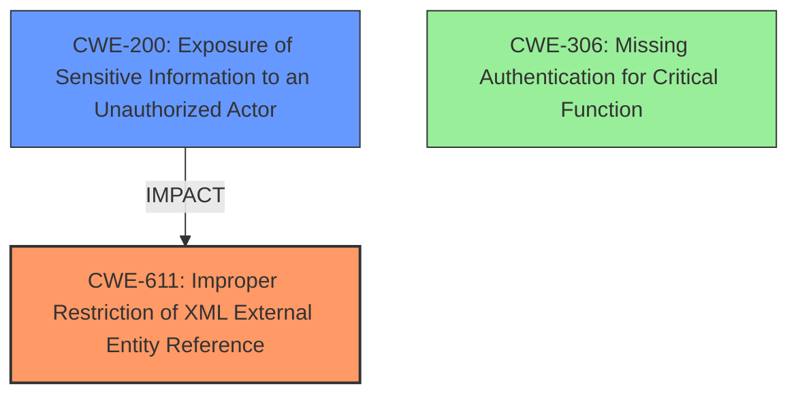

# Analysis for CVE-2024-21195

# Summary
| CWE ID | CWE Name | Confidence | CWE Abstraction Level | CWE Vulnerability Mapping Label | CWE-Vulnerability Mapping Notes |
|---|---|---|---|---|---|
| CWE-611 | Improper Restriction of XML External Entity Reference | 0.8 | Base | Allowed | Primary CWE. This is the root cause of the vulnerability. |
| CWE-200 | Exposure of Sensitive Information to an Unauthorized Actor | 0.5 | Class | Discouraged | Secondary candidate. While information exposure is a result, it's not the root cause. |
| CWE-306 | Missing Authentication for Critical Function | 0.4 | Base | Allowed | Secondary candidate. Additional information states that the vulnerability is not exploitable without authentication, thus authentication is present. |

## Evidence and Confidence

*   **Confidence Score:** 0.7
*   **Evidence Strength:** MEDIUM

## Relationship Analysis
The primary CWE, CWE-611, is a Base level weakness, which is preferred. It doesn't have any direct parent-child or chain relationships that strongly influence its selection in this context. CWE-200 is a Class level weakness and is a potential impact of the vulnerability. CWE-306 is a base level weakness but is less relevant given the need for authentication.



## Vulnerability Chain
The vulnerability chain starts with the **improper handling of external references** in the layout templates (CWE-611). This can lead to the **unauthorized access to critical data** (CWE-200) and potential **denial of service**. The attacker injects malicious code through crafted template data via HTTP requests.

## Summary of Analysis
The primary selection, CWE-611, is based on the root cause identified in the "CVE Reference Links Content Summary," which states, "The vulnerability lies within the layout template processing functionality of Oracle BI Publisher, specifically related to its **handling of external references** or inclusions." This directly corresponds to the description of CWE-611: "Improper Restriction of XML External Entity Reference." The retriever results also list CWE-611 with a good score. The description also mentions "Potential for injection or exploitation through malformed template data" as a weakness.

CWE-200 is considered because the vulnerability description states, "Successful attacks of this vulnerability can result in unauthorized access to critical data." However, CWE-200 is a high-level class and represents the impact rather than the root cause. Therefore, it's a secondary consideration.

CWE-306 is considered, but the "additional_information" in the CVE Reference Links Content Summary indicates that authentication is required for exploitation, making this CWE less relevant.

The final selection prioritizes the root cause (CWE-611) over the impact (CWE-200) and considers the authentication context.

Relevant CWE Information:
# Vulnerability Description
Vulnerability in the Oracle BI Publisher product of Oracle Analytics (component Layout Templates). Supported versions that are affected are 7.0.0.0.0, 7.6.0.0.0 and 12.2.1.4.0. Easily exploitable vulnerability allows low privileged attacker with network access via HTTP to compromise Oracle BI Publisher. Successful attacks of this vulnerability can result in unauthorized access to critical data or complete access to all Oracle BI Publisher accessible data as well as unauthorized update, insert or delete access to some of Oracle BI Publisher accessible data and unauthorized ability to cause a partial denial of service (partial DOS) of Oracle BI Publisher. CVSS 3.1 Base Score 7.6 (Confidentiality, Integrity and Availability impacts). CVSS Vector (CVSS3.1/AVN/ACL/PRL/UIN/SU/CH/IL/AL).

### Vulnerability Description Key Phrases
- **impact:** DOS and Integrity and Availability impacts and denial of service and insert or delete access and unauthorized access to critical data and unauthorized update
- **vector:** low privileged attacker with network access via HTTP
- **product:** Oracle BI Publisher
- **version:** 7.0.0.0.0 and 7.6.0.0.0 and 12.2.1.4.0
- **component:** Layout Templates

### CWE for similar CVE Descriptions
### Primary CWE Match
CWE-NVD-noinfo

#### Top CWEs
- CWE-NVD-noinfo (Count: 336)
- CWE-284 (Count: 6)
- CWE-200 (Count: 2)

## CVE Reference Links Content Summary
```
{
  "vulnerability_details": {
    "root_cause": "The vulnerability lies within the layout template processing functionality of Oracle BI Publisher, specifically related to its **handling of external references** or inclusions.",
    "weaknesses": [
      "**Improper handling of external references**",
      "Potential for injection or exploitation through malformed template data"
    ],
    "impact": "Successful exploitation of this vulnerability could allow an attacker to gain unauthorized access to sensitive information or potentially execute arbitrary code on the server hosting Oracle BI Publisher.",
    "attack_vectors": [
       "Network-based attacks through HTTP requests targeting the BI Publisher server.",
      "Injection of malicious code through specially crafted template data."
    ],
    "attacker_capabilities": "An attacker requires the ability to send specially crafted HTTP requests to the server hosting Oracle BI Publisher. They may need to possess or discover the format and mechanism for injecting malicious content within the template data.",
    "additional_information": "The risk matrix indicates that this vulnerability is not exploitable without authentication, meaning an attacker would need some valid user context or session to be able to send malicious request and exploit it."
   }
}
```