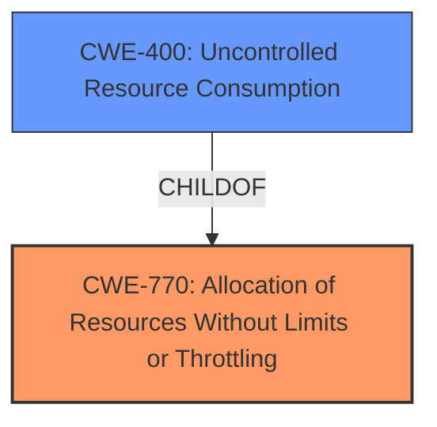

# Analysis for CVE-2024-21207

# Summary
| CWE ID | CWE Name | Confidence | CWE Abstraction Level | CWE Vulnerability Mapping Label | CWE-Vulnerability Mapping Notes |
|---|---|---|---|---|---|
| **CWE-770** | **Allocation of Resources Without Limits or Throttling** | 0.75 | Base | Primary CWE | Allowed |
| CWE-400 | Uncontrolled Resource Consumption | 0.5 | Class | Secondary Candidate | Allowed |

## Evidence and Confidence

*   **Confidence Score:** 0.7
*   **Evidence Strength:** MEDIUM

## Relationship Analysis
The primary CWE selected is CWE-770 (Allocation of Resources Without Limits or Throttling), which is a Base level CWE. The vulnerability description indicates that the attack results in a hang or crash of the MySQL server (complete DOS), suggesting a resource exhaustion issue. CWE-770's child CWE, CWE-400 (Uncontrolled Resource Consumption), was considered but not selected as the primary because the description more closely aligns with the allocation issue rather than simply consumption. CWE-770 can lead to CWE-400.

## Vulnerability Chain
The vulnerability chain starts with **Allocation of Resources Without Limits or Throttling (CWE-770)**, which leads to **Uncontrolled Resource Consumption (CWE-400)**, ultimately resulting in a Denial of Service (DoS).

## Summary of Analysis
The initial assessment considered several CWEs from the Retriever Results, including CWE-89 (SQL Injection), CWE-129 (Improper Validation of Array Index), and CWE-789 (Memory Allocation with Excessive Size Value). However, based on the vulnerability description and the CVE Reference Links Content Summary, the most relevant CWE is **CWE-770 (Allocation of Resources Without Limits or Throttling)**. The evidence points to a **resource exhaustion** issue due to the ability of a high-privileged attacker to cause a hang or crash of the MySQL server. This aligns with CWE-770's description of allocating resources without limits, leading to potential denial of service. The selection of CWE-770 is further supported by its Base level of abstraction, which is preferred for mapping root causes. The final decision emphasizes the resource allocation aspect as the primary weakness, directly causing the denial-of-service condition.

Relevant CWE Information:

# Enhanced Context (25 CWEs)
The following CWEs were identified as potentially relevant to this vulnerability:

## CWE-89: Improper Neutralization of Special Elements used in an SQL Command ('SQL Injection')
**Abstraction Level**: Base
**Similarity Score**: 0.69

**Description**:
The product constructs all or part of an SQL command using externally-influenced input from an upstream component, but it does not neutralize or incorrectly neutralizes special elements that could modify the intended SQL command when it is sent to a downstream component. Without sufficient removal or quoting of SQL syntax in user-controllable inputs, the generated SQL query can cause those inputs to be interpreted as SQL instead of ordinary user data.

**Mapping Guidance**:
- Usage: Allowed
- Rationale: This CWE entry is at the Base level of abstraction, which is a preferred level of abstraction for mapping to the root causes of vulnerabilities.

## CWE-770: Allocation of Resources Without Limits or Throttling
**Abstraction Level**: Base
**Similarity Score**: 1080.62

**Description**:
The product allocates a reusable resource or group of resources on behalf of an actor without imposing any restrictions on the size or number of resources that can be allocated, in violation of the intended security policy for that actor.

**Mapping Guidance**:
- Usage: Allowed
- Rationale: This CWE entry is at the Base level of abstraction, which is a preferred level of abstraction for mapping to the root causes of vulnerabilities.

CWE-770 is chosen because the vulnerability allows for a complete Denial of Service (DOS) of the MySQL Server due to a hang or frequently repeatable crash, indicating a resource exhaustion issue. The vulnerability occurs because resources are allocated without proper limits or throttling.